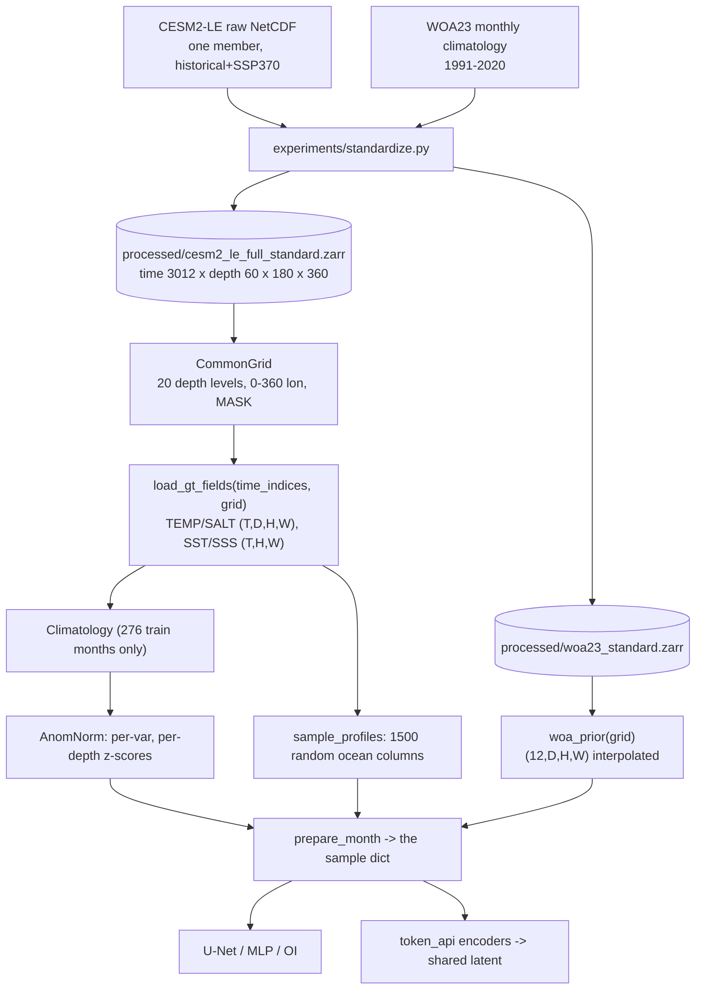
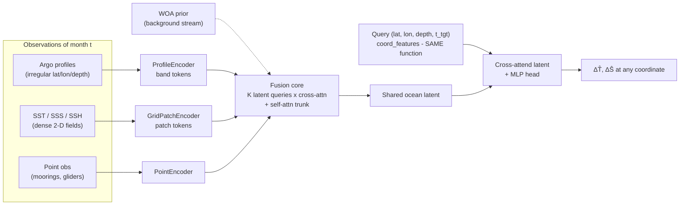

# OceanLatent — Architecture, Normalization and Tokenization Specification

*Authoritative description of the pipeline **as implemented**, written to answer
the advisor's "data normalization detail write it down and detail of the whole
architecture" and "detail of tokenization looking into it". Every claim carries
a `file:line` provenance link. The paper's method section should be lifted from
this document, not re-derived.*

**Status date**: 2026-08-08 · **Protocol**: [protocol_v1](../reports/protocol_v1.md)
(frozen 2026-07-17) · **Rule**: where this document and the code disagree, the
code is right and this document is a bug.

**Scope note.** Sections A–D describe what runs today. Section E describes the
target architecture and marks explicitly what exists and what does not.
Section F records the transferable ideas from the advisor-assigned cBottle
reference ([reading note](../reports/reading_cbottle.md)).

---

## A. Data pipeline



### A.1 Stores and the common grid

| Item | Value | Provenance |
|---|---|---|
| Ground truth | CESM2-LE, **one member** (member id unrecoverable — a declared limitation), regridded to regular 1°, 180×360, monthly 1850–2100 (3012 steps) | [config.py:23](../src/ocean_tokenizer/config.py#L23) |
| Prior | WOA23 monthly climatology, interpolated onto the analysis grid | [data.py:112](../src/ocean_tokenizer/data.py#L112) |
| Longitude | 0–360 convention; WOA is rolled onto it and re-sorted | [data.py:32](../src/ocean_tokenizer/data.py#L32) |
| Ocean mask | `MASK == 1` of the GT store; fallback = finite SST at t=0 | [data.py:54](../src/ocean_tokenizer/data.py#L54) |
| Depth | **20 native CESM2-LE levels, 5 → 984.7 m**, indices `[0,1,2,3,4,5,6,8,10,12,14,16,18,21,24,27,30,33,36,39]` | [config.py:41](../src/ocean_tokenizer/config.py#L41) |
| Ocean fraction | 0.654 → **42 395 ocean cells** per level | `CommonGrid.__repr__` |

Native levels are used deliberately: the *target* is never vertically
interpolated, so the ground truth stays lossless. WOA23 is interpolated onto
these levels instead ([data.py:125](../src/ocean_tokenizer/data.py#L125)).

> The extended 23-level / 1400 m grid is a **separate, secondary protocol**
> ([layered_depth_eval.md](../reports/layered_depth_eval.md)). 20- and 23-level
> numbers must never share a table, and no ">1000 m" claim may be made from the
> 20-level task.

### A.2 Split (protocol_v1, frozen)

| Split | Years | Count |
|---|---|---|
| Train | 1985–2007 | 276 months |
| Validation | 2008–2010 | 36 months |
| Test | 2011–2014 | 12 **pinned** snapshots |

Pinned test time indices: `[1933, 1935, 1936, 1938, 1942, 1946, 1952, 1953, 1956, 1965, 1967, 1976]`.
All model *and hyperparameter* selection uses validation only; test months are
touched once per final model.

### A.3 Synthetic Argo

`sample_profiles` draws `n_profiles` ocean columns uniformly without
replacement and returns their full vertical T/S columns
([argo.py:12](../src/ocean_tokenizer/argo.py#L12)):

```python
pick = rng.choice(oi.size, size=min(n_profiles, oi.size), replace=False)
```

Two properties that matter downstream:

* The draw depends **only on the ocean mask and `n_profiles`**, never on the
  field values. This is what lets `27_oi_vs_unet.py` replay a previous run's
  RNG state exactly and compare methods on byte-identical observations.
* Profiles are **noise-free, exact model columns** at 1500/month ≈ 3.5 %
  coverage — the headline OSSE limitation.

### A.4 `prepare_month` — the shared sample dict

Every method consumes the same dict ([baselines.py:76](../src/ocean_tokenizer/baselines.py#L76)):

| Key | Shape | Meaning |
|---|---|---|
| `month` | scalar | calendar month 1–12 of this snapshot |
| `prof` | dict | raw profiles: `ij`, `lat`, `lon`, `month`, `TEMP`/`SALT` (P,D) |
| `gt` | {var: (D,H,W)} | ground truth, land = NaN |
| `woa` | {var: (D,H,W)} | WOA prior for this calendar month |
| `obs` | {var: (D,H,W)} | profiles scattered onto the grid, **NaN where unobserved** |
| `surf` | {SST,SSS: (H,W)} | dense surface fields |
| `ocean_ij` | (2, n_ocean) | indices of ocean cells |
| `nn`, `nn_dist` | (n_ocean,) | nearest-profile index and **chord** distance on the unit sphere |
| `unobs_mask` | (H,W) bool | ocean **and** not a profile column — the scoring mask |
| `near` | {var: (D,H,W)} | nearest-profile fill |

`nn_dist` is a **chord** length on the unit sphere, not km — a trap when
writing new distance-based methods. `oi.py` converts explicitly via
`_chord_to_arc_km`.

---

## B. Normalization — the core section

Every formula below is train-only. This is what makes "predict zero anomaly"
a principled floor rather than an arbitrary reference.

### B.1 Physical clipping

Applied at load, before anything else ([data.py:26](../src/ocean_tokenizer/data.py#L26)):

$$\text{clip}(x) = \begin{cases} x & x \in [\text{lo}, \text{hi}] \\ \text{NaN} & \text{otherwise}\end{cases}$$

with TEMP/SST ∈ [−3, 40] °C and SALT/SSS ∈ [2, 45] PSU
([config.py:61](../src/ocean_tokenizer/config.py#L61)). This drops fill values
and brine outliers. Land is then set to NaN via the ocean mask.

### B.2 Monthly climatology (train months only)

For variable $v$ and calendar month $m \in \{1..12\}$
([anomaly.py:35](../src/ocean_tokenizer/anomaly.py#L35)):

$$\mathrm{clim}_v[m] = \operatorname*{nanmean}_{t \in \text{train},\, \text{month}(t) = m} x_v(t)$$

with fallback to the all-month mean when a calendar month is absent from the
split, so every test month is defined. Under protocol_v1 the mean is over the
**276 train months only** — validation months are excluded (stricter than
week-1, which used all 312).

### B.3 Anomaly target

$$a_v(t) = x_v(t) - \mathrm{clim}_v[\text{month}(t)]$$

Rationale ([anomaly.py:1–26](../src/ocean_tokenizer/anomaly.py#L1-L26)): most of
the field's variance *is* the climatology, so a model trained on the absolute
field scores well by memorising the seasonal cycle. Reconstruction RMSE is
invariant to the reframing (the climatology cancels in `pred − true`); what
changes is what the network must learn and what floor we report against.

### B.4 z-scoring — per variable, per depth level

$$z_{v,d} = \frac{a_{v,d} - \mu_{v,d}}{\sigma_{v,d}}, \qquad
\mu_{v,d} = \operatorname*{nanmean}_{t \in \text{train},\, h, w} a_{v,d,h,w}, \quad
\sigma_{v,d} = \operatorname*{nanstd}_{t \in \text{train},\, h, w} a_{v,d,h,w}$$

with $\sigma < 10^{-6}$ replaced by 1 ([anomaly.py:90–96](../src/ocean_tokenizer/anomaly.py#L90-L96)).
Per-depth statistics matter: anomaly variance falls by more than an order of
magnitude from the surface to 985 m, so a single global $\sigma$ would let the
surface dominate the loss entirely.

Surface SST/SSS use **scalar** (not per-depth) statistics
([anomaly.py:97–106](../src/ocean_tokenizer/anomaly.py#L97-L106)).

Inverse, used to return physical units
([anomaly.py:113](../src/ocean_tokenizer/anomaly.py#L113)):

$$\hat{x}_{v,d} = z_{v,d}\,\sigma_{v,d} + \mu_{v,d} + \mathrm{clim}_{v,d}[m]$$

**Consequence to keep in mind**: $z = 0 \Rightarrow \hat{x} = \mu + \mathrm{clim}$,
i.e. predicting zero recovers the climatology and therefore the reported floor
(0.5523 °C / 0.1305 PSU). Any method that "does nothing" lands exactly there —
which is why OI, whose analysis relaxes to zero far from data, can never score
much worse than the floor.

### B.5 NaN handling into models

NaN means *missing*, never zero. The convention is **value → 0 plus a separate
finite-flag channel**, so the model can distinguish "no observation" from
"an observed anomaly of zero" ([baselines.py:294–298](../src/ocean_tokenizer/baselines.py#L294-L298)):

```python
chans.append(z_or_zero(obs, v))                     # value, NaN -> 0
chans.append((np.isfinite(obs)).astype("float32"))  # finite flag
```

The token encoders follow the same rule, and a token whose flag is entirely
zero is masked out of attention rather than fed as a zero.

### B.6 Where each statistic comes from — summary

| Statistic | Estimated on | Used by |
|---|---|---|
| `clim[m]` | 276 train months | anomaly target, floor, `unz3d` |
| `μ_{v,d}`, `σ_{v,d}` | train-month anomalies | all model I/O |
| SST/SSS scalar stats | train-month surface anomalies | surface channels |
| OI `(L, γ, k)` | **validation** months | `predict_oi` |
| U-Net checkpoint | validation score | test scoring |

---

## C. Tokenization

### C.1 Two families, two purposes

The repo contains two things called "tokenizer" and they are unrelated:

| | Lossless tokenizers | Learned encoders |
|---|---|---|
| Where | [tokenizers.py](../src/ocean_tokenizer/tokenizers.py) | [token_api.py](../src/ocean_tokenizer/token_api.py) |
| Purpose | bit-exact round-trip compression of fields | map heterogeneous observations into a common embedding space |
| Verified by | bit-exact round-trip ([tokenizer_roundtrip.md](../reports/tokenizer_roundtrip.md)) | unit tests on shape/mask/invariance |
| Used by the model? | **no** | yes |

Only the second family is part of the method. The first is a data-handling
utility and should not appear in the method section.

### C.2 The token schema

`TokenBatch` ([token_api.py:137](../src/ocean_tokenizer/token_api.py#L137)) is
the unified `OceanObservationToken` contract: every observation, whatever its
modality, becomes

> (embedding, physical coordinate, modality id, validity mask) — plus DFS
> metadata (support mass, σ, source id, record id) used by the evidence-weighted
> fusion variants.

Modality registry ([token_api.py:54](../src/ocean_tokenizer/token_api.py#L54)):
`{"surf_grid": 0, "woa_grid": 1, "profile": 2, "point": 3}`.

Missing modality = an absent key in the observation dict. Variable observation
counts (including zero) are native; every per-token operation is masked.

### C.3 `coord_features` — the coordinate-consistency contract

One parameter-free featurisation, shared **verbatim** by every encoder and by
the query decoder, so a location means the same thing on both sides
([token_api.py:74](../src/ocean_tokenizer/token_api.py#L74)).

Input `(lat°, lon°, depth_m, month)` → **68 features**
([token_api.py:62](../src/ocean_tokenizer/token_api.py#L62)):

| Group | Count | Content |
|---|---|---|
| Smooth (original 7) | 7 | `lat/90`, `sin/cos lon`, `d/1000`, `log1p(d)/log1p(1000)`, `sin/cos(2π·month/12)` |
| Unit-sphere xyz | 3 | `x, y, z` |
| Sphere harmonics | 36 | `sin/cos(2^k π c)`, `c ∈ {x,y,z}`, `k = 0..5` |
| Depth harmonics | 20 | `sin/cos(2^k π d̃)` on linear **and** log depth, `k = 0..4` |
| Semi-annual | 2 | `sin/cos(4π·month/12)` |

> **Correction to the intern plan.** The plan describes `coord_features` as the
> 7-dim smooth featurisation. That was superseded in week 4 by **fourier_v2**
> (68-dim). The reason is recorded in the docstring and matters: with
> first-harmonic features only, attention has no spatially selective basis, and
> the full-scale runs collapsed to the zero-anomaly solution — training loss
> pinned at 1.0 *even when queries were sampled at observed profile columns*
> (the copy diagnostic, `18_full_train.py --probe-observed`). Do not revert it.

Finest sphere wavelength ≈ 3.6°, deliberately matched to the typical spacing of
1500 profiles/month. The log-depth harmonics exist to resolve adjacent shallow
levels (5, 15, 25 m), which the linear scale cannot separate.

### C.4 Per-modality encoders

**`GridPatchEncoder`** ([token_api.py:334](../src/ocean_tokenizer/token_api.py#L334)) —
dense fields → one token per spatial patch, default `patch = (10, 12)`
([token_api.py:355](../src/ocean_tokenizer/token_api.py#L355)), i.e. an 18×30
patch grid = 540 patches per level. Surface fields (SST/SSS, and SSH once
Phase 4 lands) yield one level; the WOA prior yields per-level volume patches
with a stratification feature.

**`ProfileEncoder`** ([token_api.py:534](../src/ocean_tokenizer/token_api.py#L534)) —
`(B, P, C, D)` → **one token per physical depth band per profile**. Default
bands `0–50 / 50–200 / 200–500 / 500–max`
([token_api.py:522](../src/ocean_tokenizer/token_api.py#L522)).

> **Correction to the intern plan.** The plan lists as a known issue that the
> encoder cuts profiles into "4 depth-segment tokens (20 levels ÷ 4)" and that
> the 23-level grid trips a `D % n_segments == 0` assert, proposing 5-6-6-6
> segments as the fix. **That is already fixed, and differently.** Levels are
> assigned to bands by *physical depth*, not by index: each level is embedded by
> a small per-level MLP and masked-mean-pooled within its band. One trained
> encoder therefore handles the 20-level grid, the 23-level grid, and ragged
> per-profile depths with no divisibility constraint. A band with no finite
> level is masked out.

Each band token additionally carries a `support_mass` = the *valid* physical
depth span in metres it represents — the observation-measure seam the
measure-balanced and DFS fusion variants consume.

**`PointEncoder`** ([token_api.py:767](../src/ocean_tokenizer/token_api.py#L767)) —
scattered scalars → one token each, with a variable embedding
(`VAR_IDS = {MULTI:-1, TEMP:0, SALT:1, SST:2, SSS:3}`). This is the path real
Argo will take in Phase 5, since real profiles do not sit on grid centres.

### C.5 Token budget and the imbalance problem

At 1500 profiles/month on the 20-level grid:

| Modality | Tokens | Note |
|---|---|---|
| `woa_grid` | 540 × 20 ≈ **10 800** | dense prior, per-level patches |
| `profile` | 1500 × 4 = **6 000** | 4 physical depth bands |
| `surf_grid` | 540 × 2 = **1 080** | SST + SSS (SSH would add 540) |

The prior contributes nearly twice as many tokens as the observations. Under an
ordinary softmax cross-attention, token *count* acts as unnormalised evidence,
so the dense prior can drown out the sparse observations that carry the actual
signal. This is precisely what the fusion-rule comparison in
[fusion.py](../src/ocean_tokenizer/fusion.py) exists to study (standard
Perceiver vs fixed-budget resampler vs measure-balanced vs DFS-weighted), and
it is the reason a naive "just concatenate all tokens" fusion is not the
baseline to ship.

Per-modality observation-error defaults, in **anomaly z-units** so they are
comparable across variables ([token_api.py:127](../src/ocean_tokenizer/token_api.py#L127)):
`surf_grid 0.35 · woa_grid 0.60 · profile 0.10 · point 0.15`. These are
dominated by *representativeness* error, not instrument error — a 10×12-cell
patch stands for ~10⁶ km² of ocean.

---

## D. Model and loss as implemented today

### D.1 Depthwise U-Net (the strongest baseline)

[unet.py:25](../src/ocean_tokenizer/unet.py#L25) — a deliberately small 2-D
U-Net applied **per depth slice** by one shared network:

* `DoubleConv` = Conv3×3 → GroupNorm(8) → SiLU, twice
* 2 down (MaxPool2) / 2 up (ConvTranspose2), `base = 32` → channels 32/64/128
* H,W padded to a multiple of 4; output 1×1 conv to 2 channels (TEMP, SALT)
* **469 858 parameters**

Input channels for `profiles_woa_surf` (**c_in = 10**),
[baselines.py:283](../src/ocean_tokenizer/baselines.py#L283):

| # | Channel |
|---|---|
| 1–2 | z-scored sparse TEMP obs + finite flag |
| 3–4 | z-scored sparse SALT obs + finite flag |
| 5–6 | z-scored WOA TEMP, SALT |
| 7 | normalised depth (broadcast) |
| 8–9 | z-scored SST, SSS (broadcast over depth) |
| 10 | ocean mask |

Configs: `profiles_only` (5 ch) · `woa_only` · `profiles_woa` · `profiles_woa_surf`.

### D.2 Loss

Masked MSE in **z-anomaly space**, spatially weighted
([baselines.py:361](../src/ocean_tokenizer/baselines.py#L361)):

$$\mathcal{L} = \frac{\sum_{b,c,h,w} (\hat{z} - z)^2 \, w_{b,h,w}}{C \sum_{b,h,w} w_{b,h,w} + 10^{-8}}$$

where $w$ = `unobs_mask` when `unobs_loss=True` (the model is trained on
interpolation skill, not on copying the observations it is fed) and the plain
ocean mask otherwise. $C$ = number of output channels.

### D.3 Training hyperparameters

| | Depthwise | Joint-depth |
|---|---|---|
| Epochs | 40 | 400 (cosine) |
| LR | 2e-3 | 2e-3 |
| Batch | 16 depth-slices | 8 months |
| Base width | 32 | 48 |
| Optimizer | Adam | Adam |
| Steps | 13 800 | — |
| Selection | best validation score | best validation score |

Validation score = mean over variables of RMSE / clim-floor RMSE.

### D.4 Metric

**Unobserved-only anomaly RMSE** ([metrics.py:69](../src/ocean_tokenizer/metrics.py#L69)):
the `unobs_mask` is broadcast across depth, so an entire observed column is
excluded at every level. Pooled over the 12 test months; reported per variable,
full column and per band (0–100 / 100–300 / 300–max m).
Skill = 1 − RMSE/floor.

### D.5 Where the numbers stand (protocol_v1, 12 pinned test months)

| Method | TEMP (°C) | SALT (PSU) |
|---|---|---|
| WOA prior | ~1.57 | ~0.63 |
| **Climatology floor** | **0.5523** | **0.1305** |
| Nearest-profile fill (3 seeds) | 0.9595 ± 0.0012 | 0.3107 ± 0.0022 |
| Pointwise MLP (3 seeds) | 0.2983 ± 0.0003 | 0.0525 ± 0.0003 |
| **Optimal interpolation** (L=500 km, γ=0.1, k=10; seed 1234) | **0.2287** | **0.0528** |
| Depthwise U-Net, `profiles_only` (seed 1234) | 0.1829 | 0.0489 |
| Depthwise U-Net (certified, seed 1234) | **0.1580** | **0.0325** |
| Depthwise U-Net + pseudo-SSH (seed 1234) | **0.1366** | **0.0316** |
| Joint-depth U-Net (certified, seed 1234) | 0.1948 | 0.0420 |
| Shared latent — DFS / MBCA / Perceiver (3 seeds) | ~0.52 | ~0.12 |

**The OI row is the bar that matters.** It is the operational standard, and it
beats the pointwise MLP outright. The convolutional U-Nets clear it by ~31 %
(TEMP) — and still by 20 % when restricted to OI's own information
(`profiles_only`), so the margin is a better interpolator, not just richer
inputs. The shared-latent variants, at ~0.52, are currently *far below* it. Any
table claiming a learned method is useful needs this row in it —
[oi_baseline.md](../reports/oi_baseline.md).

**The SSH row is the cheapest open win.** One derived channel takes the same
architecture from 0.1580 to 0.1366 (−13.9 %), with the largest gain in the
100–300 m thermocline — the layer §D.5's band table shows is weakest. It is not
yet in the shared-latent model; adding it as a third `GridPatchEncoder` stream
(+540 tokens/month) is the obvious next step ([ssh_ablation.md](../reports/ssh_ablation.md)).

The shared-latent rows sit near the floor. That is the **month-identity recall**
failure documented in [full_training_report.md](../reports/full_training_report.md):
with only 276 training fields, exact-column observations uniquely fingerprint
each month, so reconstruct-the-field training collapses into recall for a
globally attending token model, and every masking level that destroys the
fingerprint also destroys the signal. Checkpoints are validation-selected near
the peak. Closing this gap — more training members/years, field-space decoding,
or local-attention decoders — is the standing top priority, and it is why the
convolutional baselines remain the accuracy reference.

---

## E. Final-vision architecture



| Component | Status |
|---|---|
| Modality encoders (grid / profile / point) | **exists** — [token_api.py](../src/ocean_tokenizer/token_api.py) |
| `TokenBatch` contract + coordinate consistency | **exists** |
| Fusion core (4 comparable variants) | **exists** — [fusion.py](../src/ocean_tokenizer/fusion.py); trained at full scale in week 4 |
| Coordinate query decoder | **exists** |
| SSH modality | **missing** — Phase 4.1 (pseudo-SSH from dynamic height) |
| Accuracy competitive with the U-Net | **not yet** — the recall-overfit gap of §D.5 |
| Target-time query (4-D) | **missing** — Phase 6.1, design below |

> **Correction to the intern plan.** Task 4.3 asks to *create* `fusion.py` with
> a `PerceiverFusion` class and treats training it as week-2/3 work. It already
> exists, with four fusion variants, and was trained at full scale in week 4.
> The plan's graded acceptance ("pass = beat the joint U-Net's 0.1787") is
> already **known to be missed** — the shared latent sits at ~0.52 against the
> joint U-Net's 0.1948 under protocol_v1. The open problem is not "implement
> the fusion core" but "fix the training dynamics", which is a different task
> with a different plan.

**Why this architecture and not a bigger U-Net.** The convolutional baselines
retrain per observation density and require gridded inputs. The shared latent's
reason to exist is the flexibility axis: one checkpoint across densities and
missing modalities, arbitrary off-grid query coordinates (real Argo positions,
Phase 5), and a natural place to put evidence weighting. It has to *earn* that
flexibility by first matching the U-Net's accuracy; today it does not.

### E.1 Forward pointer — the 4-D query (Phase 6.1)

The decoder already takes `(lat, lon, depth, month)`. Adding a **target time**
to the query — the D4RT format ([arXiv:2512.08924](https://arxiv.org/abs/2512.08924),
"a novel querying mechanism … allows the model to independently and flexibly
probe the 3D position of any point in space and time") — upgrades it from 3-D
to 4-D, at which point reconstruction, forecasting and super-resolution become
the same operation with a different query:

* `t_tgt = t` → reconstruction / reanalysis (today's behaviour)
* `t_tgt > t` → forecast, with **no separate forecasting head**
* off-grid `(lat, lon, depth)` → super-resolution, no second cascaded model

Minimal, backward-compatible implementation: extend `coord_features` with a
normalised lead `Δt = (t_tgt − t_obs)/6` clamped to [0,1] plus target-month
harmonics, held **exactly zero** for all current training so existing behaviour
is bit-identical. Then mix 70 % `t_tgt = t` / 30 % `t_tgt ∈ {t+1, t+2, t+3}`
queries per step. The probe is positive only if lead-1 beats **persistence**
(reusing this month's reconstruction), not merely climatology.

---

## F. Transferable ideas from cBottle

Full reading note: [reading_cbottle.md](../reports/reading_cbottle.md).
cBottle is an *atmospheric*, pixel-space, diffusion generative model validated
distributionally — no OI, no pointwise RMSE, no observation operator, no latent
query. Nothing transplants directly; these four mechanisms do.

1. **Multi-modal masked loss** — zero-fill missing modalities and renormalise
   the loss by the unmasked fraction so modalities weigh equally. Directly
   applicable to treating sparse profiles as a heavily-masked channel; it is
   row (c) of the Phase-4.4 loss ablation.
2. **Zero-shot channel infilling** — train with random channel dropout, then
   reconstruct unobserved channels from observed ones. Our task in diffusion
   form; logged as an alternative route, not a course change.
3. **Cascaded super-resolution** — coarse generation → patch-based 16× SR with
   overlapping-patch blending. The long-term km-scale reference for Phase 6.2,
   and the honest competitor to the query-based route in §E.1: a cascade buys
   resolution with a second model, a query decoder buys it for free but has to
   prove it.
4. **Masked-frame conditioning for forecasting** — condition on lead frames and
   mask the future instead of rolling out autoregressively. The competing
   design to §E.1: time on the *input* side rather than the *query* side. Both
   belong in the Phase-6.1 comparison. *(Attributed in the plan to a
   "cBottle-Video" variant; not confirmed from the abstract — see the reading
   note.)*

---

## Appendix — corrections this document makes to the intern plan

| Plan states | Reality | Where |
|---|---|---|
| Split 312 train / 12 test; floor 0.535 / 0.125 | protocol_v1: 276 / 36 / 12 pinned; floor **0.5523 / 0.1305** | §A.2, B.6 |
| Best U-Net = 0.1492 / 0.0312 | Certified under protocol_v1: **0.1580 / 0.0325** | §D.5 |
| `coord_features` is 7-dim | **68-dim fourier_v2** since week 4; do not revert | §C.3 |
| ProfileEncoder = 4 index segments; 23-level grid trips an assert; fix = 5-6-6-6 | Already fixed via **physical depth bands**; no divisibility constraint | §C.4 |
| Create `fusion.py`; training is week-2/3 work | Exists with 4 variants; trained at full scale in week 4; its accuracy bar was **missed** | §E |
| Tune OI on training months | protocol_v1: hyperparameter selection uses **validation** months | §A.2, B.6 |
| cBottle has three models (3D/Video/SR) | Abstract describes **two stages**; the video variant is unconfirmed | §F |
