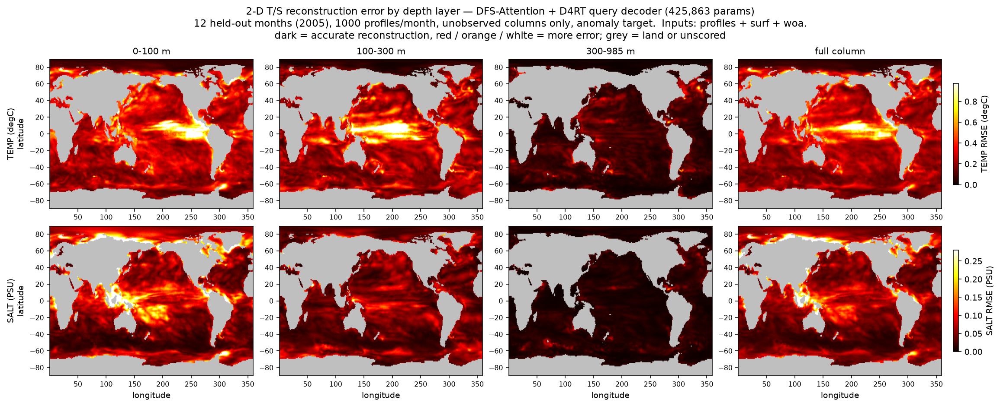
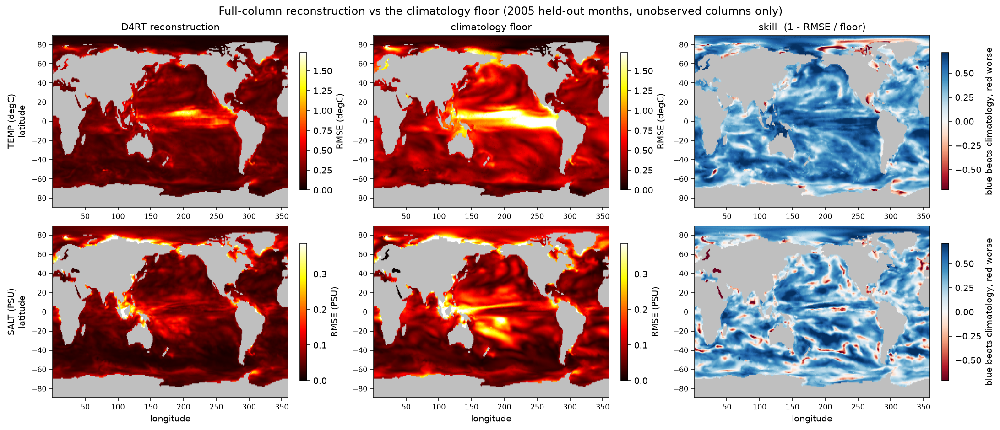

# 2-D T/S Reconstruction + Spatial Error Heatmap

Model: **DFS-Attention fusion over a Perceiver-IO latent + D4RT causal space-time query decoder** (`fusion.D4RTFusion`), lead 0 (reconstruction only), 445,703 parameters.

Data: CESM2-LE 1x1deg — train 2000-2003 (48 mo) / val 2004 (12 mo) / test 2005 (12 mo), 1000 synthetic Argo profiles per month.

Inputs: **profiles + surf + woa + ssh** (WOA23 decav91C0 monthly 1&deg;, the background DFS-Attention references its evidence against).

> **Caveat — short month window.** This run uses 48/12/12 train/val/test months, not protocol_v1's 276/36/12, so the numbers are not directly comparable with the tables elsewhere in `reports/`.

Scoring excludes the full column of every supplied profile (unobserved-only), so the model cannot score by echoing its input.

## Headline (test, full column)

| var | D4RT RMSE | climatology floor | skill |
|-----|-----------|-------------------|-------|
| TEMP | 0.3102 degC | 0.5898 degC | +47.4% |
| SALT | 0.0755 PSU | 0.1130 PSU | +33.2% |

## By depth band

| var | band | D4RT RMSE | floor | skill |
|-----|------|-----------|-------|-------|
| TEMP | 0-100m | 0.3584 | 0.7307 | +50.9% |
| TEMP | 100-300m | 0.3414 | 0.5901 | +42.1% |
| TEMP | 300-max | 0.0956 | 0.1385 | +31.0% |
| SALT | 0-100m | 0.1064 | 0.1594 | +33.3% |
| SALT | 100-300m | 0.0521 | 0.0778 | +33.0% |
| SALT | 300-max | 0.0146 | 0.0201 | +27.3% |

## Error heatmap by depth layer

Rows are TEMP / SALT, columns are oceanographic layers plus the pooled column. **Darker = better reconstruction; brighter red / orange / yellow = more error.** Land and never-scored cells are grey. Each row shares one colour scale across its panels, so layers are directly comparable.

| var | panel | median RMSE | median floor |
|-----|-------|-------------|--------------|
| TEMP | 0-100 m | 0.2554 degC | 0.4831 degC |
| TEMP | 100-300 m | 0.2217 degC | 0.3140 degC |
| TEMP | 300-985 m | 0.0629 degC | 0.0825 degC |
| TEMP | full column | 0.2290 degC | 0.3844 degC |
| SALT | 0-100 m | 0.0622 PSU | 0.0949 PSU |
| SALT | 100-300 m | 0.0396 PSU | 0.0540 PSU |
| SALT | 300-985 m | 0.0095 PSU | 0.0128 PSU |
| SALT | full column | 0.0501 PSU | 0.0788 PSU |

## Against the climatology floor

Full-column reconstruction, the climatology floor on the same colour scale, and the skill ratio. Blue beats climatology, red is worse than it — the honest read of whether the model is adding anything over simply predicting the seasonal mean.

Per-cell values pool the levels in each layer x 12 test months (42,337 ocean cells scored), converted to physical units with each level's anomaly std, so a cell's number is a physical RMSE.

Run record: `outputs/cache/d4rt_recon_ssh_p1000_s1234.json`
