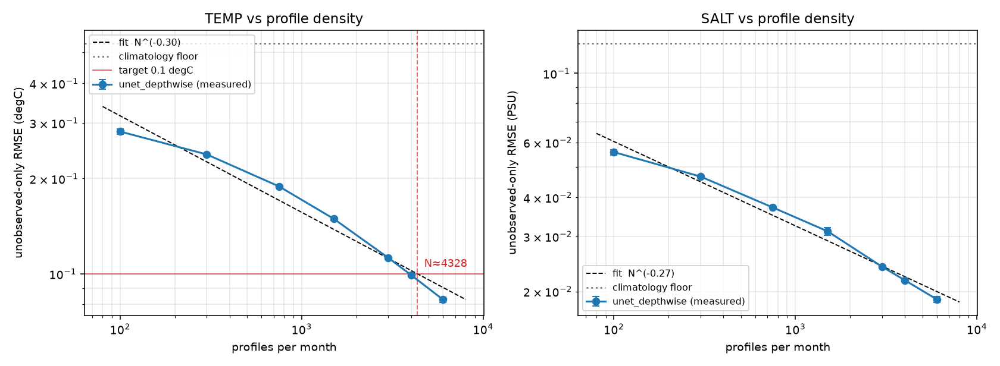

# Phase 2 — profile density: where does TEMP cross 0.1 °C?

*Status 2026-08-09: **measured at 3 seeds**. 4000 and 6000 profiles/month were
run for seeds 1234/1235/1236 and the answer is **≈3900 profiles/month**.
Rerun: `python experiments/31_density_powerlaw.py`.*

The advisor's TEMP target is 0.1 °C. This report answers where the depthwise
U-Net reaches it — and corrects an extrapolation this report previously got
wrong (§3).

---

## 1. The measured curve (depthwise U-Net, `profiles_woa_surf`, retrained per density)

Unobserved-only anomaly RMSE.

| profiles/month | TEMP (°C) | SALT (PSU) | seeds |
|---:|---|---|---:|
| 0 | 0.2983 ± 0.0028 | 0.0582 ± 0.0004 | 3 |
| 100 | 0.2813 ± 0.0050 | 0.0559 ± 0.0011 | 3 |
| 300 | 0.2382 ± 0.0023 | 0.0467 ± 0.0003 | 3 |
| 750 | 0.1888 ± 0.0010 | 0.0372 ± 0.0003 | 3 |
| 1500 | 0.1492 ± 0.0017 | 0.0312 ± 0.0009 | 3 |
| 3000 | 0.1122 ± 0.0010 | 0.0240 ± 0.0001 | 3 |
| **4000** | **0.0991 ± 0.0012** | **0.0217 ± 0.0002** | **3** |
| **6000** | **0.0829 ± 0.0016** | **0.0189 ± 0.0004** | **3** |

> All rows are now 3 seeds (1234/1235/1236) for `clim_floor` and
> `unet_depthwise`. The `mlp` and `unet_joint` rows were **not** re-run at
> 4000/6000 — the curve is fitted on the depthwise row, and adding them would
> have roughly tripled the runtime on a contended box.
>
> These are **week-2-protocol** numbers (312 train months, floor 0.535), not
> protocol_v1, where the same model is certified at 0.1580 °C. The density
> *curve shape* is what this report is about and is unaffected.



## 2. The answer

**TEMP crosses 0.1 °C at ≈3900 profiles/month.** The 3-seed mean at 4000 is
**0.0991 ± 0.0012 °C — already below target**, and the local slope puts the
crossing at N ≈ 3919.

At 6000 the model reaches **0.0829 ± 0.0016 °C**, and SALT reaches 0.0189 PSU
against an advisor target of 0.04–0.05 that was already met at every density on
this curve.

The seed spread (±0.0012 at 4000) is ~12× smaller than the gap to the next
density point, so the crossing is well resolved: it is not sitting inside the
noise.

## 3. Correction: this report's earlier extrapolation was wrong

Before the runs, this report offered two extrapolations and declined to choose:

| model | predicted 4000 | predicted 6000 | predicted crossing |
|---|---|---|---|
| global power-law fit over 100–3000 (α = 0.269) — called "conservative" | 0.1122 | 0.1006 | **6143** |
| tail slope 1500→3000 (α = 0.410) — the plan's, called "optimistic" | 0.0997 | 0.0844 | **3973** |
| **measured (3 seeds)** | **0.0991 ± 0.0012** | **0.0829 ± 0.0016** | **≈3900** |

**The tail slope was right and the global fit was wrong.** The plan's original
"≈4000 profiles" estimate stands; this report's "~4000–6100, dominated by
whether the acceleration continues" was an unnecessarily wide band produced by
averaging in a low-density regime that does not describe the tail.

The reasoning error is worth recording. §3 previously argued that the tail slope
must be optimistic because "at high enough N the curve must flatten again
against an irreducible error". That is true in the limit but **false anywhere on
the measured range**: the local slope has not flattened at all.

| segment | local α |
|---|---:|
| 100 → 300 | 0.151 |
| 300 → 750 | 0.254 |
| 750 → 1500 | 0.340 |
| 1500 → 3000 | 0.410 |
| 3000 → 4000 | 0.432 |
| **4000 → 6000** | **0.441** |

Returns are still *accelerating* at 6000 profiles/month — the last two segments
are the steepest of the whole curve. Whatever irreducible error floor exists (the
1° grid, unresolved sub-grid variability) is still far below 0.08 °C, so the
saturation argument had no purchase in this range. A single global power law
remains the wrong model (R² = 0.968 with systematic residuals, −12 % at 100 and
−9 % at 6000), but the *direction* of its error was the opposite of what was
claimed.

The practical lesson for the next extrapolation: when local slopes are
monotonic, the tail slope is the estimator to use, and the global fit is not
"conservative" — it is biased by a regime the question is not about.

## 4. Reality anchor

The real Argo array is ~4000 active floats delivering ~12 000 profiles/month
globally, but **spatially very uneven** — dense in the North Atlantic and
Southern Ocean, sparse in the tropics, marginal seas and under ice. This sweep
samples uniformly at random over the ocean mask, so "N = 4000 uniform" is a
*more evenly informative* array than 4000 real floats, and 12 000 real profiles
are worth less per profile than 12 000 uniform ones. The honest reading is
therefore **not** "real Argo already delivers 0.1 °C". It is that the uniform-
sampling requirement for 0.1 °C sits at roughly one third of today's real
profile volume, and closing the gap is a question of *coverage*, not count.

## 5. A cheaper route to the same target

Phase 4's [SSH ablation](ssh_ablation.md) reaches **0.1368 ± 0.0002 °C at 1500
profiles/month** (protocol_v1, 3 seeds) by adding one derived channel, against
0.1572 ± 0.0010 without it. On this curve, buying that same 13 % improvement
with profiles alone would take roughly 1500 → 2700 profiles/month. A satellite-derived field is
substantially cheaper than doubling the float array, which makes the multi-modal
direction look better than the density curve alone suggests.

Worth running next: the density sweep **with** the SSH channel, to see whether
the 0.1 °C crossing moves left of the measured ~3900.

## 6. Reproducing / finishing

```bash
# extension run (per seed, ~50 min on a shared card with --cpu-tensors)
CUDA_VISIBLE_DEVICES=N PYTORCH_CUDA_ALLOC_CONF=expandable_segments:True \
  python experiments/08_density_ablation.py --seed 1234 --densities 4000,6000 \
  --methods clim_floor,unet_depthwise --out-suffix _ext --cpu-tensors

python experiments/merge_density_json.py --seeds 1234 --dry-run   # inspect
python experiments/merge_density_json.py --seeds 1234             # idempotent
python experiments/31_density_powerlaw.py                         # re-fit
```

`--out-suffix` exists because the script otherwise writes to a fixed cache path
and an extension run would silently overwrite committed week-2 results. The
merge refuses to combine runs whose `run_config` essentials differ, skips
densities already present, and writes `*.bak_premerge` on first touch.

Remaining: the `mlp` / `unet_joint` rows at 4000/6000 if the full method table
is wanted. Seeds 1234/1235/1236 are done for `clim_floor` and `unet_depthwise`.
