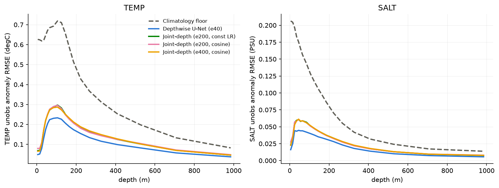

# Depth-Band Evaluation (Task 8) — frozen 20-level grid, protocol_v1

- **Grid:** 20 levels, 5-984.7 m. **There is no >1000 m band in this protocol** (last week's '>1000 m' label is retired here; the extended 23-level run lives in `layered_depth_eval.md` and is never mixed in).
- **Metric:** unobserved-only anomaly RMSE, valid-cell-weighted (every scored cell equal; area-x-thickness weighting is a planned secondary column). Bands: 0-100 / 100-300 / 300-max.
- Scored cells per band (12 test months): 0-100m: 3,867,093, 100-300m: 3,243,419, 300-max: 2,190,356.

## TEMP (degC)

| model | full column | 0-100m | 100-300m | 300-max | skill (full) |
|---|---|---|---|---|---|
| Climatology floor (train-only) | 0.5520 | 0.6485 | 0.5844 | 0.2140 | — |
| Depthwise U-Net (e40) | 0.1580 | 0.1589 | 0.1916 | 0.0837 | +0.714 |
| Joint-depth (e200, const LR) | 0.1960 | 0.1980 | 0.2365 | 0.1049 | +0.645 |
| Joint-depth (e200, cosine) | 0.1959 | 0.2009 | 0.2333 | 0.1051 | +0.645 |
| Joint-depth (e400, cosine) | 0.1948 | 0.1973 | 0.2341 | 0.1063 | +0.647 |

## SALT (PSU)

| model | full column | 0-100m | 100-300m | 300-max | skill (full) |
|---|---|---|---|---|---|
| Climatology floor (train-only) | 0.1305 | 0.1804 | 0.0974 | 0.0279 | — |
| Depthwise U-Net (e40) | 0.0325 | 0.0393 | 0.0332 | 0.0119 | +0.751 |
| Joint-depth (e200, const LR) | 0.0422 | 0.0525 | 0.0410 | 0.0150 | +0.676 |
| Joint-depth (e200, cosine) | 0.0423 | 0.0528 | 0.0406 | 0.0149 | +0.676 |
| Joint-depth (e400, cosine) | 0.0420 | 0.0519 | 0.0412 | 0.0153 | +0.678 |

## Takeaways

- **Hardest layer:** 100-300m — depthwise U-Net TEMP RMSE 0.1916 degC vs 0.0837 in the easiest band. The thermocline band remains where anomaly variance (and thus headroom for the fusion method) concentrates; the deep band's small absolute errors reflect shrinking variance, not model skill saturation.
- **Depthwise vs joint-depth:** the depthwise model leads in every band (e.g. 100-300m: 0.1916 vs 0.2341 degC) even after the joint model's audit (validation selection, cosine decay, 2x budget) — consistent with the 23-level secondary run. The joint-depth model is kept as the certified matched-input *control*, not as the stronger baseline.
- This is supporting analysis for the baseline table, not the core novelty result (the MBCA invariance work is).