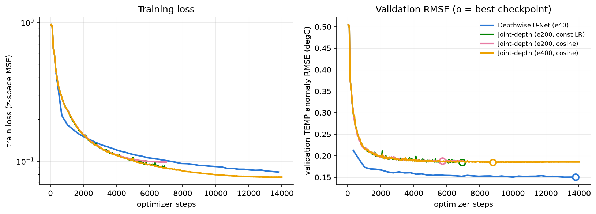

# Joint-Depth U-Net Audit (Task 1) — protocol_v1

- **Protocol:** 276 train / 36 val (2008-2010) / 12 pinned test months; train-only climatology + anomaly target; unobserved-only RMSE; config `profiles_woa_surf`; seed 1234.
- **Goal:** certify the joint-depth U-Net as a *fairly trained* baseline (it does not need to beat the depthwise model).

## Budget & result table

| model | schedule | epochs | optimizer steps | batch | params | GPU-h | best val epoch | val TEMP | val SALT | **test TEMP** | **test SALT** |
|---|---|---|---|---|---|---|---|---|---|---|---|
| Depthwise U-Net (e40) | const | 40 | 13,800 | 16 | 469,858 | 0.19 | 40 | 0.1505 | 0.0306 | **0.1580** | **0.0325** |
| Joint-depth (e200, const LR) | const | 200 | 7,000 | 8 | 1,104,136 | 0.23 | 198 | 0.1842 | 0.0379 | **0.1960** | **0.0422** |
| Joint-depth (e200, cosine) | cosine | 200 | 7,000 | 8 | 1,104,136 | 0.23 | 164 | 0.1878 | 0.0383 | **0.1959** | **0.0423** |
| Joint-depth (e400, cosine) | cosine | 400 | 14,000 | 8 | 1,104,136 | 0.44 | 251 | 0.1848 | 0.0376 | **0.1948** | **0.0420** |
| Climatology floor | — | — | — | — | — | — | — | — | — | 0.5520 | 0.1305 |

## The five audit questions

1. **Has validation plateaued?** Late-training val-TEMP slope of the largest-budget run is +1.43e-06 degC/epoch — yes, plateaued.
2. **Does LR decay help?** At equal budget (e200), cosine decay moves test TEMP 0.1960 -> 0.1959 degC (+0.0%).
3. **Is the joint model receiving fewer updates?** Yes by construction: 7,000 steps (e200) vs 13,800 for the depthwise model — the joint model sees 1 gradient/month vs 20 gradients/month (per-slice).
4. **Does doubling the budget close the gap?** e200-cos -> e400-cos changes test TEMP by +0.5% (0.1959 -> 0.1948).
5. **Under-training or architecture?** With a validation-selected checkpoint, LR decay, and a 2x step budget the joint model still trails the depthwise model by +23.3% test TEMP (0.1948 vs 0.1580). The remaining gap is **architectural** (channel-stacked depth loses the per-level spatial prior), not budget — the joint-depth baseline is now certified fairly trained, and further tuning weeks are NOT warranted (stopping rule of the brief).

## Definition of done

- [x] training/validation curves (fig_audit_curves.png)
- [x] final baseline table (above)
- [x] frozen best checkpoints: `outputs/ckpt/audit_depthwise_e40.pt`, `outputs/ckpt/audit_joint_e200_const.pt`, `outputs/ckpt/audit_joint_e200_cos.pt`, `outputs/ckpt/audit_joint_e400_cos.pt`
- [x] reproducible commands: header of `experiments/13_joint_audit.py`
- [x] conclusion: joint-depth baseline **closed** — use `audit_joint_e400_cos.pt` as the joint-depth reference and stop tuning.