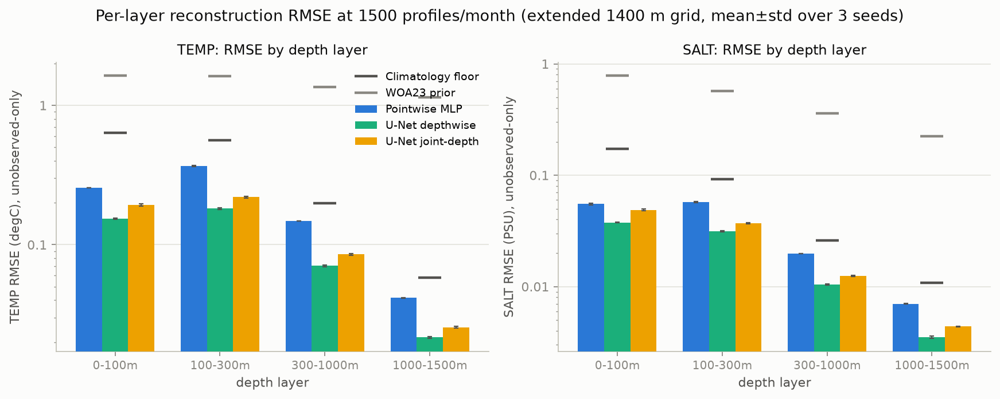
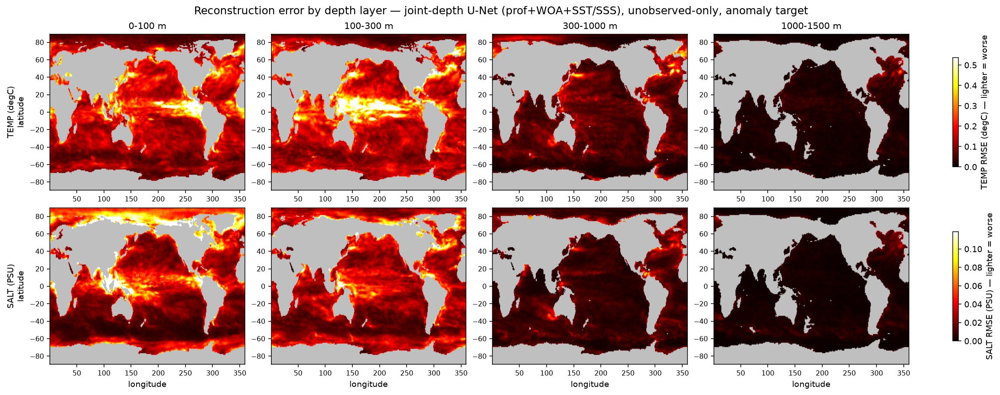

# Phase-1 — Layered Depth Evaluation (extended grid to 1400 m)

- **Question (professor):** measure RMSE by ocean depth layer, incl. a >1000 m layer.
- **Extended grid:** 23 levels to **1400 m** (was 20 to 985 m). Capped at 1400 m because WOA23 — the prior and an input feature — reaches only 1500 m; the CESM2 anomaly target/floor are defined at all depths.
- **Layers:** 0-100m, 100-300m, 300-1000m, 1000-1500m (surface/mixed-layer · thermocline · intermediate · deep).
- **Protocol:** train-only monthly CESM2 anomaly target, **unobserved-only RMSE**, config `profiles_woa_surf`, **1500 profiles/month**, 312 train / 12 test months. Seeds [1234, 1235, 1236] (fixed month split; seeds vary profile sampling + training).
- **Per-layer RMSE** pools squared errors over the band's depths (valid-cell-weighted = true RMSE over that ocean volume).
- **Commit:** `ec12ccfbe178`

## TEMP RMSE (degC) — mean ± std over 3 seeds

| method | full-column | 0-100m | 100-300m | 300-1000m | 1000-1500m |
|---|---|---|---|---|---|
| WOA23 prior | 1.5225 ± 0.0003 | 1.6411 ± 0.0005 | 1.6136 ± 0.0003 | 1.3504 ± 0.0004 | 1.1438 ± 0.0003 |
| Climatology floor (train-only) | 0.5027 ± 0.0002 | 0.6329 ± 0.0003 | 0.5631 ± 0.0003 | 0.1990 ± 0.0001 | 0.0582 ± 0.0000 |
| Pointwise MLP | 0.2651 ± 0.0017 | 0.2559 ± 0.0008 | 0.3678 ± 0.0044 | 0.1478 ± 0.0004 | 0.0416 ± 0.0003 |
| U-Net (depthwise) | 0.1413 ± 0.0005 | 0.1544 ± 0.0014 | 0.1816 ± 0.0023 | 0.0705 ± 0.0009 | 0.0216 ± 0.0004 |
| U-Net (joint-depth) | 0.1731 ± 0.0029 | 0.1925 ± 0.0038 | 0.2194 ± 0.0040 | 0.0854 ± 0.0013 | 0.0256 ± 0.0004 |

## SALT RMSE (PSU) — mean ± std over 3 seeds

| method | full-column | 0-100m | 100-300m | 300-1000m | 1000-1500m |
|---|---|---|---|---|---|
| WOA23 prior | 0.5999 ± 0.0002 | 0.7878 ± 0.0003 | 0.5721 ± 0.0002 | 0.3605 ± 0.0001 | 0.2242 ± 0.0001 |
| Climatology floor (train-only) | 0.1172 ± 0.0000 | 0.1732 ± 0.0001 | 0.0920 ± 0.0000 | 0.0259 ± 0.0000 | 0.0108 ± 0.0000 |
| Pointwise MLP | 0.0470 ± 0.0004 | 0.0551 ± 0.0008 | 0.0574 ± 0.0004 | 0.0197 ± 0.0001 | 0.0070 ± 0.0000 |
| U-Net (depthwise) | 0.0291 ± 0.0002 | 0.0377 ± 0.0003 | 0.0312 ± 0.0003 | 0.0104 ± 0.0001 | 0.0035 ± 0.0001 |
| U-Net (joint-depth) | 0.0364 ± 0.0003 | 0.0488 ± 0.0008 | 0.0369 ± 0.0005 | 0.0125 ± 0.0002 | 0.0044 ± 0.0000 |

## Per-layer RMSE

## Spatial error structure by layer

## Takeaways

- **Absolute error is concentrated in the upper ocean.** The depthwise U-Net's TEMP RMSE falls from ~0.18 degC in the 100–300 m thermocline to ~0.022 degC in the 1000–1500 m deep layer — an ~8× spread. The WOA prior and the climatology floor fall with depth too, so this is variance shrinking, not the model failing.
- **Skill over climatology is roughly constant with depth.** The depthwise U-Net's skill (1 − RMSE/floor) is +0.76 / +0.68 / +0.65 / +0.63 across 0–100 / 100–300 / 300–1000 / 1000–1500 m. Even the >1000 m layer beats its climatology floor (~0.022 vs 0.058 degC): the deep ocean is *not* just climatology — the profiles carry recoverable deep anomaly signal.
- **The thermocline (100–300 m) is the hardest layer** in absolute RMSE for every method, above even the mixed layer (which the SST/SSS surface fields help constrain). The layered view localises where a shared-latent method has the most upper-ocean error to win back.
- **Method ranking holds at every depth:** depthwise U-Net < joint-depth U-Net < MLP, consistent with the 985 m week-2 result — the joint-depth 'strong baseline' is still the weaker U-Net layer by layer.
