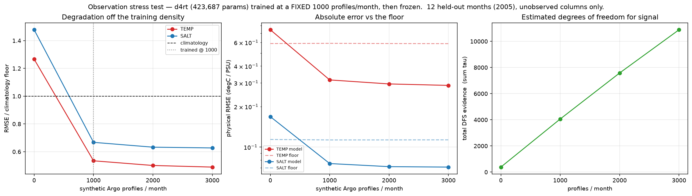

# Observation stress test — `d4rt`

One model, trained once at a **fixed 1000 synthetic Argo profiles/month**, then frozen and pushed off that density. This is the counterpart `experiments/08_density_ablation.py` names in its own docstring (that sweep retrains every baseline per density; this one never refits).

Model: d4rt (423,687 params), inputs profiles + surf + woa, test 2005 (12 months), unobserved columns only, anomaly target. Floor = predicting zero anomaly (the train-only monthly climatology), recomputed per cell because the scored pool changes with density.

## 1. Profile density

| profiles/month | TEMP RMSE | TEMP floor | TEMP ratio | SALT ratio | DFS evidence |
|---|---|---|---|---|---|
| 0 | 0.7449 | 0.5882 | 1.2663 | 1.4783 | 383.4 |
| 1000 **(trained here)** | 0.3155 | 0.5903 | 0.5344 | 0.6674 | 4062.5 |
| 2000 | 0.2946 | 0.5883 | 0.5007 | 0.6326 | 7580.2 |
| 3000 | 0.2873 | 0.5872 | 0.4892 | 0.6272 | 10885.0 |

## 2. Redundancy — the same profiles re-ingested

Identical columns supplied 2x/3x: more tokens, no new physical evidence. DFS-Attention should discount the copies.

| copies | live tokens | TEMP ratio | SALT ratio | DFS evidence |
|---|---|---|---|---|
| x1 (reference) | 12507 | 0.5344 | 0.6674 | 4062.5 |
| x2 | 16289 | 0.5406 | 0.6647 | 4080.0 |
| x3 | 20121 | 0.5341 | 0.6739 | 4116.6 |

## 3. Coverage — same count, confined to a longitude band

| band (fraction of lon) | TEMP ratio | SALT ratio |
|---|---|---|
| 0.25 (90 deg) | 0.9730 | 0.9638 |
| 0.1 (36 deg) | 1.0817 | 1.0392 |

## 4. Modality dropout

| inputs | TEMP ratio | SALT ratio |
|---|---|---|
| full | 0.5319 | 0.6684 |
| no_surf | 0.5316 | 0.6893 |
| no_woa | 0.5336 | 0.6666 |
| profiles_only | 0.5328 | 0.6866 |
| no_profiles | 1.2648 | 1.4738 |

## Figure

## How to read this

* Ratio approaching 1.0 as density falls, without exceeding it, is the background-referenced fallback working as claimed (`fusion.DFSAttention`: thin evidence -> climatology).

* A ratio **above** 1.0 at low density means the model over-trusts sparse observations — `log_lambda_bg` is not carrying its weight. That is a finding, not a failed run.

* Duplicated profiles moving the prediction means the evidence estimator is not discounting redundancy, which is the DFS premise.

Run record: `outputs/cache/stress_d4rt_d1000_s1234.json`
