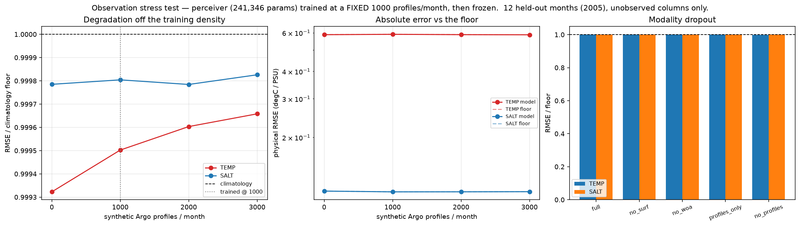

# Observation stress test — `perceiver`

> ## Read this first: the model collapsed to climatology

> Every cell below sits within **0.0007** of the climatology floor (ratio 1.0). The training target is the anomaly in z-space, so predicting ~0 everywhere reproduces the climatology exactly and scores 1.0 *by construction* — and that is the degenerate solution this model found.

> **The flat rows are therefore NOT evidence of robustness.** A model that ignores its observation tokens is trivially invariant to removing them, duplicating them, clustering them, or dropping whole modalities. These axes can only discriminate on a model that actually reads its inputs, so for this run they are uninformative rather than passing.

> What the density axis *does* establish is the collapse itself: identical output at 0 and 3000 profiles is direct evidence the observation pathway is unused. A single-density evaluation would have reported 'near the floor' and hidden that.

One model, trained once at a **fixed 1000 synthetic Argo profiles/month**, then frozen and pushed off that density. This is the counterpart `experiments/08_density_ablation.py` names in its own docstring (that sweep retrains every baseline per density; this one never refits).

Model: perceiver (241,346 params), inputs profiles + surf + woa, test 2005 (12 months), unobserved columns only, anomaly target. Floor = predicting zero anomaly (the train-only monthly climatology), recomputed per cell because the scored pool changes with density.

## 1. Profile density

| profiles/month | TEMP RMSE | TEMP floor | TEMP ratio | SALT ratio |
|---|---|---|---|---|
| 0 | 0.5878 | 0.5882 | 0.9993 | 0.9998 |
| 1000 **(trained here)** | 0.5900 | 0.5903 | 0.9995 | 0.9998 |
| 2000 | 0.5880 | 0.5883 | 0.9996 | 0.9998 |
| 3000 | 0.5870 | 0.5872 | 0.9997 | 0.9998 |

## 2. Redundancy — the same profiles re-ingested

Identical columns supplied 2x/3x: more tokens, no new physical evidence. DFS-Attention should discount the copies.

| copies | live tokens | TEMP ratio | SALT ratio |
|---|---|---|---|
| x1 (reference) | 12507 | 0.9995 | 0.9998 |
| x2 | 16289 | 0.9996 | 0.9998 |
| x3 | 20121 | 0.9996 | 0.9998 |

## 3. Coverage — same count, confined to a longitude band

| band (fraction of lon) | TEMP ratio | SALT ratio |
|---|---|---|
| 0.25 (90 deg) | 0.9995 | 0.9998 |
| 0.1 (36 deg) | 0.9995 | 0.9998 |

## 4. Modality dropout

| inputs | TEMP ratio | SALT ratio |
|---|---|---|
| full | 0.9995 | 0.9998 |
| no_surf | 0.9998 | 0.9997 |
| no_woa | 0.9994 | 0.9999 |
| profiles_only | 0.9999 | 0.9998 |
| no_profiles | 0.9993 | 0.9998 |

## Figure

## How to read this

* Ratio approaching 1.0 as density falls, without exceeding it, is the background-referenced fallback working as claimed (`fusion.DFSAttention`: thin evidence -> climatology).

* A ratio **above** 1.0 at low density means the model over-trusts sparse observations — `log_lambda_bg` is not carrying its weight. That is a finding, not a failed run.

* Duplicated profiles moving the prediction means the evidence estimator is not discounting redundancy, which is the DFS premise.

Run record: `outputs/cache/stress_perceiver_d1000_s1234.json`
