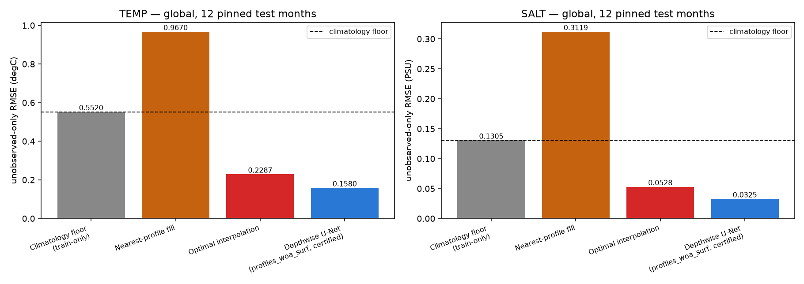
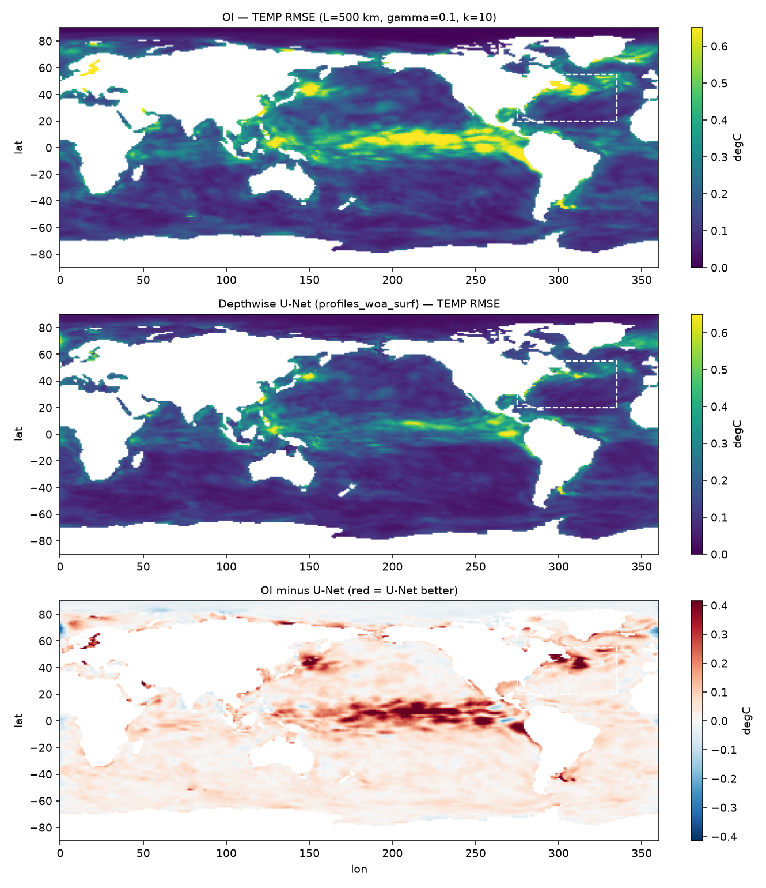

# Milestone M1 — Optimal Interpolation vs the learned reconstructors

*protocol_v1 · 12 pinned test months · 1500 profiles/month · seed 1234 · commit `ac90064d` · 0.07 CPU-hours.*

**The M1 question**: does the learned method match or beat optimal interpolation, the operational standard behind EN4, the Roemmich-Gilson Argo climatology and ISAS? If not, the method is not yet useful.

## Setup

* OI hyperparameters (frozen on validation months, see [oi_tuning.md](oi_tuning.md)): TEMP L=500 km, gamma=0.1, k=10; SALT L=500 km, gamma=0.1, k=10
* **Every method sees byte-identical observations.** `27_oi_vs_unet.py` replays the certified run's RNG (312 discarded profile draws) so the profile positions are exactly those `audit_depthwise_e40` was scored on.
* Verification: the certified checkpoint reproduces its cached test RMSE to 1.0e-06 (PASS).

> **Seed discipline.** Every number below is **1 seed** (seed 1234). The repo's headline convention is 3 seeds (1234/1235/1236) reported as mean ± std, so these are not final figures. For scale, the 3-seed spread of comparable rows is small — the pointwise MLP varies by ±0.0003 °C and the nearest-profile fill by ±0.0012 °C — so the ~31 % margin is far outside seed noise, but the numbers themselves should be quoted as single-seed until seeds 1235/1236 land. OI is deterministic given its samples, so its only seed dependence is the profile draw itself.

## 1. Headline — unobserved-only anomaly RMSE

| method | TEMP (degC) | SALT (PSU) | skill vs floor (TEMP) |
|---|---|---|---|
| WOA23 prior | 1.5670 | 0.6342 | -1.839 |
| Climatology floor (train-only) | 0.5520 | 0.1305 | +0.000 |
| Nearest-profile fill | 0.9670 | 0.3119 | -0.752 |
| **Optimal interpolation** | 0.2287 | 0.0528 | +0.586 |
| Depthwise U-Net (profiles_woa_surf, certified) | 0.1580 | 0.0325 | +0.714 |

### Verdict

The full system (depthwise U-Net, profiles+WOA+SST/SSS) **beats** optimal interpolation: **+30.9 % on TEMP** (0.2287 → 0.1580 degC) and **+38.4 % on SALT** (0.0528 → 0.0325 PSU).

> The `profiles_only` U-Net row (the like-for-like information comparison) still needs a free GPU: `CUDA_VISIBLE_DEVICES=N python experiments/27_oi_vs_unet.py --train-profiles-only`. Until it lands, the comparison above confounds *better interpolator* with *more inputs*.

### Context: where OI sits among the existing protocol_v1 rows

> **Caveat.** These rows come from `baselines_protocol_v1.json`, which drew its test-month profiles from a *different position* in the RNG stream (it skips 276 train draws; this script skips 276 + 36 to land on the certified U-Net's state). They are therefore the same protocol and the same distribution but **not the same profiles** — indicative, not identical-sample. The table in §1 is the identical-sample one. For scale, the nearest-profile row differs by 0.0075 degC between the two draws.

| method | TEMP (degC) | SALT (PSU) |
|---|---|---|
| Pointwise MLP (3 seeds) | 0.2983 ± 0.0003 | 0.0525 ± 0.0003 |
| **Optimal interpolation** (this run) | **0.2287** | **0.0528** |
| Shared-latent fusion variants (3 seeds) | ~0.52 | ~0.12 |

**A properly tuned classical baseline beats the learned pointwise model**: OI 0.2287 vs MLP 0.2983 degC (+23.4 %). Only the convolutional U-Nets clear it. This is worth carrying into the paper line: an OI row belongs in any table that claims a learned method is useful, and the shared-latent variants (~0.52, near the floor) are currently far below it.

## 2. Depth bands (global)

| method | TEMP 0-100m | TEMP 100-300m | TEMP 300-max |
|---|---|---|---|
| WOA23 prior | 1.6412 | 1.6130 | 1.3508 |
| Climatology floor (train-only) | 0.6485 | 0.5844 | 0.2140 |
| Nearest-profile fill | 1.0510 | 1.0000 | 0.7342 |
| **Optimal interpolation** | 0.2509 | 0.2622 | 0.0953 |
| Depthwise U-Net (profiles_woa_surf, certified) | 0.1589 | 0.1916 | 0.0837 |

Gain of the U-Net over OI, by band: **0-100m** +36.7 % · **100-300m** +26.9 % · **300-max** +12.1 %.

**The gain is largest at the surface, not in the thermocline — and that is the expected result once stated carefully.** The plan predicted the 100-300 m band on the reasoning that "OI cannot use SST/SSS". The premise is right but the conclusion does not follow: SST and SSS are *dense observations of the 0-100 m layer itself*, so the modality OI lacks constrains the surface directly and the thermocline only indirectly, through learned covariance. The ordering above is what that mechanism predicts.

Note also that OI is the *only* method here whose 100-300 m error exceeds its 0-100 m error (0.2622 > 0.2509): with profiles alone, the thermocline is genuinely the hardest layer. The U-Net inverts that ordering by using the surface fields.

**Testable prediction this makes**: the `profiles_only` U-Net (pending a GPU) should show a *much* smaller 0-100 m advantage over OI than the full system does, because it loses exactly the modality that produces this band's gain. If it does not, this explanation is wrong and the advantage is coming from the convolutional prior instead.

## 3. Regional check — North Atlantic box (20-55 N, 275-335 E, 2100 cells)

Gulf Stream + subtropical gyre — a high-eddy-energy region where interpolation is hardest.

| method | TEMP (degC) | SALT (PSU) | TEMP vs global |
|---|---|---|---|
| WOA23 prior | 2.1768 | 0.5809 | 1.39x |
| Climatology floor (train-only) | 0.6459 | 0.1455 | 1.17x |
| Nearest-profile fill | 1.3265 | 0.3437 | 1.37x |
| **Optimal interpolation** | 0.3139 | 0.0625 | 1.37x |
| Depthwise U-Net (profiles_woa_surf, certified) | 0.1938 | 0.0335 | 1.23x |

Regional margin over OI: +38.3 % vs +30.9 % globally — consistent with the global conclusion.

## 4. Figures

## 5. References

* Bretherton, Davis & Fandry (1976), *A technique for objective analysis and design of oceanographic experiments*, Deep-Sea Res. — the OI weight equation implemented in `oi.py`.
* Roemmich & Gilson (2009), *The 2004-2008 mean and annual cycle of T/S from Argo*, Prog. Oceanogr. — the operational Argo OI climatology.
* Good, Martin & Rayner (2013), *EN4*, JGR Oceans.
* Gaillard et al. (2016), *ISAS*, J. Climate.

---

Rerun: `python experiments/27_oi_vs_unet.py --verify-unet` then `python experiments/30_oi_report.py`
