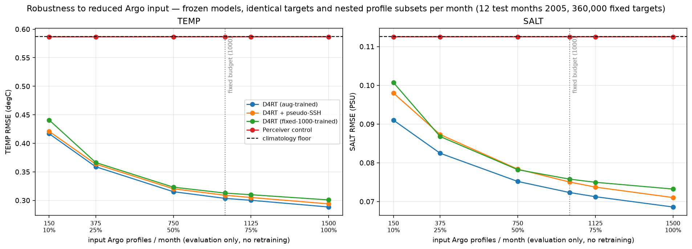

# Eval-only Argo-profile reduction (mentor stress test)

Frozen models, no retraining: the input profile count is reduced at evaluation time — 100%, 75%, 50%, 25%, 10% of 1500, plus the fixed data-budget point(s) [1000] — while the **evaluation targets and the profile subsets are identical for every method** (nested prefix subsets of one permutation per month; one fixed target pool drawn against the 100% set, so the climatology floor is a single line).

Test: 2005 (12 months), 360,000 targets, unobserved columns only, physical full-column RMSE.

Floor: TEMP 0.5870 degC · SALT 0.1126 PSU

## TEMP (degC)

| profiles | D4RT (aug-trained) | D4RT + pseudo-SSH | D4RT (fixed-1000-trained) | Perceiver control |
|---|---|---|---|---|
| 1500 (100%) | 0.2884 | 0.2939 | 0.3008 | 0.5867 |
| 1125 (75%) | 0.3001 | 0.3051 | 0.3099 | 0.5867 |
| 1000 (budget) | 0.3035 | 0.3090 | 0.3128 | 0.5867 |
| 750 (50%) | 0.3152 | 0.3204 | 0.3232 | 0.5866 |
| 375 (25%) | 0.3589 | 0.3636 | 0.3664 | 0.5866 |
| 150 (10%) | 0.4169 | 0.4210 | 0.4409 | 0.5866 |

## SALT (PSU)

| profiles | D4RT (aug-trained) | D4RT + pseudo-SSH | D4RT (fixed-1000-trained) | Perceiver control |
|---|---|---|---|---|
| 1500 (100%) | 0.0686 | 0.0710 | 0.0732 | 0.1125 |
| 1125 (75%) | 0.0712 | 0.0737 | 0.0750 | 0.1125 |
| 1000 (budget) | 0.0723 | 0.0750 | 0.0758 | 0.1125 |
| 750 (50%) | 0.0752 | 0.0784 | 0.0782 | 0.1125 |
| 375 (25%) | 0.0825 | 0.0873 | 0.0868 | 0.1125 |
| 150 (10%) | 0.0910 | 0.0980 | 0.1007 | 0.1125 |

## Figure

## Notes

* Eval-only reduction measures robustness of the existing models; the training-regime companion (retrain at a fixed density, extrapolate) is `experiments/37_obs_stress.py` / `reports/obs_stress_d4rt.md`.

* The Perceiver control collapsed to climatology during training (`reports/obs_stress_perceiver.md`), so its flat curve is the ignore-the-observations reference, not robustness.

Run record: `outputs/cache/profile_reduction_s1234.json`
