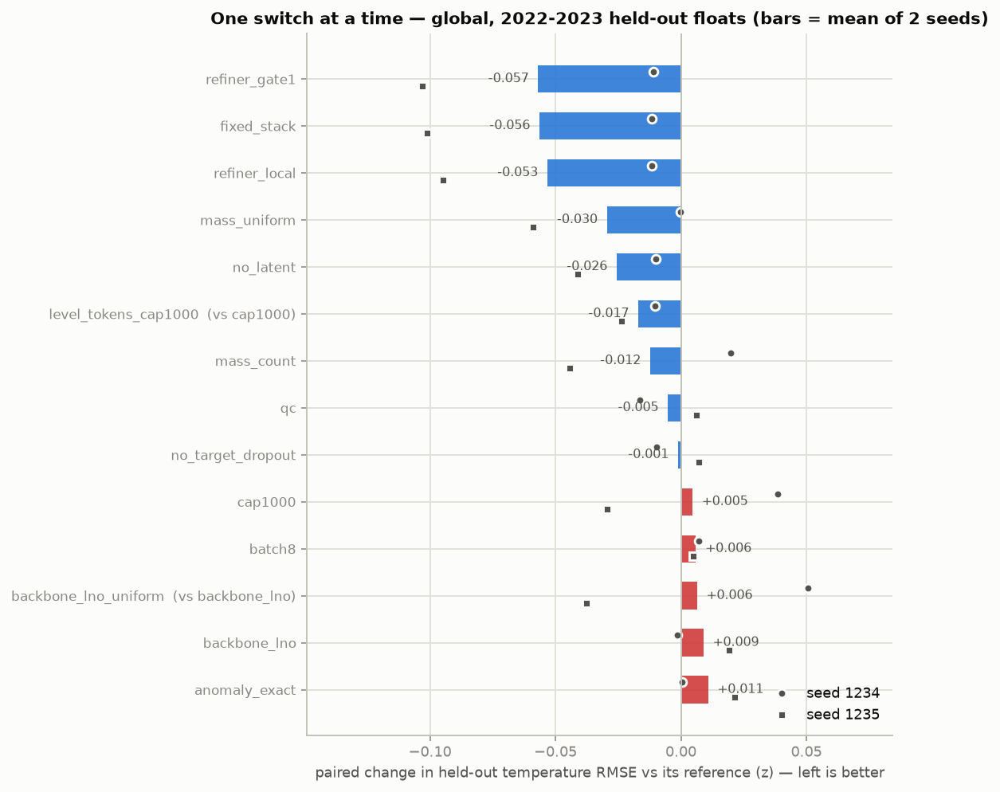
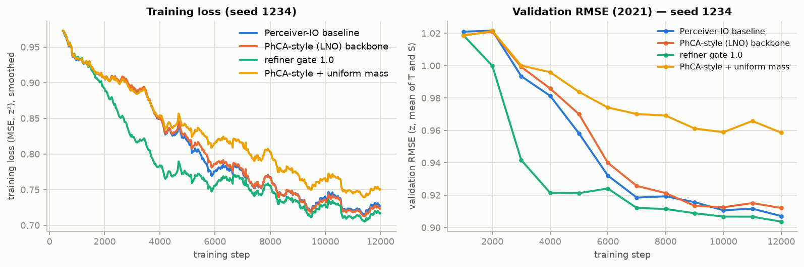

# Ablation ladder — global, one component at a time

<!-- generated by 62_sanity_train.py + 63_audit_report.py — do not edit by hand -->

> Every arm is the same training run with exactly one switch moved, scored on a FIXED held-out set: the same months, the same input profiles and the same held-out floats. Selection uses 2021; the test columns are 2022-2023, scored on every held-out cell. Two seeds per arm.

> **Δ is paired**: the mean over seeds of (arm − reference) at the same seed. The two seeds differ by more than most switches do, so only same-seed differences are meaningful. The reference is the baseline for most arms, `backbone_lno` for the PhCA uniform-mass arm, `cap1000` for per-level tokens.

> **`qc` and `anomaly_exact` change the target itself**; compare those two by J.

## 1. PhCA-style (LNO) fuse vs the Perceiver-IO fuse, with DFS against uniform mass in each

Four arms, nothing else moved: the two fuse stages, each with DFS evidence and with uniform mass. Both use the same D4RT query decoder, the same data and the same seeds. The PhCA-style fuse computes each observation token's weights over 32 latent slots from its **position only** (an MLP on the shared coordinate features) and normalises them **over the slots**, Slot-Attention style, so each token spreads exactly its DFS evidence and slot mass is conserved. It departs from the LNO paper, whose PhCA encoder normalises over the input points, in exactly that respect.

| arm | what it changes | params | TEMP z, seed 1234 | TEMP z, seed 1235 | mean | J TEMP | J SALT | TEMP (°C) | paired Δ (z) | Δ where neither collapsed | reference |
|---|---|---|---|---|---|---|---|---|---|---|---|
| `baseline` | baseline — Perceiver-IO fuse, DFS mass, D4RT decoder | 405,063 | 0.9264 | 1.0172 **collapsed** | 0.9718 | 0.914 | 0.947 | 1.105 | — | — | — |
| `mass_uniform` | uniform mass instead of DFS | 405,063 | 0.9262 | 0.9584 | 0.9423 | 0.886 | 0.926 | 1.067 | -0.0295 | -0.0002 | `baseline` |
| `backbone_lno` | PhCA-style (LNO) fuse instead of Perceiver-IO, 32 slots | 405,543 | 0.9251 | 1.0365 **collapsed** | 0.9808 | 0.922 | 0.955 | 1.115 | +0.0090 | -0.0013 | `baseline` |
| `backbone_lno_uniform` | PhCA-style fuse, uniform mass | 405,543 | 0.9756 | 0.9988 | 0.9872 | 0.928 | 0.945 | 1.123 | +0.0064 | +0.0505 | `backbone_lno` |

Climatology on the same held-out cells: **1.0638 z** (TEMP), **1.1403 z** (SALT); J is RMSE divided by it.

## 2. The full ladder

| arm | what it changes | params | TEMP z, seed 1234 | TEMP z, seed 1235 | mean | J TEMP | J SALT | TEMP (°C) | paired Δ (z) | Δ where neither collapsed | reference |
|---|---|---|---|---|---|---|---|---|---|---|---|
| `refiner_gate1` | refiner output gate 0.05 → 1.0 | 405,063 | 0.9156 | 0.9142 | 0.9149 | 0.860 | 0.900 | 1.035 | -0.0569 | -0.0108 | `baseline` |
| `fixed_stack` | QC + exact climatology + refiner locality + gate | 405,063 | 0.9148 | 0.9161 | 0.9154 | 0.865 | 0.868 | 1.003 | -0.0564 | -0.0116 | `baseline` |
| `refiner_local` | refiner length scales 150 km / 100 m | 405,063 | 0.9147 | 0.9224 | 0.9186 | 0.863 | 0.895 | 1.038 | -0.0532 | -0.0117 | `baseline` |
| `mass_uniform` | uniform mass instead of DFS | 405,063 | 0.9262 | 0.9584 | 0.9423 | 0.886 | 0.926 | 1.067 | -0.0295 | -0.0002 | `baseline` |
| `no_latent` | no global latent (query path only) | 405,063 | 0.9163 | 0.9761 | 0.9462 | 0.889 | 0.931 | 1.074 | -0.0256 | -0.0101 | `baseline` |
| `level_tokens_cap1000` | per-level tokens (at cap 1000) | 405,063 | 0.9548 | 0.9641 | 0.9594 | 0.902 | 0.934 | 1.086 | -0.0170 | -0.0170 | `cap1000` |
| `mass_count` | count mass instead of DFS | 405,063 | 0.9462 | 0.9728 | 0.9595 | 0.902 | 0.951 | 1.087 | -0.0123 | +0.0198 | `baseline` |
| `qc` | robust input QC | 405,063 | 0.9100 | 1.0232 **collapsed** | 0.9666 | 0.918 | 0.941 | 1.079 | -0.0052 | -0.0164 | `baseline` |
| `no_target_dropout` | no target dropout | 405,063 | 0.9168 | 1.0245 **collapsed** | 0.9706 | 0.912 | 0.951 | 1.105 | -0.0012 | -0.0096 | `baseline` |
| `baseline` | baseline — Perceiver-IO fuse, DFS mass, D4RT decoder | 405,063 | 0.9264 | 1.0172 **collapsed** | 0.9718 | 0.914 | 0.947 | 1.105 | — | — | — |
| `cap1000` | cap 1000 profiles / month | 405,063 | 0.9650 | 0.9878 | 0.9764 | 0.918 | 0.964 | 1.108 | +0.0046 | +0.0386 | `baseline` |
| `batch8` | 8 months per optimiser step | 405,063 | 0.9336 | 1.0220 **collapsed** | 0.9778 | 0.919 | 0.957 | 1.112 | +0.0060 | +0.0072 | `baseline` |
| `backbone_lno_uniform` | PhCA-style fuse, uniform mass | 405,543 | 0.9756 | 0.9988 | 0.9872 | 0.928 | 0.945 | 1.123 | +0.0064 | +0.0505 | `backbone_lno` |
| `backbone_lno` | PhCA-style (LNO) fuse instead of Perceiver-IO, 32 slots | 405,543 | 0.9251 | 1.0365 **collapsed** | 0.9808 | 0.922 | 0.955 | 1.115 | +0.0090 | -0.0013 | `baseline` |
| `anomaly_exact` | climatology at the profile's own position | 405,063 | 0.9267 | 1.0385 **collapsed** | 0.9826 | 0.920 | 0.954 | 1.106 | +0.0108 | +0.0003 | `baseline` |

Runs marked **collapsed** end with held-out TEMP J above 0.94: they end near the climatology. When one side of a pair collapsed, the paired Δ mostly measures the collapse; the *Δ where neither collapsed* column is the clean effect of the switch ('—' when every seed of the pair had a collapse).

## 3. Training curves

Both panels show the same four arms in the same colours, on seed 1234: training loss on the left (smoothed; batch size 1), validation RMSE on 2021 on the right. The refiner-gate arm reaches its level by 4 k steps; PhCA with uniform mass stays above the rest in both panels. Per-seed end points, including the seed-1235 collapses, are in the tables above. Every run also logs to W&B (offline in `outputs/wandb/`; `wandb sync outputs/wandb/wandb/offline-run-*`).
