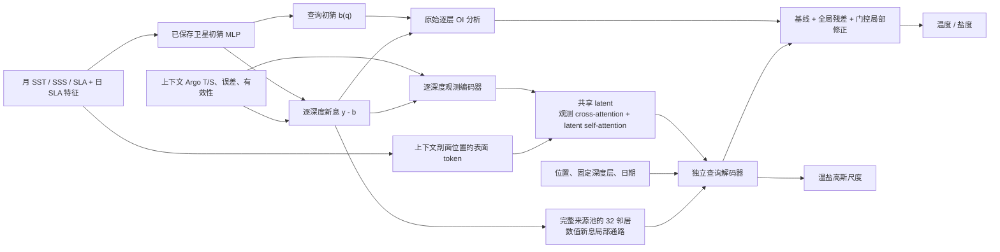

# 多模态海洋潜在状态：架构与完整实验协议

日期：2026-10-07。本文依据当前实现说明目标、组件、计算公式和已登记的实验；训练完成数与实际结果以 [实时结果报告](latent_ocean_20261007.md) 为准。架构实现完成不等于训练、复现实验或研究结论已经完成。

## 1. 目标与当前任务边界

长期目标是由卫星 SST、SSS、SLA 与稀疏 Argo 温盐剖面学习一个共享三维海洋状态，通过位置、深度和日期查询返回温度、盐度及不确定性。当前实验首先研究回顾性重建：目标浮标不提供温盐值，上下文浮标提供同月观测，模型恢复目标浮标上的温盐异常。

当前数据和初猜输出只有 20 个固定深度层：5、15、25、35、45、55、65、85、105、125、145、165.1、186.3、222.6、267.7、326.9、408.8、527.7、707.6、984.7 m。神经解码器接受连续坐标，但实验管线以深度层索引选择初猜和局部新息，尚不支持对任意新深度执行完整推理，也没有证明任意深度的连续重建能力。

同月上下文可能晚于查询日期，因此这些实验不是因果预测。预报需要另设时间截断、仅使用截断前可得产品与观测，并独立定义预报时距和评分集合。

## 2. 当前 backbone 与完整组件

当前 backbone 为“逐深度观测编码器 → 共享 latent Transformer → 独立查询解码器”，外接固定卫星初猜和已有逐层 OI 新息分析，并保留新增的精确数值新息局部通路。不是单独用 Transformer 取代所有已有方法。

实现入口：场景和固定数据协议见 [latent_experiment.py](../../src/ocean_tokenizer/latent_experiment.py)，神经组件见 [latent_ocean.py](../../src/ocean_tokenizer/latent_ocean.py)，原始 OI 与初猜定义见 [anchored.py](../../src/ocean_tokenizer/anchored.py)，训练及严格重放见 [69_latent_ocean.py](../../experiments/real_data/69_latent_ocean.py)。

| 组件 | 真实输入与计算 | 设计目的与边界 |
| --- | --- | --- |
| 卫星与位置特征 | 56 维：球面/位置特征、月份周期、月 SST/SSS/SLA 异常及有效性、月 SST 绝对值、查询日 SLA 异常/与月值差异/东西南北差分及有效性 | 完全复用已保存初猜的特征顺序、归一化和指纹 |
| 初猜 MLP | 56 → 512 → 512 → 512 → 40，输出 20 深度 × 2 变量；训练场景用按年份 cross-fit 缓存 | 减少训练新息中初猜过拟合；本轮不重新选择初猜 |
| 逐深度 Argo token | 62 维外部特征 = 56 卫星位置特征 + 2 初猜 + 2 报告误差特征 + 2 误差有效性；另读该深度的 T/S 新息和独立有效性 | 一个 token 对应一条剖面的一个实际深度层，不做深度带均值；同层 T/S 可以分别缺失 |
| 报告误差 | `log1p(clipped(ERR / train_std))`，并提供有限且非负的有效性 | 缺失误差与真实零误差可区分；不等于已建立测量误差的完整概率模型 |
| 表面 token | 从上下文剖面位置抽取同一 56 维特征，深度坐标置零 | 当前不是完整卫星栅格编码器；特征还包含位置/时间 |
| 坐标编码 | 42 维：球面 xyz 与 Fourier 特征、线性/对数深度与 Fourier 特征、年/月周期日期 | 经度周期连续；坐标编码本身不提供动力学约束 |
| 共享 latent | 可学习 latent，加准均匀球面位置和若干固定深度锚点；每层先读观测，再 latent self-attention，再 FFN/Soft MoE | 共享状态可跨位置、深度和模态交换信息；只是学习到的表示，不是物理状态同化的精确后验 |
| 模态先验 | 活跃 Argo 与表面模态分配相等总 attention prior；每模态内部按 token 数分配，另有 null token | 防止 20 倍 Argo 深度 token 数直接压倒表面 token；不保证重复记录证据不变性 |
| 原始 OI 通路 | 每查询取完整上下文来源池的 32 个空间近邻，使用同深度温盐新息；学习 x/y/时间/SLA 状态尺度及噪声比 | 保留强逐层分析基线；默认与新网络一起继续训练 |
| 查询编码 | 58 维外部输入 = 查询 56 特征 + 2 初猜；模型再拼初猜和 OI 增量，并加坐标嵌入 | 不读取目标温盐值或目标测量误差 |
| 独立查询 decoder | 2 层 query-to-latent cross-attention 和逐查询 FFN；没有不同查询之间的 self-attention | 一个查询的预测不应受其他待查询位置、排列或分块影响 |
| 新增数值新息通路 | 66 维邻居特征 = 62 维观测特征 + 4 归一化偏移，模型另显式拼接偏移、新息和有效性；可学习权重、null/background 权重和门控 | 局部新息不被 latent 压缩丢弃；基于插值权重，并非硬性强制通过全部观测 |
| 温盐均值头 | 共享表示后用 T/S 各自的非线性头预测全局残差 | 共享海洋上下文，保留两变量差异 |
| 不确定性头 | 共享 query 表示与局部覆盖/新息方差统计输出 T/S 两个正尺度 | 高斯尺度处于标准化异常值单位；尚不是经过验证的物理不确定性 |

当前输入层的报告误差仅进入神经特征。原始 OI 的噪声比是每变量每深度的可学习参数，没有逐条直接使用 `TEMP_ERR` / `SALT_ERR` 作为其对角观测误差。

## 3. 核心公式及实际含义

令 \(q=(\phi,\lambda,z,t)\) 为查询，\(c\in\{T,S\}\)，所有以下均值和新息均在按训练数据标准化的异常值空间计算。卫星初猜为 \(b_c(q)\)，可用 Argo 数值新息为

\[
d_{i,c}=y_{i,c}-b_c(q_i),\qquad v_{i,c}=\mathbf 1\{\text{该变量有效}\}.
\]

训练上下文仅接受有限且绝对标准化异常值不超过 10 的温盐值。缺失新息置零，同时保留独立有效性，避免将缺失解释为真实零新息。

### 3.1 初猜与原始逐层 OI

完整来源池中最近 32 条剖面定义查询局部集合 \(\mathcal N(q)\)。原始核同时考虑东西/南北距离、日期差和标准化日 SLA 状态差：

\[
k_{qi,c}=\exp\!\left[-\frac12\left(
\frac{\Delta x_i^2}{\ell_{x,c,z}^2}+
\frac{\Delta y_i^2}{\ell_{y,c,z}^2}+
\frac{\Delta t_i^2}{\ell_{t,c,z}^2}+
\frac{\Delta s_i^2}{\ell_{s,c,z}^2}\right)\right].
\]

由邻居间相同核构成 \(K_{c,z}\)，在有效观测子系统上解

\[
w^{\rm OI}_{q,c}=(K_{c,z}+\gamma_{c,z}I)^{-1}k_{q,c},\quad
a_c(q)=b_c(q)+\sum_{i\in\mathcal N(q)}w^{\rm OI}_{qi,c}d_{i,c}.
\]

求解使用 float64；无效邻居权重为零并从有效子系统隔离。两变量各 20 层、每层五个标量参数，因此原始 OI 有 200 个参数。该矩阵核解不是 softmax attention。

本轮固定 anchor 是 **`anc_satday_dfs` 保存的初猜缓存 + `anc_satday_kriging` 保存的 OI 参数** 的重新组合。它与历史 `anc_satday_kriging` 完整预测并非完全相同，公平差值必须使用新场景下重新计算的 `baseline_scores` 与保存的 `baseline` 数组，不能直接拿历史 \(J\approx0.623\) 数字相减。

### 3.2 共享状态更新

各观测 token 由 62 维特征、坐标、模态嵌入和 T/S 两个独立新息编码器相加组成。表面 token 使用独立投影；有效 token 与 null token 构成同一 memory \(M\)。每层更新形式为

\[
\widetilde Z^{(l)}=Z^{(l)}+\operatorname{sigmoid}(g_l)
  \operatorname{CrossAttn}(\operatorname{LN}(Z^{(l)}),M;\log p),
\]
\[
Z^{(l+1)}=\operatorname{LatentBlock}(\widetilde Z^{(l)}),
\]

其中 `LatentBlock` 为 pre-norm 自注意力残差与 FFN 残差；Soft MoE 变体替换该 FFN。现实现是从完整 memory 学习更新共享表示，不是具有解析 Kalman 增益或已证明证据一致性的 latent 后验更新。

基础档最多使用 512 条上下文剖面的所有 20 深度 token，大档最多 768 条；这只限制共享 latent 分支。原始 OI 和新数值局部通路始终从完整、相同的来源池检索，不受该压缩预算限制。编码只读取上下文，查询值完全不进入 \(Z\)。

### 3.3 精确数值局部通路

对每个变量，用查询与邻居表征计算分数，减去可学习的 x/y/时间/SLA 核距离项；无效值被屏蔽，再与一个 learned null 分数共同 softmax。其数值候选为

\[
\widetilde d_c(q)=\sum_{i\in\mathcal N(q)}\alpha_{qi,c}d_{i,c},\qquad
\sum_i\alpha_{qi,c}\leq1.
\]

神经头同时读取局部权重覆盖率及加权新息方差，以 `tanh` 得到 \(\eta_c(q)\in[-1,1]\)。最终预测为

\[
\widehat y_c(q)=a_c(q)+r_c(h_q)+
\eta_c(q)\,[\widetilde d_c(q)-(a_c(q)-b_c(q))].
\]

若该变量没有局部有效观测，门控置零。这里的“精确”指仍直接使用每层原始数值新息，不指最终预测必须等于输入观测，也不指权重是精确贝叶斯后验。

全局残差头与局部门控头的最后一层零初始化，所以初始化预测严格等于输入 OI anchor。局部候选不是零初始化，门控可从首个优化步骤接收梯度，避免两条相乘通路同时为零造成梯度阻断。

### 3.4 独立查询及不确定性

查询先融合卫星位置特征、初猜、已有 OI 增量与坐标，再逐查询从共享 latent 读取信息。Local Transformer 仅在每个查询自己的 32 邻居集合内 self-attention，再由该查询读取局部集合，不让不同目标查询互相注意。因此可以先 `encode` 一次，再 `decode` 任意查询分块；查询排列或分块变化应只引起浮点舍入级差异。

高斯尺度为

\[
\sigma_c(q)=0.03+(3.0-0.03)\operatorname{sigmoid}(u_c(h_q,\text{局部统计})),
\]

初始化为 0.6。尺度乘对应变量、对应深度的训练标准差才能恢复物理单位。仅有正尺度输出不意味着校准已经成立；需要 NLL、区间覆盖率、标准化残差及逐深度统计支持。

## 4. 三类已实现架构

| 架构 | 与共享 backbone 的关系 | 研究问题 |
| --- | --- | --- |
| Dense latent Transformer | 每个 latent block 使用扩展比为 3 的两层 FFN | 共享压缩上下文在强逐层基线上是否仍提供有效增量 |
| Soft MoE latent Transformer | 仅将 latent block 的 FFN 替换为 Soft MoE；查询 decoder 保持独立 | 更大的专家容量是否改善不同海域、深度及温盐关系的建模 |
| Local Transformer + latent | 保留 dense shared latent，在每查询局部 32 邻居与 null token 上新增集合 Transformer | 局部观测之间的关联是否能改善候选新息及查询表示 |

Soft MoE 的路由 logits 为归一化 latent 与归一化 slot 参数的内积乘可学习尺度。dispatch 对 latent token 维归一化，combine 对专家 slot 维归一化：

\[
D_{ij}=\operatorname{softmax}_{i}(R_{ij}),\quad
C_{ij}=\operatorname{softmax}_{j}(R_{ij}),\quad
U_j=\sum_i D_{ij}Z_i,\quad
\operatorname{MoE}(Z)_i=\sum_j C_{ij}f_{e(j)}(U_j).
\]

每专家两个 slot，所有专家都会执行。此实现是连续 Soft MoE，不是 top-k token 路由；不能据此宣称稀疏计算加速、自动形成海域专家或重复观测不变性。代码记录 expert usage 与 entropy，但当前没有额外负载均衡训练损失，`aux_loss=0`。

通用输入→latent→query 架构来自 [Perceiver IO](https://arxiv.org/abs/2107.14795)，连续专家 dispatch/combine 来自 [Soft MoE](https://arxiv.org/abs/2308.00951)。卫星构建初猜后用原位剖面做 OI 修正已有 [ARMOR3D](https://os.copernicus.org/articles/8/845/2012/) 先例。MoE、Transformer 或“卫星加 Argo”本身不能作为本研究的新颖性结论。

## 5. 训练损失、优化与选择规则

训练年份 2016–2020，验证年份 2021，先前已使用的开发年份 2022–2023。训练每步抽一个月份，从该月训练上下文浮标中按 WMO 整体隐藏约 30% 浮标作为当前目标，再抽取 1024 个个体深度查询。目标 WMO 与来源 WMO 不重叠；同一浮标不同深度不会分别落到输入和目标两边。

归一化沿用既有协议，由所有训练年份剖面拟合，包含被全局划为 heldout 的训练 WMO。这没有使用验证/开发年份温盐，但也不能声称 heldout WMO 从未参与预处理。初猜缓存必须注明训练预测按年份 cross-fit，并严格匹配观测、特征和场景指纹。

温盐损失对实际有效的变量分别求均值，再对活跃变量平均；不会因盐度有效数量少而降低其整变量权重：

\[
\mathcal L=\frac1{|\mathcal C_{\rm active}|}\sum_{c\in\mathcal C_{\rm active}}
\left[\operatorname{MSE}_c+0.02\operatorname{NLL}_c\right],
\quad
\operatorname{NLL}_{qc}=\frac{(\widehat y_{qc}-y_{qc})^2}{2\sigma_{qc}^2}
+\log\sigma_{qc}+\frac12\log(2\pi).
\]

采用 AdamW：神经模块初始学习率 \(3\times10^{-4}\)、weight decay 0.01；OI 参数学习率 \(10^{-3}\)、不加 weight decay。前 300 步 warmup，随后 cosine 调度至初始学习率的 10%，梯度范数裁剪为 1。CUDA 使用 bf16 autocast，OI 核解保留 float64；数值和结构测试独立验证重放与查询分块行为。

每 500 步以及最后一步在固定 2021 验证评分点上评估。每月最多 8000 个深度查询，固定 EVAL_SEED=20260918；有效评分数由目标有效性决定。选择指标 `macro_z` 是温度与盐度标准化 RMSE 的平均值，不是两变量 J 的平均值。J 为该变量 RMSE 除以相同目标零异常预测的 RMSE，越低越好。

初始化 step 0 也是合法最佳 checkpoint。如果最优结果仍为 step 0，应明确表示该训练没有超越输入 anchor，不能将这种结果解释为已学习的 latent 优势。

完整续训 checkpoint 保存当前与最佳模型、OI、优化器、调度器、NumPy 与 PyTorch/CUDA 随机状态、历史记录、数据/源代码指纹；原子替换 `last`，避免中断丢失已保存进度。改代码或数据后必须新建实验或明确 warm-start，不能冒充同一训练的严格续训。

## 6. 完整实验矩阵

### 6.1 架构搜索：7 个任务，每项 6000 步

通过 [70_latent_campaign.py](../../experiments/real_data/70_latent_campaign.py) 登记与执行，搜索种子统一为 1234，不在搜索过程中打开开发集。

| 注册任务 | 宽度 | latent 数 | 共享 block 数 | latent 剖面预算 | 专家数 / 每专家 slot | 神经参数数 | 步数 |
| --- | ---: | ---: | ---: | ---: | --- | ---: | ---: |
| `dense_base_s1234` | 128 | 64 | 4 | 512 | 普通 FFN | 1,506,838 | 6000 |
| `dense_large_s1234` | 192 | 96 | 6 | 768 | 普通 FFN | 4,386,840 | 6000 |
| `soft_moe_base_s1234` | 128 | 64 | 4 | 512 | 4 / 2 | 2,696,730 | 6000 |
| `soft_moe_large_s1234` | 192 | 96 | 6 | 768 | 8 / 2 | 13,727,262 | 6000 |
| `local_transformer_base_s1234` | 128 | 64 | 4 | 512 | 普通 FFN + 局部集合 | 1,738,774 | 6000 |
| `local_transformer_large_s1234` | 192 | 96 | 6 | 768 | 普通 FFN + 局部集合 | 4,906,776 | 6000 |
| `analysis_only_s1234` | 不使用神经网络 | 不使用 | 不使用 | 不使用 | 不使用 | 0，另有 200 OI 参数 | 6000 |

神经参数数由当前 62/58/66 输入维的实际模块实例计算，不含 200 个 OI 参数和固定初猜参数。三类神经架构均另有 2 个 query block、4 个 attention head，FFN expansion ratio 为 3。analysis-only 直接继续训练原始 OI；创建网络配置仅为统一 runner，不参加前向或优化。

所有配置固定初猜、卫星产品、归一化、完整局部来源池和评分身份。base→large 同时改变宽度、latent 数、层数和 latent 上下文预算，因此比较的是组合配置，不能把差值单独解释为纯参数规模收益。相同 capacity 的三种架构使用相同上下文预算。

### 6.2 验证选择后的多种子复现

先完成全部 7 个搜索任务，再只依据 2021 验证 `macro_z`，分别为 dense、Soft MoE、Local Transformer 冻结 base/large 中的一档，同时保留 OI-only。将冻结 manifest 保存后，为四个配置各追加种子 1235、1236，每次 6000 步，与已有 1234 构成每配置 3 种子。

搜索阶段 7 次、多种子追加 8 次，共 15 次完整训练。不得用 2022–2023 开发分数决定 capacity、停止点、种子或专家数。

### 6.3 验证总排名最优架构的机制消融

在三类 latent 架构中依据验证表现冻结总排名最优的配置，再做以下三个控制，每个控制使用 1234、1235、1236，分别 6000 步，共追加 9 次训练。全部 search、replicate、ablate 合计 24 次完整训练、144,000 个优化步骤，实际 GPU 时间由运行日志给出。

| 控制 | 开关 | 保留的通路 | 回答的问题 |
| --- | --- | --- | --- |
| 冻结原始 OI，保留完整网络 | `--freeze-analysis` | 固定原始 OI + 全部新增 neural/latent/local | 超过 anchor 的改进能否在不继续调整 OI 时成立 |
| 固定 OI 后移除共享 latent | `--freeze-analysis --latent-off` | 固定原始 OI + query MLP + 新精确数值局部通路 | 在 OI 不变时，新模型改进是否实际需要共享观测状态 |
| 固定 OI 后移除新增局部通路 | `--freeze-analysis --local-off` | 固定原始 OI + 共享 latent + 独立 decoder | 在 OI 不变时，保留未压缩数值新息是否贡献额外收益 |

三组消融都固定相同原始 OI 参数，分别是 `fixed_oi_full`、`fixed_oi_latent_off`、`fixed_oi_local_off`，使共享状态和新增局部通路的归因不混入 OI 参数调整。`--local-off` 不会关闭原始 OI。`--latent-off` 仍有 query MLP 温盐残差头，因此应称“无共享 latent 的控制”，不能误称纯 OI-only。消融训练均从登记的初始化开始；源数据、特征、评分和初猜继续匹配。

最终推荐规则在本轮打开开发评估之前注册：完成全部训练后，对冻结四配置与三个固定 OI 控制，分别计算三种子的均值预测，并仅按 2021 验证 ensemble `macro_z` 的最小值选择；参数成本只报告，不临时添加收益阈值。只有全部三种子完成 6000 步、配置/开关与登记一致、五项评分身份及观测/特征/场景指纹严格一致才允许选择。若无共享 latent 的控制胜出，应据实推荐该模型，不强行保留共享 backbone。规则记录见 `outputs/latent_ocean/final_selection_rule_20261007.json`，执行与校验见 [76_latent_selection.py](../../experiments/real_data/76_latent_selection.py)。

### 6.4 冻结后的评分、校准与统计

完成并冻结选择后才生成开发集完整预测。对各配置和控制报告三种子均值、标准差及每种子温盐 J / 标准化 RMSE / 物理 RMSE；报告逐深度、深度带和月度变化，防止平均分掩盖深层盐度退化。

不确定性比较使用模型预测尺度，并为匹配 anchor 按变量与深度，仅用 2021 验证残差 RMS 拟合一个 Gaussian sigma；冻结后应用于开发集。该 baseline 的验证校准是拟合内结果，不能将其当独立校准确认。报告 Gaussian NLL、68%/95% 覆盖率、尺度与残差统计。

多种子 ensemble 必须先验证 `month/profile/level/target/baseline` 顺序完全相同，再平均预测；总方差采用

\[
\bar\mu=\operatorname{mean}_s\mu_s,\quad
\sigma_{\rm ens}^2=\operatorname{mean}_s(\sigma_s^2+\mu_s^2)-\bar\mu^2.
\]

配对差值使用相同查询和相同 anchor，按整月 block bootstrap 给出开发 24 个月的不确定区间。区间不能自动覆盖训练种子差异、长周期相关性或开发集曾被调参使用的偏差；这些限制应与结果并列记录。

## 7. 历史结果的可比范围

SetConv、LNO 及 D4RT 的若干 global `anomaly=cell` 行与本协议开发评分数、零异常预测 RMS 匹配：温度和盐度各 976,452 个有效值，历史零预测标准化 RMS 分别约 1.063804939 和 1.140319765。本轮 loader 逐变量核对评分数和零预测 RMS，并额外保留观测、特征、场景指纹与评分数组身份。

历史例子包括 `setconv_surface`、`setconv_sla`、`backbone_setconv`、`lno_sla`、D4RT `real_cell_r500_g1`。评分身份匹配允许在同一任务上描述结果，但不能把所有这些行称为“同卫星输入的公平架构比较”：有的仅剖面，有的仅月 SLA，有的月 SST/SSS/SLA，而本轮还用日 SLA，编码和输入预算也不同。新注册三类 latent 与 OI-only 才是本轮控制输入的直接对照。

`real_exact_r500_g1` 使用 `anomaly_exact`，每变量 981,735 个有效值，零预测标准化 RMS 为 TEMP 约 1.068625153、SALT 约 1.148969253，与当前 cell 协议不相同。不得将它与 matched 行合并排名或计算架构改进比例。旧 [68_anchored_report.py](../../experiments/real_data/68_anchored_report.py) 已明确标注该行是不同 evaluation fingerprint 的历史背景。

## 8. 新颖性假设与允许的结论

潜在贡献是：共享状态能够读取跨深度、跨模态的大范围上下文，同时未压缩数值新息仍可直接修正局部温盐；再以严格消融判断共享状态、局部数值路径和 OI 参数调整各自的收益。若在相同输入下三种子精度、不确定性校准或跨时间表现优于强 anchor 与重新训练的 OI-only，才有理由保留共享 backbone。

当前没有实现或验证完整的跨产品条件信息增量估计、source-correlated Bayesian 更新、复制记录严格不变性或硬性观测一致性。SST/SSS L4 分析可能使用原位数据，Argo 证据可能通过这些产品回流；既有 [62_sanity_train.py](../../experiments/real_data/62_sanity_train.py) 已将 SLA-only 作为较清洁的信息对照。本轮匹配产品比较可以成立，但不能宣称排除跨产品证据复用。

2022–2023 在历史工作中已经用于开发，本轮仍必须称为 development。卫星缓存只覆盖 2016–2023，当前没有与 2024–2025 同协议产品匹配的独立确认集。当前结果不能支持独立泛化确认、因果预报、全海洋连续深度重建或跨论文 SOTA 声称。

如果共享架构未超越强基线，应保留负结果与全部注册任务，并据匹配实验收缩最终架构。增大模型、加入专家或引入 Transformer 都需要实测收益作为保留依据。
