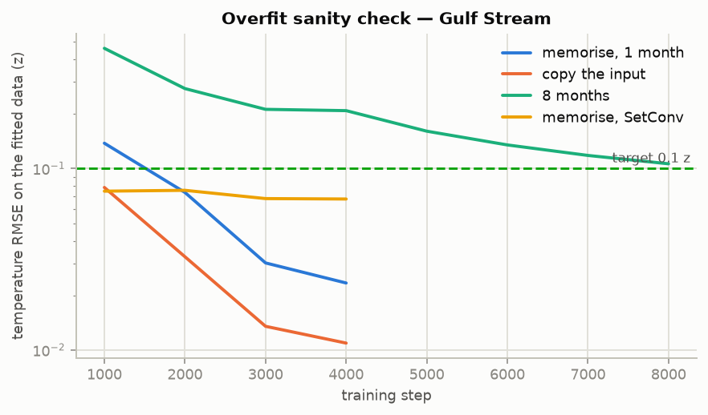

# Overfit sanity check

<!-- generated by 62_sanity_train.py + 63_audit_report.py — do not edit by hand -->

> The meeting's sanity test: drive the RMSE below 0.1 on data the model is allowed to memorise. If it cannot, the pipeline is broken; if it can, the held-out numbers are about the ocean and the observing system, not about capacity.

Three rungs, all on the Gulf Stream cohort, lead 0, the registered 405 K-parameter model unless the row says otherwise:

- **memorise** — one fixed month, one fixed input/target float split.

- **copy** — the targets *are* the input profiles, queried at their own positions and levels. Tests whether information can reach a query at all.

- **8 months** — eight fixed months with fixed partitions.

| region | run | steps | seeds | TEMP RMSE (z) | TEMP (°C) | SALT RMSE (z) | SALT (PSU) | below 0.1 z? |
|---|---|---|---|---|---|---|---|---|
| gulfstream | `copy_d4rt` | 4000 | 2 | 0.013 | 0.022 | 0.013 | 0.0042 | yes |
| gulfstream | `copy_fixed` | 4000 | 2 | 0.008 | 0.014 | 0.008 | 0.0024 | yes |
| gulfstream | `copy_setconv` | 4000 | 2 | 0.029 | 0.048 | 0.030 | 0.0102 | yes |
| gulfstream | `mem_d4rt` | 4000 | 2 | 0.017 | 0.025 | 0.014 | 0.0046 | yes |
| gulfstream | `mem_fixed` | 4000 | 2 | 0.007 | 0.012 | 0.008 | 0.0026 | yes |
| gulfstream | `mem_setconv` | 4000 | 2 | 0.040 | 0.064 | 0.051 | 0.0156 | yes |
| gulfstream | `small8_d4rt` | 8000 | 2 | 0.106 | 0.170 | 0.100 | 0.0305 | no |
| gulfstream | `small8_setconv` | 8000 | 2 | 0.085 | 0.139 | 0.088 | 0.0285 | yes |
| npac_gyre | `copy_d4rt` | 4000 | 2 | 0.004 | 0.004 | 0.004 | 0.0007 | yes |
| npac_gyre | `copy_fixed` | 4000 | 2 | 0.002 | 0.001 | 0.001 | 0.0002 | yes |
| npac_gyre | `copy_setconv` | 4000 | 2 | 0.074 | 0.057 | 0.074 | 0.0125 | yes |
| npac_gyre | `mem_d4rt` | 4000 | 2 | 0.047 | 0.039 | 0.042 | 0.0048 | yes |
| npac_gyre | `mem_fixed` | 4000 | 2 | 0.029 | 0.023 | 0.026 | 0.0027 | yes |
| npac_gyre | `mem_setconv` | 4000 | 2 | 0.104 | 0.080 | 0.091 | 0.0126 | no |
| npac_gyre | `small8_d4rt` | 8000 | 2 | 0.209 | 0.174 | 0.175 | 0.0256 | no |
| npac_gyre | `small8_setconv` | 8000 | 2 | 0.221 | 0.188 | 0.207 | 0.0316 | no |

