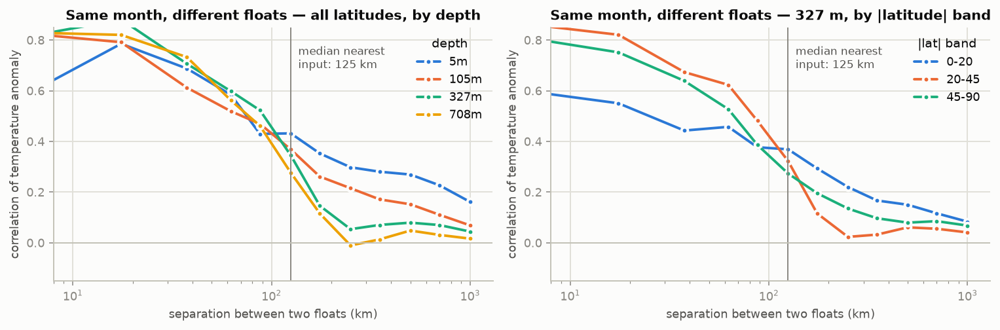

# Pipeline audit — global ocean state reconstruction

<!-- generated by experiments/real_data/61_pipeline_audit.py + 63_audit_report.py — do not edit by hand -->

> Asked for at the 2026-09-17 meeting: walk the pipeline one stage at a time before running anything else, because numbers that all sit near 1 and do not move when the model changes point at the data path.

> **Setup.** One domain over the whole ocean: the global Argo cohort (1,146,537 profiles in these years, 20 levels to 985 m), every profile a month delivers, target = WOA23 monthly anomaly, per-level z-score fitted on the training years. Split: train 2016-2020, validate 2021, test 2022-2023. Truth is held-out, WMO-disjoint floats.

## 0. The short version

| stage | what the audit found |
|---|---|
| data prep | 3,290 salinity profiles beyond 10σ pass Argo QC (max |z| 685); test-year input salinity z-RMS 1.55 with them, 0.99 without |
| data prep | the anomaly subtracts WOA23 at the 1° cell centre, not at the profile (§1.3) |
| normalisation | 1 z = 1.24 °C / 0.26 PSU in the upper 100 m; one σ per level for the whole ocean, plain (not robust) |
| tokenisation | 4 mean-pooled depth-band tokens per profile discard 19 % of its vertical variance |
| tokenisation | the query-local refiner starts at 3,503 km with a 0.05 output gate |

The trained baseline scores **0.9264 / 1.0172 z** on its two seeds against a climatology of **1.0638 z** (`ablation_ladder.md`).

## 1. Data preparation

### 1.1 What one z unit is worth

| channel | 0-100m | 100-300m | 300-700m | 700-1400m | unit |
|---|---|---|---|---|---|
| TEMP | 1.241 | 1.240 | 0.838 | 0.467 | °C |
| SALT | 0.260 | 0.159 | 0.099 | 0.048 | PSU |

The anomaly's own standard deviation **is** the z scale: 1 z is 1.24 °C and 0.260 PSU in the upper 100 m of the global ocean. A model at RMSE ≈ 1 z is predicting the training climatology. The meeting's 0.1-0.2 °C target is 6-12× below that variability.

### 1.2 Values that are not measurements

| channel | profiles with abs(z)>10 | floats | max abs(z) | by data mode | test-year input z RMS | same, outliers removed |
|---|---|---|---|---|---|---|
| TEMP | 1812 | 468 | 53 | A:185, D:1506, R:121 | 1.06 | 1.04 |
| SALT | 3290 | 725 | 685 | A:418, D:2462, R:410 | 1.55 | 0.99 |

- TEMP: float **6903550** (D, 2019-2020, cohort float), 62 profiles over 10σ, max |z| 16.

- TEMP: float **5906393** (A, 2024-2024, cohort float), 56 profiles over 10σ, max |z| 13.

- SALT: float **5907083** (D, 2023-2025, cohort float), 84 profiles over 10σ, max |z| 69.

- SALT: float **2902233** (D, 2017-2020, cohort float), 76 profiles over 10σ, max |z| 38.

These pass the cohort's Argo QC flags but are not ocean. They enter the model as **inputs** and they enter the per-level standard deviation that defines the z unit. The audit's robust QC (8σ, iterated on training-year statistics) flags 45,465 temperature and 73,519 salinity values and drops 1,912 / 3,484 profile-channels; the `qc` arm measures what that is worth.

### 1.3 Where the climatology is evaluated

| grid cell | mean offset lat / lon | max offset | spurious °C 0-100m | spurious °C 300-700m | variance removed by using the profile's own position, 100-300m |
|---|---|---|---|---|---|
| 1.00° × 1.00° | 28 / 23 km | 56 / 56 km | 0.198 | 0.127 | 1.7 % |

The registered recipe subtracts WOA23 at the centre of the 1° cell, not at the profile. Across a front that offset carries a real climatological gradient, so part of what the model is asked to predict is the climatology's own spatial structure. The `anomaly_exact` arm removes it.

### 1.4 The test years are not the training years

| channel | train mean anomaly 0-100m | test mean anomaly 0-100m | test/train σ 0-100m | test/train σ 300-700m | unit |
|---|---|---|---|---|---|
| TEMP | 0.225 | 0.278 | 1.070 | 1.080 | °C |
| SALT | 0.008 | 0.009 | 1.151 | 1.667 | PSU |

This is why the climatology reference reads **1.0638 z** rather than 1.00 on the test years: the reference is the training climatology, and the ocean has moved away from it. Every J is measured against that shifted reference.

## 2. Normalisation

| channel | robust σ / fitted σ, 0-100m | same, 700-1400m | worst level | fitted vs robust σ there |
|---|---|---|---|---|
| TEMP | 0.70 | 0.44 | 708 m | 0.567 vs 0.236 |
| SALT | 0.65 | 0.42 | 708 m | 0.058 vs 0.023 |

Per-level z-scoring pools the whole ocean at each level, so one z unit mixes the quiet interior with the western boundary currents, and it is fitted with the plain standard deviation, so the outliers of §1.2 set part of the scale. Where the ratio sits well below 1 the level's unit is inflated by heavy tails (fronts and eddies) or by a handful of bad values.

## 3. Tokenisation

### 3.1 A profile becomes 4 tokens

| band | levels pooled | token depth | level depths |
|---|---|---|---|
| 0-50 m | 5 | 25 m | 5, 15, 25, 35, 45 |
| 50-200 m | 8 | 125 m | 55, 65, 85, 105, 125, 145, 165, 186 |
| 200-500 m | 4 | 350 m | 223, 268, 327, 409 |
| 500-985 m | 3 | 742 m | 528, 708, 985 |

`ProfileEncoder` embeds each level, **mean-pools inside the band**, and places the token at the band's midpoint. A band-mean summary discards 19 % of temperature and 20 % of salinity variance within a profile — the vertical detail the thermocline lives in. Per-level tokens avoid it but multiply the token count ~5×, which is why that arm is run at cap 1000.

### 3.2 The resolution the model can express

| component | scale |
|---|---|
| shared coordinate features (finest Fourier wavelength) | 3.58° ≈ 398 km |
| local refiner Gaussian, north-south (init) | 3503 km |
| local refiner Gaussian, east-west (init, at the equator) | 7005 km |
| local refiner depth / time (init) | 300 m / 3 months |
| local refiner output gate (init) | 0.05 |

Both paths into a query start far wider than the ocean's correlation scales (§4): the 'local' refiner's distance prior spans thousands of kilometres and its output is gated at 0.05. The scales are learnable but start orders of magnitude away; the `refiner_local` and `refiner_gate1` arms test the fix.

### 3.3 How much of the observing system reaches the model

| profiles / month (median, min-max) | used by the model | median distance target → nearest input | targets within 50 km | same at cap 1000 |
|---|---|---|---|---|
| 8862 (8147-9750) | all | 125 km | 18 % | 244 km, 4 % within 50 km |

## 4. What is recoverable at all

| depth | 0-10 km | 25-50 km | 50-75 km | 100-150 km | 200-300 km | 400-600 km |
|---|---|---|---|---|---|---|
| 5m | 0.56 | 0.69 | 0.58 | 0.43 | 0.30 | 0.27 |
| 105m | 0.83 | 0.61 | 0.52 | 0.37 | 0.22 | 0.15 |
| 327m | 0.80 | 0.71 | 0.60 | 0.35 | 0.05 | 0.08 |
| 708m | 0.83 | 0.73 | 0.56 | 0.28 | -0.01 | 0.05 |

| abs(latitude) band, 327 m | 0-10 km | 25-50 km | 50-75 km | 100-150 km | 200-300 km | 400-600 km |
|---|---|---|---|---|---|---|
| 0-20 | 0.61 | 0.44 | 0.46 | 0.37 | 0.22 | 0.15 |
| 20-45 | 0.87 | 0.67 | 0.62 | 0.32 | 0.02 | 0.06 |
| 45-90 | 0.82 | 0.64 | 0.53 | 0.27 | 0.14 | 0.08 |

Two same-month profiles from different floats are far from perfectly correlated even when co-located, and the correlation length differs by latitude band. Any global model has to be local where the ocean is local and broad where it is broad.

### 4.1 The floor, from the fitted covariance

| channel | abs(lat) band | median mesoscale length L1 | mean nugget | J floor = sqrt(nugget) |
|---|---|---|---|---|
| TEMP | 0-20° | 125 km | 0.44 | 0.67 |
| TEMP | 20-45° | 75 km | 0.33 | 0.58 |
| TEMP | 45-90° | 75 km | 0.31 | 0.55 |
| SALT | 0-20° | 115 km | 0.48 | 0.69 |
| SALT | 20-45° | 90 km | 0.35 | 0.59 |
| SALT | 45-90° | 75 km | 0.24 | 0.49 |

The **nugget** is the share of the anomaly variance at a point that no other float sees — submonthly change, submesoscale structure, and the difference between a point measurement and anything smoother. It is a property of the ocean and the sampling, not of the model. A method that mapped the correlated part perfectly would still score about **J = sqrt(nugget)**; that is the floor to measure against. A 0.1-0.2 °C target corresponds to J ≈ 0.1 and is not attainable at a held-out float by any method.
