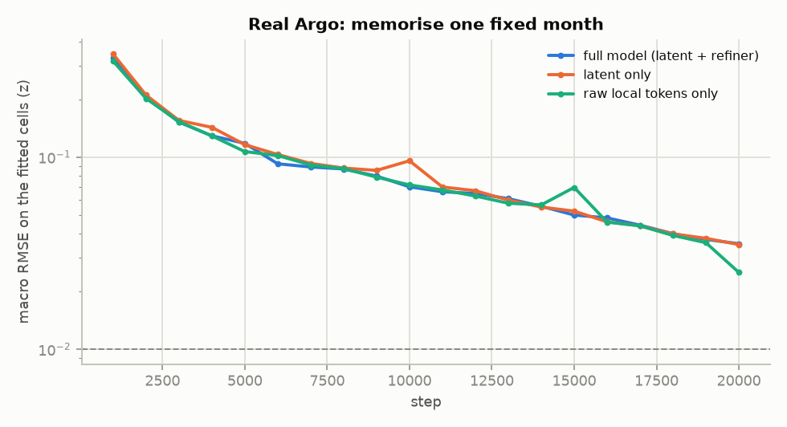

# Pre-shutdown validation on real Argo

<!-- generated by experiments/real_data/66_preshutdown_report.py — do not edit by hand -->

The question for each fix the audits proposed: does it measurably improve reconstruction on **real** Argo? Same data, split, model, optimizer, seeds and evaluation for both arms of every comparison; one switch apart.

|  |  |
|---|---|
| data | global real-Argo cohort `data/argo_cohort/global_global.nc` (Hugging Face `klin2323/ocean_project-data`), 20 levels 5-985 m, WOA23 anomaly |
| split | train 2016-2020 / validation 2021 / test 2022-2023; inputs = cohort floats, scored at held-out floats (WMO-disjoint) |
| model | 405 K Perceiver-IO + DFS + D4RT decoder, 12 k steps, AdamW 1e-3, seeds 1234-1236 |
| code | `62_sanity_train.py` at `1a1f8df` (branch `preshutdown-backup`); seeds 1234-1235 of `baseline` / `anomaly_exact` are the 2026-09-19 audit runs, whose code path is unchanged |
| selection | best validation checkpoint (every 1 k steps), scored once on the test years; per-band errors re-scored from that checkpoint with `--eval-only` |
| collapse flag | test macro J ≥ 0.94: the run ended at climatology |

## Experiment A — anomaly target: climatology at the profile vs the cell centre

```
Experiment: A, anomaly target
Hypothesis: subtracting WOA23 at the profile's own position (bilinear) instead of
            at the 1-deg cell centre removes a target artifact and lowers error,
            as it did on synthetic data (-24 %)
Baseline:   baseline       (x - C(cell centre)), registered refiner
Change:     anomaly_exact  (x - C(profile position))
Also:       the same pair at the local refiner (real_cell_r500_g1 vs
            real_exact_r500_g1), which does not collapse
Data:       global real Argo, train 2016-20 / val 2021 / test 2022-23
Seeds:      1234, 1235, 1236
Checkpoints: outputs/audit/global/<arm>/model_seed<seed>.pt
```

**Size of the artifact on real Argo**, C(position) − C(cell centre), training years, mean over levels (`65_target_qc_audit.py`):

|  | RMS artifact | RMS anomaly | share of cell-centre target | max |artifact| | values > ¼ anomaly std |
|---|---|---|---|---|---|
| TEMP (°C) | 0.167 | 1.094 | 2.3 % | 3.53 | 7.5 % |
| SALT (PSU) | 0.024 | 0.175 | 1.9 % | 1.74 | 5.8 % |

**Trained, registered refiner:**

| arm | seed | val macro J | test TEMP °C | TEMP J | test SALT PSU | SALT J |  |
|---|---|---|---|---|---|---|---|
| cell centre | 1234 | 0.858 | 1.0455 | 0.871 | 0.1932 | 0.906 |  |
| cell centre | 1235 | 0.920 | 1.1636 | 0.956 | 0.2186 | 0.989 | **collapsed** |
| cell centre | 1236 | 0.880 | 1.0666 | 0.888 | 0.1999 | 0.930 |  |
| at position | 1234 | 0.863 | 1.0344 | 0.867 | 0.1924 | 0.906 |  |
| at position | 1235 | 0.942 | 1.1773 | 0.972 | 0.2217 | 1.003 | **collapsed** |
| at position | 1236 | 0.871 | 1.0460 | 0.875 | 0.1937 | 0.911 |  |

Paired Δ (at position − cell centre), test: TEMP -0.0060 ± 0.0178 (n=3) °C, SALT -0.0013 ± 0.0046 (n=3) PSU; on the seeds where neither arm collapsed (1234, 1236): TEMP -0.0158 ± 0.0067 (n=2) °C, SALT -0.0035 ± 0.0038 (n=2) PSU.

**Trained, local refiner (500 km / 100 m / 1 month / gate 1.0):**

| arm | seed | val macro J | test TEMP °C | TEMP J | test SALT PSU | SALT J |  |
|---|---|---|---|---|---|---|---|
| cell centre | 1234 | 0.855 | 1.0310 | 0.857 | 0.1887 | 0.889 |  |
| cell centre | 1235 | 0.857 | 1.0350 | 0.861 | 0.1895 | 0.894 |  |
| cell centre | 1236 | 0.856 | 1.0365 | 0.862 | 0.1894 | 0.891 |  |
| at position | 1234 | 0.858 | 1.0249 | 0.858 | 0.1878 | 0.891 |  |
| at position | 1235 | 0.861 | 1.0258 | 0.859 | 0.1883 | 0.892 |  |
| at position | 1236 | 0.862 | 1.0271 | 0.859 | 0.1880 | 0.891 |  |

Paired Δ (at position − cell centre), test: TEMP -0.0082 ± 0.0018 (n=3) °C, SALT -0.00116 ± 0.00023 (n=3) PSU.

**Error by depth**, test RMSE (mean ± sd over seeds), and the paired difference:

| arm |  | 0-100 m | 100-300 m | 300-700 m | 700-985 m |
|---|---|---|---|---|---|
| cell centre, registered | TEMP | 1.1773 ± 0.0763 | 1.2054 ± 0.0716 | 0.8270 ± 0.0158 | 0.4440 ± 0.0064 |
| cell centre, registered | SALT | 0.2591 ± 0.0216 | 0.1914 ± 0.0059 | 0.0960 ± 0.0022 | 0.0484 ± 0.0007 |
| at position, registered | TEMP | 1.1753 ± 0.1039 | 1.1956 ± 0.0807 | 0.8215 ± 0.0217 | 0.4372 ± 0.0087 |
| at position, registered | SALT | 0.2578 ± 0.0272 | 0.1899 ± 0.0072 | 0.0960 ± 0.0029 | 0.0477 ± 0.0009 |
| cell centre, local | TEMP | 1.1104 ± 0.0038 | 1.1443 ± 0.0033 | 0.7903 ± 0.0049 | 0.4283 ± 0.0008 |
| cell centre, local | SALT | 0.2350 ± 0.0005 | 0.1849 ± 0.0005 | 0.0918 ± 0.0008 | 0.0475 ± 0.0001 |
| at position, local | TEMP | 1.1006 ± 0.0036 | 1.1343 ± 0.0024 | 0.7941 ± 0.0026 | 0.4246 ± 0.0026 |
| at position, local | SALT | 0.2338 ± 0.0007 | 0.1836 ± 0.0002 | 0.0929 ± 0.0002 | 0.0470 ± 0.0002 |

Paired Δ by depth, at position − cell centre, local refiner:

|  | 0-100 m | 100-300 m | 300-700 m | 700-985 m |
|---|---|---|---|---|
| TEMP (°C) | -0.0097 ± 0.0014 (n=3) | -0.0100 ± 0.0040 (n=3) | +0.0037 ± 0.0026 (n=3) | -0.0037 ± 0.0027 (n=3) |
| SALT (PSU) | -0.0013 ± 0.0005 (n=3) | -0.0013 ± 0.0007 (n=3) | +0.0011 ± 0.0008 (n=3) | -0.0005 ± 0.0001 (n=3) |

Paired Δ by depth, at position − cell centre, registered refiner:

|  | 0-100 m | 100-300 m | 300-700 m | 700-985 m |
|---|---|---|---|---|
| TEMP (°C) | -0.0020 ± 0.0294 (n=3) | -0.0098 ± 0.0095 (n=3) | -0.0055 ± 0.0122 (n=3) | -0.0068 ± 0.0040 (n=3) |
| SALT (PSU) | -0.0012 ± 0.0077 (n=3) | -0.0014 ± 0.0017 (n=3) | +0.0000 ± 0.0016 (n=3) | -0.0008 ± 0.0004 (n=3) |

## Experiment B — local refiner scale

```
Experiment: B, local refiner
Hypothesis: a genuinely local refiner start improves real-Argo reconstruction
            and removes the seed-dependent collapse
Baseline:   anomaly_exact       (registered start: ~3,500 km, 300 m, 3 months,
                                 gate 0.05)
Change:     real_exact_r500_g1  (500 km, 100 m, 1 month, gate 1.0)
Target:     at-position anomaly in both arms (A's fix)
Data:       global real Argo, train 2016-20 / val 2021 / test 2022-23
Seeds:      1234, 1235, 1236
```

| arm | seed | val macro J | test TEMP °C | TEMP J | test SALT PSU | SALT J |  |
|---|---|---|---|---|---|---|---|
| registered refiner | 1234 | 0.863 | 1.0344 | 0.867 | 0.1924 | 0.906 |  |
| registered refiner | 1235 | 0.942 | 1.1773 | 0.972 | 0.2217 | 1.003 | **collapsed** |
| registered refiner | 1236 | 0.871 | 1.0460 | 0.875 | 0.1937 | 0.911 |  |
| 500 km / gate 1.0 | 1234 | 0.858 | 1.0249 | 0.858 | 0.1878 | 0.891 |  |
| 500 km / gate 1.0 | 1235 | 0.861 | 1.0258 | 0.859 | 0.1883 | 0.892 |  |
| 500 km / gate 1.0 | 1236 | 0.862 | 1.0271 | 0.859 | 0.1880 | 0.891 |  |

Paired Δ (local − registered): validation macro J -0.031 ± 0.043 (n=3); test TEMP -0.0600 ± 0.0794 (n=3) °C, SALT -0.01460 ± 0.01629 (n=3) PSU; on the seeds where neither arm collapsed (1234, 1236): TEMP -0.0142 ± 0.0066 (n=2) °C, SALT -0.00520 ± 0.00075 (n=2) PSU. Seed-to-seed sd of test TEMP: 0.0794 °C registered vs 0.0011 °C local.

Paired Δ by depth, local − registered:

|  | 0-100 m | 100-300 m | 300-700 m | 700-985 m |
|---|---|---|---|---|
| TEMP (°C) | -0.0747 ± 0.1021 (n=3) | -0.0613 ± 0.0829 (n=3) | -0.0274 ± 0.0220 (n=3) | -0.0125 ± 0.0095 (n=3) |
| SALT (PSU) | -0.0241 ± 0.0266 (n=3) | -0.0063 ± 0.0073 (n=3) | -0.0030 ± 0.0030 (n=3) | -0.0007 ± 0.0008 (n=3) |

## Experiment C — real-data overfit sanity check

```
Experiment: C, overfit on one fixed real month
Hypothesis: given enough steps the model fits a fixed real subset, so the
            earlier 0.068 z (8 k steps) was a training-budget limit
Setup:      --mode memorise: one training month drawn with seed 1234, inputs fixed
            (70 % of its cohort floats), queries fixed (8,000 cells at the other
            30 %), trained and scored on the same cells, 20 k steps, cosine decay
Seed:       1234
```

| decoder | TEMP z | TEMP °C | SALT z | SALT PSU | macro z at 4 k | 8 k | 16 k | 18 k | 20 k | ≤ 0.01 z? |
|---|---|---|---|---|---|---|---|---|---|---|
| full model (latent + refiner) | 0.0495 | 0.0592 | 0.0214 | 0.0044 | 0.129 | 0.087 | 0.048 | 0.040 | 0.035 | no |
| latent only | 0.0473 | 0.0565 | 0.0230 | 0.0048 | 0.143 | 0.088 | 0.046 | 0.040 | 0.035 | no |
| raw local tokens only | 0.0290 | 0.0340 | 0.0213 | 0.0042 | 0.129 | 0.087 | 0.046 | 0.039 | 0.025 | no |

The 2026-09-19 real run with the same setup stopped at 8 k steps at 0.068 z (`mem_d4rt_8k`).



## Experiment D — salinity and QC sanity check

Full tables: [`target_qc_audit.md`](target_qc_audit.md) (`65_target_qc_audit.py`).

|  | max |z| | |z| > 8 | |z| > 100 | Σz² share from |z| > 8 | 25 largest, classified | 8σ QC removes (values / whole profile-channels) |
|---|---|---|---|---|---|---|
| TEMP | 53 | 13,237 | 0 | 4 % | impossible for location 12, single-level spike 7, plausible ocean value 4, whole-profile offset 2 | 45,267 / 1,896 |
| SALT | 693 | 23,326 | 603 | 53 % | impossible for location 25 | 72,633 / 3,308 |
