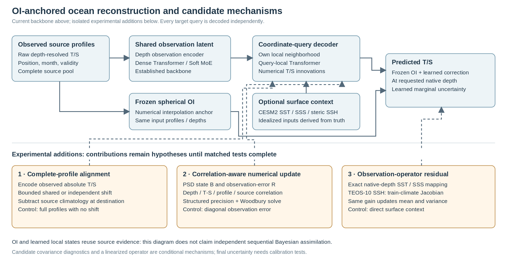

# CESM2 ocean reconstruction: contribution experiments

07 Oct 2026, 18:20 PDT · Original campaign 36/39 audited runs · New campaign 10/60 fresh runs complete + 3 reused controls

Matched validation contrasts support: Local numerical pathway (argo). External novelty and generalization still require independent comparisons.

Train: 2000–2003. Validate: 2004, 92,517 values per variable, identical profile/depth/month identities and canonical float64 truth. Learned families: three seeds × 15,000 steps, 6,080 source profiles/month at evaluation. SST/SSS are noiseless 5 m CESM2 products; steric SSH is derived from T/S truth. The previously used 2005 year is development evidence.

Queue: train · 2 running · 48 pending in the archived queue status.

Engineering verification: 12 recipes passed GPU forward/backward with 1,024 queries and the complete source pool; 170 unique focused tests passed; 2 CUDA tests skipped in the restricted sandbox. These checks and short smoke runs do not establish efficacy.

[Editable SVG](fig_innovation_architecture_20261007.svg) · [PDF](fig_innovation_architecture_20261007.pdf)

## Measured validation comparison

| Method | Inputs | T RMSE (°C) | S RMSE (PSU) | T MAE | S MAE | T bias | S bias |
| --- | --- | --- | --- | --- | --- | --- | --- |
| Climatology | Argo | 0.76715 | 0.12601 | 0.43237 | 0.06872 | -0.08210 | -0.00121 |
| Nearest profile | Argo | 0.18401 | 0.03851 | 0.08762 | 0.01729 | -0.00099 | 0.00005 |
| Fixed OI | Argo | 0.09060 | 0.02185 | 0.03867 | 0.00763 | -0.00111 | 0.00008 |
| Prior learned OI | Argo | 0.08389 | 0.02069 | 0.03668 | 0.00723 | -0.00086 | 0.00011 |
| Fixed pointwise MLP | Argo | 0.18832 | 0.03858 | 0.09029 | 0.01773 | 0.00099 | -0.00096 |
| Dense192 | Argo | 0.08623 ± 0.00040 | 0.02141 ± 0.00003 | 0.03920 ± 0.00032 | 0.00798 ± 0.00003 | 0.00005 ± 0.00060 | 0.00017 ± 0.00011 |
| Dense64 | Argo | 0.08676 ± 0.00008 | 0.02139 ± 0.00004 | 0.03944 ± 0.00008 | 0.00803 ± 0.00003 | -0.00023 ± 0.00041 | 0.00014 ± 0.00019 |
| Local Transformer192 | Argo | 0.07837 ± 0.00014 | 0.02002 ± 0.00010 | 0.03473 ± 0.00009 | 0.00687 ± 0.00001 | 0.00007 ± 0.00086 | 0.00013 ± 0.00005 |
| 4DVarNet task adaptation | Argo | 0.22294 ± 0.01652 | 0.04358 ± 0.00205 | 0.13336 ± 0.00760 | 0.02335 ± 0.00127 | 0.00083 ± 0.00714 | 0.00023 ± 0.00088 |
| Previous 64-slot | Argo | 0.26382 ± 0.00413 | 0.04478 ± 0.00030 | 0.13358 ± 0.00095 | 0.02205 ± 0.00011 | 0.00939 ± 0.00129 | 0.00053 ± 0.00037 |
| Soft MoE192 | Argo | 0.08605 ± 0.00011 | 0.02143 ± 0.00003 | 0.03914 ± 0.00016 | 0.00800 ± 0.00003 | 0.00015 ± 0.00088 | 0.00004 ± 0.00008 |
| Soft MoE192 / latent off | Argo | 0.08644 ± 0.00012 | 0.02142 ± 0.00009 | 0.03948 ± 0.00021 | 0.00805 ± 0.00006 | 0.00011 ± 0.00046 | 0.00023 ± 0.00005 |
| Soft MoE192 / local off | Argo | 0.09060 ± 0.00000 | 0.02185 ± 0.00000 | 0.03867 ± 0.00000 | 0.00763 ± 0.00000 | -0.00111 ± 0.00000 | 0.00008 ± 0.00000 |
| Dense192 | Argo + surface | 0.08115 ± 0.00083 | 0.01664 ± 0.00028 | 0.03709 ± 0.00094 | 0.00659 ± 0.00013 | -0.00003 ± 0.00210 | -0.00007 ± 0.00023 |
| 4DVarNet task adaptation | Argo + surface | 0.38089 ± 0.03709 | 0.07143 ± 0.00088 | 0.21686 ± 0.01783 | 0.03421 ± 0.00080 | -0.02089 ± 0.01148 | 0.00018 ± 0.00072 |
| Soft MoE192 | Argo + surface | 0.08089 ± 0.00038 | 0.01651 ± 0.00008 | 0.03640 ± 0.00010 | 0.00649 ± 0.00003 | 0.00211 ± 0.00074 | 0.00008 ± 0.00019 |
| Soft MoE192 / latent off | Argo + surface | 0.08085 ± 0.00061 | 0.01697 ± 0.00017 | 0.03757 ± 0.00028 | 0.00684 ± 0.00005 | 0.00150 ± 0.00039 | 0.00002 ± 0.00017 |
| Matched local control (reused) | Argo | 0.07837 ± 0.00014 | 0.02002 ± 0.00010 | 0.03473 ± 0.00009 | 0.00687 ± 0.00001 | 0.00007 ± 0.00086 | 0.00013 ± 0.00005 |
| Local / latent off | Argo | 0.07892 ± 0.00005 | 0.02008 ± 0.00014 | 0.03497 ± 0.00003 | 0.00693 ± 0.00001 | 0.00038 ± 0.00064 | 0.00017 ± 0.00013 |
| Local / local off | Argo | 0.09060 ± 0.00000 | 0.02185 ± 0.00000 | 0.03867 ± 0.00000 | 0.00763 ± 0.00000 | -0.00111 ± 0.00000 | 0.00008 ± 0.00000 |
| Full profiles / no shift | Argo | 0.07899 ± 0.00022 | 0.02018 ± 0.00005 | 0.03495 ± 0.00005 | 0.00692 ± 0.00002 | 0.00000 ± 0.00045 | 0.00007 ± 0.00013 |

Main table reports the arithmetic seed mean ± sample SD, not ensemble RMSE. Fixed baselines have no seed SD. A learned row appears only after all three complete runs pass budget, checkpoint, source-hash, identity and normalization checks. Bias means prediction minus truth.

## System-level paired evidence

| Ensemble contrast | ΔT RMSE [95% CI] | ΔS RMSE [95% CI] |
| --- | --- | --- |
| Local Transformer192 vs Dense192 | -0.008234 [-0.009010, -0.007462] | -0.001494 [-0.001809, -0.001162] |
| Local Transformer192 vs Prior learned OI | -0.006744 [-0.008590, -0.004787] | -0.000907 [-0.001302, -0.000478] |

Contrasts use the three-seed prediction ensemble and 4,000 paired bootstrap draws of whole months; negative ΔRMSE favors Local Transformer. There are only 12 validation months. System comparisons do not isolate attention or latent necessity.

## Contribution tests

| Candidate | Inputs | Required contrast | Current evidence |
| --- | --- | --- | --- |
| Local shared latent | argo | local_control vs local_latent_off | complete: benefit not established for both variables |
| Local numerical pathway | argo | local_control vs local_off | validation evidence supports this contrast |
| Complete-profile context | argo | profile_none vs local_control | complete: benefit not established for both variables |
| Full-profile alignment | argo | profile_shared vs profile_none | pending: full matched three-seed contrast required |
| Joint T/S displacement | argo | profile_shared vs profile_independent | pending: full matched three-seed contrast required |
| Correlated observation error | argo | cov_correlated vs cov_diagonal | pending: full matched three-seed contrast required |
| Covariance after alignment | argo | aligned_correlated vs profile_shared | pending: full matched three-seed contrast required |
| Local shared latent | surface | local_control vs local_latent_off | pending: full matched three-seed contrast required |
| Local numerical pathway | surface | local_control vs local_off | pending: full matched three-seed contrast required |
| Complete-profile context | surface | profile_none vs local_control | pending: full matched three-seed contrast required |
| Full-profile alignment | surface | profile_shared vs profile_none | pending: full matched three-seed contrast required |
| Joint T/S displacement | surface | profile_shared vs profile_independent | pending: full matched three-seed contrast required |
| Correlated observation error | surface | cov_correlated vs cov_diagonal | pending: full matched three-seed contrast required |
| Covariance after alignment | surface | aligned_correlated vs profile_shared | pending: full matched three-seed contrast required |
| Observation operators | surface | operator_update vs operator_direct | pending: full matched three-seed contrast required |
| Combined operator increment | surface | all_modules vs aligned_correlated | pending: full matched three-seed contrast required |

Mechanism attribution requires the registered full three-seed matched control, consistent architecture/training settings, and a 95% paired-month ΔRMSE interval below zero for both variables. This is validation evidence; it does not establish external method novelty. Pilot runs are excluded. New development arrays stay unread until selection is frozen.

## Uncertainty and computation

| Method / inputs | Parameters / seed | Minutes / seed | Ensemble T / S CRPS | Ensemble T / S 95% coverage |
| --- | --- | --- | --- | --- |
| Climatology / argo | — | — | — / — | — / — |
| Nearest profile / argo | — | — | — / — | — / — |
| Fixed OI / argo | — | — | — / — | — / — |
| Prior learned OI / argo | 120 | — | — / — | — / — |
| Fixed pointwise MLP / argo | 134658 | — | — / — | — / — |
| Dense192 / argo | 4338840 | 49.6–68.1 | 0.03137 / 0.00640 | 96.1% / 96.6% |
| Dense64 / argo | 268180 | 15.6–23.5 | 0.03245 / 0.00673 | 96.0% / 96.5% |
| Local Transformer192 / argo | 4858776 | 50.1–50.8 | 0.02529 / 0.00503 | 92.3% / 93.0% |
| 4DVarNet task adaptation / argo | 241200 | 33.2–36.3 | — / — | — / — |
| Previous 64-slot / argo | 407111 | 416.7–500.6 | — / — | — / — |
| Soft MoE192 / argo | 8343198 | 49.2–88.3 | 0.03116 / 0.00638 | 95.8% / 96.4% |
| Soft MoE192 / latent off / argo | 8343198 | 6.7–7.1 | 0.03287 / 0.00691 | 95.9% / 96.7% |
| Soft MoE192 / local off / argo | 8343198 | 48.7–54.6 | 0.05974 / 0.01106 | 99.0% / 98.2% |
| Dense192 / surface | 4386840 | 51.9–67.9 | 0.02830 / 0.00504 | 96.2% / 96.5% |
| 4DVarNet task adaptation / surface | 250278 | 37.4–54.6 | — / — | — / — |
| Soft MoE192 / surface | 8391198 | 52.5–60.2 | 0.02806 / 0.00498 | 95.8% / 96.4% |
| Soft MoE192 / latent off / surface | 8391198 | 6.7–6.7 | 0.02939 / 0.00541 | 95.8% / 96.3% |
| Matched local control / argo | 4858776 | 50.1–50.8 | 0.02529 / 0.00503 | 92.3% / 93.0% |
| Local / latent off / argo | 4858776 | 18.7–20.9 | 0.02558 / 0.00510 | 92.8% / 93.7% |
| Local / local off / argo | 4858776 | 70.9–97.7 | 0.05974 / 0.01106 | 99.0% / 98.2% |
| Full profiles / no shift / argo | 5083800 | 70.3–83.1 | 0.02546 / 0.00506 | 91.8% / 93.0% |

Runtime is recorded per-run wall time, including validation; hardware/concurrency are not normalized. Parameters are allocated counts, not active FLOPs. Neural ensemble scales are moment-matched Gaussian summaries; no uncertainty is invented for deterministic baselines.

## Pending families

| Campaign | Family | Inputs | Audited seeds | Status |
| --- | --- | --- | --- | --- |
| old | Previous 64-slot | surface | 0/3 | Awaiting full-budget artifacts |
| new | Shared alignment + correlated R | argo | 0/3 | Awaiting full-budget artifacts |
| new | Covariance / correlated R | argo | 0/3 | Awaiting full-budget artifacts |
| new | Covariance / diagonal R | argo | 0/3 | Awaiting full-budget artifacts |
| new | Full profiles / independent shifts | argo | 0/3 | Awaiting full-budget artifacts |
| new | Full profiles / shared T/S shift | argo | 1/3 | Awaiting full-budget artifacts |
| new | Shared alignment + correlated R | surface | 0/3 | Awaiting full-budget artifacts |
| new | All candidate modules | surface | 0/3 | Awaiting full-budget artifacts |
| new | Covariance / correlated R | surface | 0/3 | Awaiting full-budget artifacts |
| new | Covariance / diagonal R | surface | 0/3 | Awaiting full-budget artifacts |
| new | Matched local control | surface | 0/3 | Awaiting full-budget artifacts |
| new | Local / latent off | surface | 0/3 | Awaiting full-budget artifacts |
| new | Local / local off | surface | 0/3 | Awaiting full-budget artifacts |
| new | Column / direct surface context | surface | 0/3 | Awaiting full-budget artifacts |
| new | Column / observation update | surface | 0/3 | Awaiting full-budget artifacts |
| new | Full profiles / independent shifts | surface | 0/3 | Awaiting full-budget artifacts |
| new | Full profiles / no shift | surface | 0/3 | Awaiting full-budget artifacts |
| new | Full profiles / shared T/S shift | surface | 0/3 | Awaiting full-budget artifacts |

## Source robustness diagnostics

Source robustness: after all registered training runs complete; before development scoring. 1 individual diagnostic artifacts available. These capped fixed-checkpoint results stay separate; a single artifact is never presented as a three-seed family or formal mechanism contrast.

[Method / stress script](../../experiments/synthetic/65_innovation_stress.py) · [Archived source_robustness schedule status](newer_version_snapshot_20261007/innovation_20261007__status.json)

| Checkpoint / run | Diagnostic seed | Condition | Capped queries | T RMSE (°C) | S RMSE (PSU) |
| --- | --- | --- | --- | --- | --- |
| local_transformer192_argo_s1234 | 20261007 | standard | 3072 | 0.07637 | 0.01712 |
| local_transformer192_argo_s1234 | 20261007 | thin_profiles_25pct | 3072 | 0.09855 | 0.01985 |
| local_transformer192_argo_s1234 | 20261007 | thin_profiles_50pct | 3072 | 0.13378 | 0.02862 |
| local_transformer192_argo_s1234 | 20261007 | mask_depths_30pct | 3072 | 0.10409 | 0.02051 |
| local_transformer192_argo_s1234 | 20261007 | profile_common_bias | 3072 | 0.09022 | 0.02014 |
| local_transformer192_argo_s1234 | 20261007 | independent_depth_noise | 3072 | 0.09282 | 0.02021 |

## Development status

withheld: validation selection is not frozen

[Original manifest](newer_version_snapshot_20261007/synthetic_matched_20261007__campaign.json) · [New manifest](newer_version_snapshot_20261007/innovation_20261007__campaign.json) · Frozen selection: pending / not frozen · Canonical validation arrays: runtime artifact, excluded from this snapshot

Run logs: runtime artifacts, excluded from this snapshot · [CSV](innovation_contribution_report_20261007.en.csv) · [Audit JSON](innovation_contribution_report_20261007.en.json)

[Publication snapshot and provenance](newer_version_snapshot_20261007/README.md).
