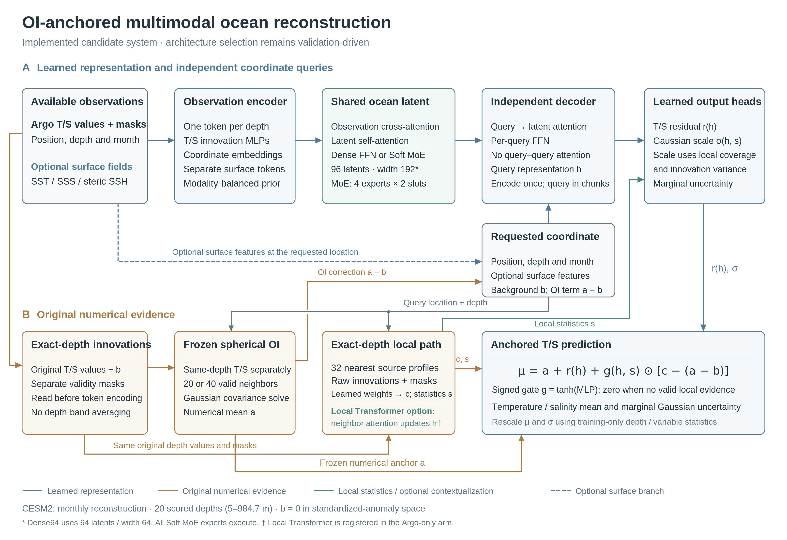

# CESM2 multimodal ocean reconstruction

Validation snapshot · 20/39 training runs complete · 07 Oct 2026, 08:43 PDT

Reconstruct temperature and salinity from sparse Argo profiles and optional SST, SSS and steric sea height, then return their means and marginal uncertainty at a requested location, native depth and month.

This experiment evaluates retrospective monthly reconstruction at 20 depths (5–984.7 m). The final architecture has not yet been selected.

## Common experimental setting

| Item | Registered protocol |
| --- | --- |
| Data split | 2000–2003 training; 2004 validation; previously used 2005 development |
| Common observations | 6,080 input profiles/month; 4,256 training sources after target holdout |
| Budget | 13 family/input settings × 3 seeds × 15,000 steps; 1,024 training queries/step |
| Scoring | 92,517 validation values per variable; 351,895 development values per variable |
| Targets | Anomalies at each Argo profile’s own position; train-year climatology and normalization |

## Implemented architecture

Depth-resolved observation encoders feed a shared latent Transformer and independent coordinate-query decoder. Fixed spherical optimal interpolation (OI) supplies a numerical mean anchor. A separate 32-profile neighborhood reads original T/S innovations at the query depth; a signed gate controls its correction. The uncertainty head uses the query representation and local evidence statistics.

[Editable SVG](fig_matched_architecture_20261007.svg) · [Vector PDF](fig_matched_architecture_20261007.pdf).

Dense64 uses width 64 and 64 latents. Large variants use width 192, 96 latents and six latent blocks. Soft MoE replaces only the latent feed-forward layers with four experts × two slots; every expert executes. Local Transformer instead adds attention within each query’s own neighborhood and updates that query representation. Its registered arm is Argo-only. Queries do not attend to other prediction queries.

## What changed from the previous implementation

| Component | Previous 64-slot model | Current candidates |
| --- | --- | --- |
| Observation representation | Embeddings pooled into four depth bands | One observation row per native depth |
| Numerical mean | Learned token-model estimate | Frozen OI + zero-initialized residual and local gate |
| Local evidence | Refiner reads compressed embeddings | Direct numerical innovations at the query depth |
| Shared backbone | Perceiver-style 64-slot latent already present | Dense / Soft MoE; optional query-local Transformer |
| Uncertainty | No learned Gaussian scale | Query- and evidence-conditioned marginal Gaussian scale |

Old-to-new comparisons also change capacity, optimization and loss (variable-balanced MSE + 0.02 Gaussian NLL). Only the registered Soft MoE full/latent-off and full/local-off controls isolate those pathways; their conclusions do not transfer directly to Local Transformer.

## Measured validation comparison

| Method (Argo-only) | Per-run parameters | Budget | T RMSE (°C) ↓ | S RMSE (PSU) ↓ |
| --- | --- | --- | --- | --- |
| Climatology | 0 | Fixed method | 0.767149 | 0.126007 |
| Nearest profile | 0 | Fixed method | 0.184005 | 0.038511 |
| Classical OI, validation tuned | 0 | Fixed method | 0.090599 | 0.021848 |
| Prior learned anisotropic OI | 120 | 1 seed · 1.5k steps | 0.083886 | 0.020695 |
| Pointwise MLP, fixed single run | 134,658 | 1 seed · 30 epochs | 0.188320 | 0.038579 |
| Dense Transformer 64 | 268,180 | 3 seeds · 15k steps | 0.086762 ± 0.000076 | 0.021395 ± 0.000036 |
| Soft MoE 192 | 8,343,198 | 3 seeds · 15k steps | 0.086054 ± 0.000108 | 0.021434 ± 0.000027 |
| Dense Transformer 192 | 4,338,840 | 3 seeds · 15k steps | 0.086226 ± 0.000402 | 0.021412 ± 0.000030 |
| Local Transformer 192 | 4,858,776 | 3 seeds · 15k steps | 0.078369 ± 0.000142 | 0.020019 ± 0.000097 |
| Soft MoE 192, latent disabled | 8,343,198 | 3 seeds · 15k steps | 0.086440 ± 0.000118 | 0.021424 ± 0.000086 |
| Soft MoE 192, local correction disabled | 8,343,198 | 3 seeds · 15k steps | 0.090599 ± 0.000000 | 0.021848 ± 0.000000 |

All values use the same 2004 locations and canonical float64 truth. Neural rows show mean ± sample SD across three completed seeds at their validation-selected checkpoints; these are not prediction-ensemble metrics. Fixed/single-seed baselines have no invented seed SD. Parameter totals include bypassed ablation modules.

Soft MoE without the added local path selects the initial OI checkpoint in all three seeds (best step = 0), which explains its identical RMSE to classical OI.

Among the completed three-seed configurations, Local Transformer has the lowest validation RMSE. Its seed-mean error is 6.58% lower for temperature and 3.26% lower for salinity than the prior learned OI. This is a validation trend, not a final architecture decision or development-set improvement.

## Comparisons still in progress

| Incomplete comparison | Inputs | Complete seeds / 3 |
| --- | --- | --- |
| Previous 64-slot model | Argo | 0/3 |
| 4DVarNet, official-code task adaptation | Argo | 2/3 |
| Dense Transformer 192 | Argo + synthetic SST/SSS/SSH | 0/3 |
| Soft MoE 192 | Argo + synthetic SST/SSS/SSH | 0/3 |
| Soft MoE 192, latent disabled | Argo + synthetic SST/SSS/SSH | 0/3 |
| 4DVarNet, official-code task adaptation | Argo + synthetic SST/SSS/SSH | 0/3 |
| Previous 64-slot model | Argo + synthetic SST/SSS/SSH | 0/3 |

Previous 64-slot, official 4DVarNet task adaptation and multimodal comparisons remain incomplete. Partial-seed averages are withheld. After all 39 runs finish, validation ensembles freeze the selection before new 2005 predictions are scored. The final report also includes MAE, bias, R², correlation, depth-resolved errors, Gaussian NLL/CRPS, coverage and paired confidence intervals.

## Contribution and interpretation

The candidate contribution is how OI-anchored means, original depth-resolved numerical evidence and shared multimodal context work together. Its value requires strong-baseline and pathway-control evidence. Shared-latent query architectures and Soft MoE are established components. [Perceiver IO](https://arxiv.org/abs/2107.14795); [Soft MoE](https://arxiv.org/abs/2308.00951).

Synthetic SST/SSS equal noiseless 5 m truth; steric sea height is derived from the target T/S state. These idealized inputs do not establish real-satellite gains. This snapshot does not establish forecasting, arbitrary-depth interpolation, exact Bayesian updates, duplicate-evidence consistency or external SOTA.

Sources: [full protocol](matched_architecture_protocol_20261007.md), [comparison CSV](concise_english_comparison_20261007.csv), [audited data](concise_english_comparison_20261007.json), [literature audit](literature_novelty_audit_20261007.md).
