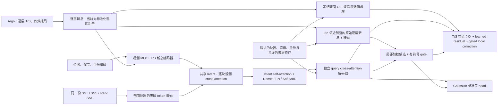

# CESM2 多模态海洋重建：实际架构与完整对比协议

日期：2026-10-07。本文依据当前源码、已冻结的实验清单和可定位的历史产物整理。它说明正式实验要回答什么问题；39 个注册训练任务的完成状态和最终数值以各任务产物及自动汇总报告为准。目前不能据此宣布新模型超过全部强基线，或已经达到 SOTA。

## 1. 目标与本轮实验的范围

最终研究目标是：把卫星 SST、SSS、海面高度和稀疏 Argo 温盐剖面融合为一个可查询的三维海洋状态，按经纬度、深度和日期输出温度、盐度及预测不确定性。当前优先验证重建；预测未来需要另设观测截止时间，并禁止使用截止时间之后的输入。

本轮是 **CESM2 月尺度、回顾性、20 个固定深度层的重建实验**。模型有坐标查询接口，但现有数据接口和评分只验证了这 20 层，尚未验证任意新深度的连续查询、真实日尺度重建、未来预测或跨海盆迁移。当前没有物理方程、守恒或稳定性约束，也没有 transfer pretraining 实验。

要回答的核心问题有三个：新完整系统在旧 setting 下是否优于旧实现和已有强基线；在固定 OI、数据、损失与训练设置后，共享 latent 是否提供额外收益；在相同大型 Transformer 配置下，Soft MoE 或局部 Transformer 是否值得增加模型容量与计算成本。

本轮新模型的初始均值来自冻结的球面 OI。它的标准化距平背景为零，**没有另训练一个卫星初猜 MLP**。之前真实 Argo 实验中的卫星初猜加 learned OI 是另一套实验，不能把其中的旧综合误差数字直接带入本表。真实数据的物理指标和限制见[标准指标报告](../real_data/standard_metrics_20261007.md)。

## 2. 固定数据、输入池与评分点

| 项目 | 当前固定协议 |
|---|---|
| 数据 | CESM2 synthetic Argo，72 个月，547,200 条剖面；每月 7,600 条，其中 6,080 条为输入 cohort、1,520 条为 held-out cohort |
| 年份 | 训练 2000–2003；验证 2004；2005 已在旧工作中多次评分，本轮称为 development，不作为从未使用的最终测试集 |
| 空间与目标 | 连续 Argo 位置；CESM2 水平双线性插值；月气候态在剖面自己的位置取值，再形成距平 |
| 深度 | 5、15、25、35、45、55、65、85、105、125、145、165.1、186.3、222.6、267.7、326.9、408.8、527.7、707.6、984.7 m |
| 每步训练材料 | 随机取一个训练月；从 6,080 条输入 cohort 中抽取 30% 的 float 作为训练 target；剩余 4,256 条作为 source；抽取 1,024 个剖面深度 query |
| 验证与 development 输入 | 每月完整 6,080 条 source，所有注册模型采用同一输入池；source 与 target float 身份不重叠 |
| 验证评分 | 固定采样规则，最多 8,000 个剖面深度位置/月；每个变量 92,517 个有效数值 |
| Development 评分 | 使用完整已注册评分点；每个变量 351,895 个有效数值 |
| 标准化 | 仅训练年份拟合的逐深度、逐变量均值和标准差；气候态同样取训练年份 |
| 随机种子与预算 | 1234、1235、1236；注册模型全部完整训练 15,000 个 optimizer steps |

所有 source 对 OI 和显式数值局部通路可用；新模型清单中的 `context_profiles=6080` 也覆盖完整 source，因此本轮共享 latent **没有额外截断或抽样输入剖面**。训练最多形成 4,256×20=85,120 个逐层 Argo 观测行；验证最多形成 6,080×20=121,600 行，随后移除没有任一有效变量的观测行。

数据中的 float ID 用于防止 source/target 重叠，但这套 synthetic cohort 每条剖面有独立 ID，并不模拟真实 float 的长期轨迹与重复采样相关性。预处理标准化使用了训练年份全部剖面，包括训练年份中 held-out cohort 的数值；没有使用验证或 development 年份拟合标准化。因此不能额外声称 held-out float 身份也从未参与训练年份预处理。

原数据处理移除了被零值填充的 29 个沿岸水柱；本轮不截断有限的极端 synthetic 温盐值。时间特征由对应月份的 15 日确定，它是一致的月度时间编码，不是新增的真实日观测。

原始 cohort 文件 SHA256：`773c5b3f3f16749e0c89570c34e57cf29e59c85902dd61a407c27af7645f0b83`。公共预测数组用 `month/profile/level` 对齐同一数值。部分新模型存储 float32 target，历史重放存储 float64 target；身份验证检查与 canonical target 的 float32 一致性，**最终全部物理指标使用 47 导出的原始 float64 canonical target**，避免评分真值随保存精度改变。

数据与评分实现见[synthetic 数据接口](../../src/ocean_tokenizer/synth_argo_eval.py)、[新模型 synthetic scenes](../../src/ocean_tokenizer/synthetic_latent_experiment.py)和[统一汇总器](../../experiments/synthetic/53_matched_reconstruction_report.py)。

## 3. 已实现的 backbone 与各条通路

当前新增 backbone 是 **逐层观测编码器 → 共享 latent Transformer → 独立查询解码器**，同时保留冻结 OI 均值锚点和直接读原始数值新息的局部通路。完整实现见[latent_ocean.py](../../src/ocean_tokenizer/latent_ocean.py)。

图中的表层分支只在 `surface` 组启用。当前 synthetic 背景为零标准化距平；图中没有一个额外训练的卫星 first-guess 模型。共享 latent 接收观测后通过注意力更新，尚不能称为解析精确的 Kalman posterior update。

### 3.1 输入特征与观测编码器

每条剖面有 56 维特征：前 44 维编码纬度、球面 xyz、六组空间 Fourier 频率及年度/半年度季节；后 12 维预留表层信息。在 `surface` 组，44–49 位按 SST 值/有效标志、SSS 值/有效标志、steric SSH 值/有效标志排列，第 50 位为固定尺度的绝对 SST，其余预留位为零。在 Argo-only 组，这 12 位均为零。

每一个实际深度层都是独立的 Argo 观测行，携带 62 维基础特征、4 维经纬深时坐标、2 维温盐新息和分别对应 T/S 的有效标志。62 维由剖面特征 56、背景 2、背景误差 2、误差有效标志 2 构成；当前 synthetic 后三组中背景和误差均为零。两个新息 MLP 分别编码 T、S 的数值及有效标志，没有一个变量有效时才丢弃该行。

坐标投影另外使用 42 维编码：球面位置、深度线性和对数尺度、Fourier 频率、年/月时间周期。不同模态有各自 embedding；上下文始终包含 null token。现存模态平分 0.95 的 attention prior 总量，null token 占 0.05，同模态内部按 token 数量归一。这是模态数量平衡，**不是 DFS、相关观测的独立信息量估计或重复证据去重规则**。

表层 token 在 source 剖面位置构造，并非把整张卫星栅格作为 latent 输入。查询位置还直接获得允许使用的表层特征。因此 `latent_off` 的 surface 模型仍可以通过 query/local MLP 使用卫星信息。

### 3.2 共享潜在状态

learnable latent slots 具有固定的准均匀球面参考位置与深度锚点，深度锚点为 0、50、150、300、700、1500、2000 m；这些是 latent 的坐标先验，不是本轮观测或评分范围扩展。

每个 block 先用 gated cross-attention 再次读取完整观测 memory，再执行 latent self-attention 和 FFN。cross-attention gate 经 sigmoid，初值为 −1。Dense 版本的 FFN 是 SiLU MLP，hidden ratio 为 3。

Soft MoE 只替换 latent blocks 的 FFN。router 使用归一化 token 与 slot 向量计算 logits；dispatch 在输入 token 维归一，把 token 加权汇聚到 expert slots；combine 在 slots 维归一，再把 expert 输出分配回 latent tokens。本轮为 4 个 experts、每个 2 个 slots。**全部 experts 都执行**，没有 top-k token routing 或 token dropping；当前没有 load-balancing 辅助损失，只有使用率与 entropy 诊断。不能据此直接宣称稀疏计算节省或把 Soft MoE 本身列为新方法。其基本构造来自[Soft MoE 原论文](https://arxiv.org/abs/2308.00951)。

### 3.3 独立查询解码器与温盐 heads

query 输入包含位置/季节/可用表层特征、背景和 OI 相对背景的修正；数据接口的58维query features在projection中与背景2维、OI相对背景修正2维拼成62维，再加坐标投影。每个 query 独立 cross-attend 到共享 latent，随后经过 FFN。query 之间没有 self-attention；更换 query 排列或分块不应改变同一个 query 的预测。共享隐变量之后，T、S 使用各自 mean head。

Local Transformer 版本还在**每一个 query 自己的邻域**中加入 self-attention，集合为 32 个附近剖面加 null token，query 再读取这组局部信息。它没有引入不同待预测 query 之间的信息交换。

观测先压缩到固定 latent、再通过任意结构 query 输出的设计与[Perceiver IO](https://arxiv.org/abs/2107.14795)有明确关系；应引用这一架构来源，不能把该通用结构作为原创性证明。

### 3.4 冻结数值 OI 与显式局部新息

固定 OI 按 query 的**实际深度和变量**读取 source 数值及掩码。它针对每个深度/变量选择最近的 20 或 40 个有效观测，以球面大圆距离构造 Gaussian covariance，长度尺度、噪声正则项及邻居数量来自旧 44 的验证集调参结果。数值距离和线性求解保持 float64；本轮没有 OI 的垂直协方差。参数在同一 depth band 内共用，不意味着先把该 band 的温盐值平均。

额外 learned local path 从整个 source 池选择地理最近的 32 条剖面，再读取 query 深度处的实际 T/S 数值及各自有效标志。它不会在这 32 条之外继续为缺失变量寻找其他邻居；固定 OI 的按变量有效邻居搜索则会。当前 synthetic 局部 offset 为东西距离、南北距离、月度日期差和一个恒为零的状态差，因此这里没有启用 SLA-state distance conditioning。

令 `b` 为背景、`a` 为冻结 OI 均值，局部候选为实际新息 `d_i` 的加权和，当前均值为：

\[
\mu=a+r(h)+g(h,s)\odot\left[\sum_i\alpha_i d_i-(a-b)\right].
\]

局部 scorer 结合 query、邻居内容和学习到的距离尺度；T/S 各有有效掩码，并通过 null token 保留零候选。`s` 包含两个变量的局部 coverage 与加权新息方差。gate 使用 tanh，可取 −1 到 1；某变量没有有效邻居时其 gate 强制为零。因此这不是仅允许正权重的凸组合，也不保证在所有观测位置严格插值。

mean heads 和 gate 的末层以零初始化，所以新模型初始均值**等于冻结 OI**。它之后可以学习降低或提高 OI 修正。直接数值通路保留了逐层新息；这不等于已经证明 latent compression 无信息损失、独立观测信息量正确、复制记录不增加信息，或已经有精确后验更新。

### 3.5 不确定性

标准差 head 读取 query 隐变量和局部 evidence statistics，输出有界 Gaussian 标准差：0.03–3，初值 0.6，单位是逐深度/逐变量标准化距平。物理单位标准差必须乘训练标准差，不能直接把该范围当作 °C 或 PSU。

当前 head 描述逐 query 的边际不确定性，没有输出不同位置、深度或 T/S 之间的完整协方差。三种子集成使用全方差公式合并各模型尺度与种子间均值差异；Gaussian NLL、CRPS 与区间覆盖率针对这一 moment-matched Gaussian 计算，不是对完整 Gaussian mixture 密度逐项计算。

## 4. 对照旧实现，具体改进了什么

旧实现通过 `ProfileEncoder` 先编码每层 T/S、有效标志与深度，然后在物理 depth band 内对 **embedding 做 masked mean**。本 20 层任务最深只有 984.7 m，源码默认实际是 **4 个 bands：0–50、50–200、200–500、500–984.7 m**；深度超过 1000 m 的任务才有第五个 band。旧源码个别注释仍写 five，不能据注释把本实验描述为五段原始值平均。[旧编码器源码](../../src/ocean_tokenizer/token_api.py)明确区分了逐层 embedding 与 band pooling。

**旧64-slot模型本身已有Perceiver风格的共享latent。** 本轮对旧版的主要改动是观测粒度、数值OI锚点、直接数值新息和训练目标，再探索不同latent容量与FFN。因此“固定其他输入，只增加共享latent”的严格证据来自新系统的full与`latent_off`，不是把全部old-vs-new差异归于首次添加latent。

| 部分 | 旧 64-slot 实现 | 本轮新增系统 | 对结果解释的影响 |
|---|---|---|---|
| Argo 观测表示 | 每剖面最多 4 个 band tokens，包含 support mass、层结、parent/DFS 等元数据 | 每个实际深度独立观测行；T/S 数值和掩码显式进入新息编码器 | 新法保留更细的垂直输入粒度；仍需实验验证收益 |
| 局部数值信息 | refiner 读取压缩 token embeddings | 原始 query 深度 T/S 新息可直接形成数值候选 | 避免只依赖 band embedding 恢复逐层值 |
| 初始均值 | 旧 learned token 模型输出 | 固定 44 OI + 零初始化残差与 gate | 新法首先继承了一个强数值基线；提升不能全部归因于 latent |
| Backbone | 本仓库 D4RTFusion/Perceiver 风格实现，64 slots，宽度 64 | Dense64；或宽度192、96 latents、6 blocks 的 Dense/Soft MoE/Local Transformer | 大模型对照容量和计算成本不同 |
| 查询 | 旧坐标 query decoder + learned refiners | 无 query 间 self-attention；共享隐变量后独立 T/S mean heads | 可一次编码、按块查询；需要以实现测试验证一致性 |
| 模态权重 | DFS attention weighting；此前 uniform/count 结果差别很小 | 模态总 prior 平衡及 learned attention | 当前没有重新证明 DFS 的信息量优势 |
| 表层输入 | 新 52 使用旧架构原有 SST/SSS 与 SSH patch encoders | 新 46 使用剖面位置 token，query 直接获得表层特征 | 所有组使用相同产品；表征形式不同，不能解释为只改 backbone |
| 不确定性 | 旧注册模型没有 learned Gaussian scale | 当前 query head + 局部统计学习尺度 | RMSE 和 calibration 需同时评分；不能只看 coverage 接近95% |
| 训练目标 | 有效数值 pooled MSE；20% 概率屏蔽一个 target 变量通道 | T/S 变量均衡 MSE + 0.02 Gaussian NLL；不做上述 target dropout | 旧对新是完整系统比较，不是单一组件消融 |

旧 `d4rt` 名称对应仓库内部实现，并不等于复现某篇 D4RT 原论文的完整实验。旧 Argo-only 重跑由 [49](../../experiments/synthetic/49_previous_token_matched.py)调用原 62 AST 模型与训练循环，原源码保持冻结；它补足完整状态 checkpoint、恢复及公共预测数组导出。旧权重缺失，所以不能用历史 RMSE 摘要生成 MAE、bias 或校准指标，必须完成重跑。

[52 旧架构表层组](../../experiments/synthetic/52_previous_token_surface.py)只适配表层数据读取，保留旧模型和训练循环；它是当前共同卫星缓存上的**新注册多模态 recipe**，不是对用户所贴 0.2124 °C / 0.0371 PSU 数字的精确历史回放。历史 multimodal 和两条 4DVarNet 数字缺少可定位的对应脚本/权重/完整预测，详细审计见[历史基线清单](matched_baseline_inventory_20261007.md)。

## 5. 全量实验清单、容量与训练设置

正式清单是 [campaign.json](newer_version_snapshot_20261007/synthetic_matched_20261007__campaign.json)，由[51 调度器](../../experiments/synthetic/51_matched_campaign.py)执行：Argo-only 8 个 families、表层组 5 个 families，每个 3 seeds，合计 **39 个完整 15,000-step 任务**。没有把工程短测或部分训练当作正式结果。

| Family | Argo-only | 加相同表层产品 | 实际结构/消融 |
|---|---:|---:|---|
| previous_token64 | 3 seeds | 3 seeds | 旧64slots；500 km refiner 初始尺度、gate1、DFS |
| dense64 | 3 seeds | 未注册 | 宽64、64latents、2latent blocks、2query blocks、4heads |
| dense192 | 3 seeds | 3 seeds | 宽192、96latents、6latent blocks、2query blocks、8heads |
| soft_moe192 | 3 seeds | 3 seeds | 上述大型设置；4experts×2slots 替换 latent FFN |
| local_transformer192 | 3 seeds | 未注册 | 上述大型 Dense 设置，增加独立局部集合 Transformer |
| soft_moe192_latent_off | 3 seeds | 3 seeds | 同 Soft MoE 配置与所有其他输入，禁用共享 context encode 和 query latent reads |
| soft_moe192_local_off | 3 seeds | 未注册 | 同 Soft MoE 配置，禁用新增 learned local path；冻结 OI 仍保留 |
| official4dvarnet | 3 seeds | 3 seeds | 官方10步 solver 与作者 prior/gradient modules，任务接口适配 |
| **总数** | **24** | **15** | **39** |

本轮另外重放 climate/nearest/frozen OI 等 deterministic 基线，并用[54](../../experiments/synthetic/54_fixed_pointwise_mlp.py)原样复跑历史 fixed pointwise MLP 的 seed1234、30 epochs。固定 MLP 使用位置、月份、同深度最近剖面值及距离等原特征；它是单种子固定学习基线，训练预算沿用原 recipe，清楚标注为 **39 任务之外**的 auxiliary comparison，不参与新架构选型。

已有 learned anisotropic OI（原 67 `anc_kriging`）也必须列入辅助强基线核查，不能只与固定 44 OI 比较。其已保存摘要与权重使用 seed1234、1500steps、32邻居、120 个参数；每个变量每个深度分别学习东西/南北尺度及 gamma，摘要中的 4-band 数字只是按深度参数聚合展示。历史 development RMSE 为 **0.076809 °C / 0.021750 PSU**，优于固定 44 OI 的 **0.085980 °C / 0.022639 PSU**。原最佳64slot历史结果为 **0.2293±0.0023 °C / 0.0417±0.0004 PSU**，不能把只超过旧slot模型解释为已经超过强插值方法。

当前[55重放器](../../experiments/synthetic/55_replay_learned_oi.py)针对这个既有checkpoint导出共同数组。53要求mandatory parity/eligibility registry；完整评分身份、原checkpoint和历史validation预测一致性通过后，才允许它作为固定既有方法进入Argo-only与surface两组验证候选。在审计通过前上述数字只作为历史证据。该旧模型不重新搜索或训练，也不增加39个主训练任务；最终表单列其seed1234/1500step预算，不能把它混成15k三seedfamily。历史 learned OI 摘要 (`outputs/audit/synthetic/anc_kriging/summary_seed1234.json`; runtime artifact, excluded from this snapshot)。

源码实例化的总参数数如下。总参数包括仍构造但被 bypass 的消融模块，不等于每次实际参与优化的参数数或 FLOPs。

| 架构 | Argo-only 参数 | 表层组参数 |
|---|---:|---:|
| previous_token64 | 407,111 | 384,327 |
| dense64 | 268,180 | 本轮未注册 |
| dense192 | 4,338,840 | 4,386,840 |
| soft_moe192，包括 latent/local off 的已分配模块 | 8,343,198 | 8,391,198 |
| local_transformer192 | 4,858,776 | 本轮未注册 |
| official4dvarnet | 241,200 | 250,278 |

旧表层组的总数反而更小，是旧源码在表层模式把默认 10×12 SST/SSS patch encoder 改为 3×3，再加入 SSH encoder 的结果；旧 Argo-only 模型计数包含未使用的默认表层 encoder。不能据此说旧表层组更少参数就一定更少实际计算。

| 训练项 | 旧49/52 | 新46 | 官方4DVarNet任务适配48 |
|---|---|---|---|
| Optimizer | AdamW，lr1e−3，weight decay0.01 | AdamW，lr3e−4，weight decay0.01 | Adam，lr1e−3，weight decay0 |
| Schedule | 原300-step warmup与平方根cosine曲线，最终为0 | 300-step warmup，cosine降至peak的0.1 | 300-step warmup，cosine降至peak的0.1 |
| Loss | 有效数值 pooled MSE | 各变量均衡 standardized MSE + 0.02 NLL | 各变量均衡 standardized MSE |
| Target dropout | 20%概率屏蔽整个query集合的一个随机T/S监督通道 | 无 | 无 |
| Gradient clipping | 1.0 | 1.0 | 0.5 |
| Neural precision | FP32 | 注册任务为bf16 AMP | FP32 |
| 数值 OI | 无当前固定anchor | 同一44 OI，距离与求解float64 | 不使用该OIanchor |
| 每seed训练预算 | 15,000steps；每步1,024queries | 相同 | 相同 |
| 权重选择 | 每seed最小验证均值standardized RMSE | 相同；初始OI状态也可获选 | 相同 |

**等 steps、等输入池、等评分点不等于等 FLOPs、训练时间、参数或 optimizer trajectory。** 旧64与新Dense64依然是完整系统对照；它们不只差一个共享 latent。Dense192 与 SoftMoE192匹配宽度、slots、block、heads、数据和优化器，但 FFN 总容量不同，因此不是严格参数匹配的 MoE 对照。

`latent_off` 与 `local_off` 则是更直接的同系统组件控制：保持同一 OI、完整输入池、query特征、loss、AMP和主要配置，只关闭对应执行通路。latent off 仍保留 query/local MLP 和 scale head；local off 仍保留原始 OI 修正。只有 full 相对这些控制的结果，才能分别支持共享状态和额外局部通路的必要性。

## 6. 卫星 OSSE 与 4DVarNet 对照的准确含义

[50](../../experiments/synthetic/50_prepare_matched_satellites.py)从同一 CESM2 数据生成无噪声 5 m SST/SSS，以及由这 20 层 T/S 经 TEOS-10 计算、990 dbar 参考的 steric sea height。它没有独立测高产品的观测误差或 barotropic 成分，海面高度也不是独立于待重建温盐的证据。文件名/旧代码字段仍使用 `SLA`，报告应说明其实际为上述 steric proxy。

缓存同时保存完整月度栅格和所有剖面/评分位置的双线性样本。训练年份拟合月气候态和表层字段标准化。完整 72 月缓存已完成，逐位置 SST/SSS 与 cohort 的 5 m 数值一致性守卫通过；52 的实际缓存读取也已通过 cohort、顺序、normalization和field-integrity检查。缓存 SHA256为 `312dd6761bb5212e0587bde07ba8936937780f7485e67ca6f9b981430b774aff`，标准化距平 cohort 内容指纹为 `3e217920a62e834dda5f36e5a6a66cd9daf846e5094e73fd8bd99a03f0aa2dfb`。

所有表层 families 使用同一个缓存和同一 recipe，但可见表征不同：46在剖面位置构造surface tokens、在query位置直接提供特征；52走原模型的3×3栅格patch encoders；48把整张SST/SSS/stericSSH场作为auxiliary dense observations。它们拥有相同产品，却不拥有完全相同的压缩算子和表示。结果可以比较完整多模态系统，不能把跨这些模型的差异全部归于 Transformer/MoE。

因此 synthetic 多模态提升首先证明的是 **理想化共同观测系统下的重建能力**。尤其 SST/SSS 直接等于被重建模型的 5 m 数值，近表层结果必须按深度单独展示；这不能替代有误差、时间偏移和产品相关性的真实卫星实验。

[48 官方4DVarNet runner](../../experiments/synthetic/48_official_4dvarnet.py)使用作者[4dvarnet-starter](https://github.com/CIA-Oceanix/4dvarnet-starter/tree/20f1b5f34b201342cde6dd21a30419d07541db54)，固定 commit `20f1b5f34b201342cde6dd21a30419d07541db54`。`src/models.py` SHA256为 `0330c134f69e49dd16ddf3da16d0ea203606d54f7a10f6452a9dc2e29eb4e953`；GradSolver、ConvLstmGradModel、BilinAEPriorCost通过原 AST class nodes 原样执行。任务适配见[fourdvar_synthetic.py](../../src/ocean_tokenizer/fourdvar_synthetic.py)。

该适配在180×360全球网格上重建T/S20层共40channels，表层组为43channels，官方solver展开10步；prior hidden32、gradient hidden48、prior downsampling2、dropout0.1。它把作者实现的channels语义改为深度和变量，并将观测算子改为对连续Argo位置的周期经度双线性采样。初始场由输入剖面最近栅格平均生成，实际观测cost始终读取原位置逐层数值；监督只使用与其他方法相同的held-out profile queries，**没有给予完整真实温盐场或Sobel dense truth监督**。官方eval中的solver行为也保留。

这个名称应写成“官方4DVarNet代码的本任务适配”。它既不是自写近似模型借用官方名称，也不是复现原论文数据、监督和训练预算的paper benchmark。旧贴表中两条4DVarNet数字目前没有完整可定位产物；本轮以这个明确固定版本的新实验建立可审计对照。

## 7. 正式指标与公共预测产物

主表分别报告温度 **RMSE（°C）**、盐度 **RMSE（PSU）**，并同时报告各变量MAE、bias、Pearson相关系数、R²、逐深度有效数值数量。对每seed指标报告三seed均值±样本标准差（`ddof=1`）；三seed预测均值组成的ensemble另外一行，不与“均值±标准差”混写。

令物理单位误差 `e=prediction−target`，指标为：

\[
\mathrm{RMSE}=\sqrt{\langle e^2\rangle},\qquad
\mathrm{MAE}=\langle|e|\rangle,\qquad
\mathrm{bias}=\langle e\rangle,\qquad
R^2=1-\frac{\sum e^2}{\sum(y-\bar y)^2}.
\]

R²可为负，不是Pearson相关的平方。没有真值变化的常数场，其R²或相关系数不应伪造为零。距平和绝对温盐场分别报告R²与相关；对预测和真值加回同一位置气候态不会改变RMSE/MAE/bias，但会改变绝对场R²/相关的分母和意义。

对于标准化数组 `z`，按对应depth/channel使用训练均值与标准差反标准化：物理距平=`z×train_std+train_mean`；物理标准差=`sigma_z×train_std`；绝对温盐=物理距平+该query位置的月气候态。公共NPZ中的`mean_physical/target_physical`指物理单位**距平**，绝对场另外用`mean_absolute_physical/target_absolute_physical`明确保存。

能提供尺度的模型另报Gaussian NLL、Gaussian CRPS、68%/95%区间coverage及区间宽度。NLL使用物理单位密度和自然对数，可以为负，不能直接跨°C与PSU比较其绝对大小；CRPS单位与变量相同。68%区间为`mu±sigma`，对应68.2689%正态概率；95%区间为`mu±1.95996398454sigma`。只报告coverage不能排除通过过宽区间获得覆盖率，需要同时检查CRPS、NLL和sharpness。

47导出的deterministic基线本身没有sigma。当前53为固定OI和既有learned OI分别使用各自2004验证残差拟合**逐深度/逐变量常数残差RMS**，冻结后应用到2005，表中标明它是validation-only calibration；不是该OI自动给出的posterior variance。其余没有sigma的nearest、climatology、固定MLP、旧token、4DVarNet预测保持“不提供”，不凭空填入模型uncertainty。

评分以canonical有限真值为分母；有限真值处出现非有限预测是错误，不能悄悄缩小该方法的评分集合。按深度/band汇总必须报告数量，并按数值误差池计算，不能把不同样本量各层RMSE随意平均冒充总RMSE。完整定义见[reconstruction_metrics.py](../../src/ocean_tokenizer/reconstruction_metrics.py)。

各方法导出可重算的`month/profile/level/target/mean`以及normalization、levels、climatology和metadata/provenance；有learned尺度时增加`std`。`baseline`固定为canonical44OI。源代码、数据与检查点指纹进入训练/评分合同；正式报告不只保留四舍五入后的汇总数。

## 8. 选型、重放和统计比较

本轮选型按以下顺序执行：

1. 39个注册任务完整训练15000steps，保存完整state，包括optimizer、scheduler、CPU/CUDA/NumPy RNG和当前最佳验证权重。工程continuation测试不能充当正式seed。
2. 先检查各seed的完成步数、源代码/数据/配置指纹、验证预测身份及评分支持集。固定MLP等必要辅助产物也有单独合同。
3. 分别在Argo-only和surface组，比较完整三seedfamily的**ensemble mean**与注册deterministic参考，以及通过parity/eligibility审计的既有learned OI固定checkpoint；排序依据为验证集T/S standardized RMSE的均值，尺度来自训练depth/channel标准差。物理RMSE始终作为主表；这个无单位量只用于跨°C/PSU选型，正式名称为“验证集平均标准化RMSE”。
4. 先写不可变的`selection.json`，冻结选择规则、输入/真值、三seed权重与验证预测内容指纹，再导出新模型2005development预测。固定OI可以赢，不能为了留下latent而强制挑一个新神经模型。
5. 用同一canonical target重算所有物理指标；报告与旧64slot、fixed OI、经审核的既有learned OI、nearest、fixed MLP和official4DVarNet的变化。
6. 对OI、旧模型及组件控制计算配对差值。当前报告使用整月配对bootstrap（4000次draws），另列各seed结果；12个月重采样的区间不能冒充覆盖所有地理/年代/训练随机性的全面置信区间。

上述标准化RMSE与原62保存checkpoint时的`macro_z`定义一致，但并不等于旧展示表中“相对climatology的温盐平均误差”。不能因二者都是无单位就混用或改名成某种新score。旧2005已经参与历史探索，所以即使本轮严格先验证后评分，2005结论也应标为development结果；论文最终泛化论证还需要独立年份/区域/真实观测实验。

已有learned OI辅助重放的validation-only选择资格由数组/权重来源审计确认并显式登记；53会在registry缺失、parity或eligibility未确认时停止选型，不能根据它的2005结果决定是否纳入。它无论是否属于主39family，都不能在“超过已有最强方法”的结论里被省略。

## 9. 什么能够成为贡献，什么证据仍需补上

| 候选贡献 | 必要对照/证据 | 当前可下的结论 |
|---|---|---|
| 逐层保留观测，同时用共享状态表达跨位置/深度关系 | 旧压缩模型对比；full相对latent_off；按深度、稀疏度、区域分析 | 架构与控制已实现，完整matched结果待产出 |
| OI锚定均值后学习额外上下文修正 | 新方法超过fixed OI与已有learned OI；增益超过seed变化与配对区间的不确定性 | 初始化确实等于OI；尚不能宣称latent必要 |
| MoE改善海洋状态建模 | SoftMoE192相对Dense192，连同参数、耗时、显存和泛化结果 | 使用已有SoftMoE构造；它本身不是新颖点 |
| 直接数值局部证据提高精度与可靠性 | full相对local_off；均值、CRPS/NLL、density/depth条件结果 | 原始数值通路存在；不保证严格插值或Bayesian信息量一致 |
| 多模态融合有效 | 同一表层产品下各组变化，分层展示；之后真实产品/误差实验 | 当前产品理想且真值派生，OSSE不能证明真实卫星SOTA |
| 独立信息、复制不增证据、相关观测折扣 | 明确source lineage、复制/相关噪声/独立重复观测实验及不确定性检验 | 这39任务未验证，不能写成已完成创新 |

“卫星背景后加剖面修正”的原则已有[ARMOR3D](https://os.copernicus.org/articles/8/845/2012/)等先例；本轮fixed OI不是完整ARMOR3D系统复现。共享latent和MoE也有明确已有架构来源。更合理的创新方向是：**在相同观测、真值和强插值基线下，证明逐层数值证据与共享多模态表示的特定结合，在精度、可靠不确定性或泛化上有稳定额外价值**。这些要靠本轮完整结果及后续独立实验成立，不能靠模块名称成立。

后续架构采用各设置验证冻结选择，而不是先假定最大SoftMoE最好。若共享latent相对latent_off没有可信收益，或仍不及已有learned OI，报告必须明确这个结果；可以保留更有效的数值基线，而继续在真正困难的真实观测或泛化setting中研究latent。现阶段能够确认的是完整方法、控制和运行协议已经具体化，尚未确认最终最佳架构和SOTA。

## 10. 当前可审计交付与剩余完成门槛

历史47的classical重放已生成完整验证/development数组，数量与历史物理RMSE守卫通过。49的CPU中断恢复与不中断训练在模型、AdamW、scheduler、RNG、best和loss状态上一致；52的15个CPU测试包含实际表层/SSH encoder前后向、完整缓存守卫及原训练/模型AST保持一致。所有正式训练仍需以各run实际完成15000步（`completed_steps`或训练history的末步）、验证最佳权重、公共预测数组与最终汇总作为完成证据。

最终可供评审的交付应同时包括：冻结选择文件；13个family/setting×3seed训练与验证记录；必要辅助强基线；共同2005评分数组；physical metrics与uncertainty表；old-vs-new及组件控制的配对差值；源代码/数据/缓存/检查点指纹。它们齐全之前，不能把“已经实现并启动”写成“完整实验已经完成”。
