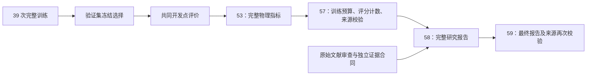

# 完整研究汇报的自动交付说明

本文规定正在执行的完整 CESM2 比较如何收尾，**不表示训练或最终选型已经完成**。实时进度见[训练进度](matched_progress_20261007.md)。

39 次注册训练（13 个架构设置，每个 3 个种子、15,000 步）全部完成后，先只用 2004 验证集冻结架构选择，再统一导出此前使用过的 2005 开发年预测。所有方法使用每月 6,080 条输入剖面，并在温度和盐度各 351,895 个共同有效值上评分。固定对照包含气候态、最近剖面、Pointwise MLP、经典 OI，以及此前最好的 learned OI。

最终完整汇报将写入 `reports/synthetic/final_research_report_20261007.md`；对应机器可读产物写入 `outputs/synthetic_matched_20261007/final_research_report_20261007.json`。报告包含：

1. 研究目标、实际验证范围、数据和完整实验设置。
2. 按验证集选定的最终模型与 backbone、架构图、组件、公式、参数和权重。
3. 与之前 64-slot 方法逐项对比：观测表示、OI 锚点、数值新息通路、latent/MoE、训练目标及优化配置。
4. 物理单位的 RMSE、MAE、偏差、R²、相关性，三种子均值与标准差、集成结果，以及逐深度结果。
5. 不确定性的 NLL、CRPS、68%/95% 覆盖率和区间尺度；相对旧版、经典 OI、最强既有 learned OI 的配对差值与区间。
6. 已注册的组件消融与同 family 的表层产品增益，指出哪些组件得到独立证据支持。
7. 核心 contribution/novelty：已实现变化、实验支持的价值、已有组件来源，以及仍未证明的研究假设。
8. 十二篇相关原始文献的具体机制对比和新颖性风险，重点讨论 CLOINet、ADAF-Ocean 与 TS-Cast。
9. 真实 Argo 结果的独立附录、当前局限和后续应采用的模型。

最终 backbone 不预先指定为 Transformer 或 MoE。如果既有 learned OI 或关闭 latent 的模型在验证集获选，报告按实际结果决定架构。旧模型本来已有共享 latent，因此新旧整体误差差值不能解释为“第一次加入 latent”的贡献。SoftMoE 的组件消融只支持该 family，不能移借给 Dense 或 Local Transformer 的赢家。相关领域论文原文的误差不来自相同数据设置，不能直接拼成排名。

方法创新与性能优势分别判断。通用 latent、Transformer/MoE、卫星与剖面融合都有先例；本轮的可检验设计是冻结 OI、逐层原始数值新息旁路与共享上下文怎样协作。报告只将实际支持的部分列为贡献。本协议中的最好结果不能直接称为全领域 SOTA。

自动收尾链条：

[58 报告生成器](../../experiments/synthetic/58_final_research_report.py)要求完成凭证中的指标、选择、基础报告 SHA256 一致，并再次检查冻结权重与评分产物。缺少完成证据时返回 pending，不生成正式最终报告。[59 自动交付服务](../../experiments/synthetic/59_final_report_delivery.py)独立等待完整实验完成，核验事先封印的报告代码、文献和证据文件，并生成 `research_report_completion.json`。该文件存在且 `phase=complete` 才表示完整研究汇报已通过交付检查。

后台服务名为 `ocean-synthetic-research-report-20261007.service`；状态与日志在 `outputs/synthetic_matched_20261007/research_report_status.json` 和 `research_report_delivery.log`。训练服务、冻结配置和评分选择规则保持由现有实验流程执行。

可立即审阅的材料：

- [完整架构与实验协议](matched_architecture_protocol_20261007.md)
- [文献相似性与贡献审查](literature_novelty_audit_20261007.md)
- [最终报告证据合同](final_report_evidence_contract_20261007.md)
