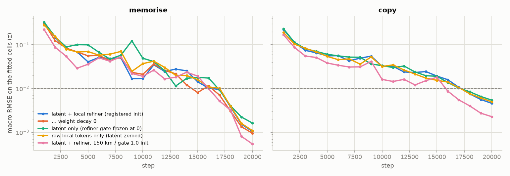
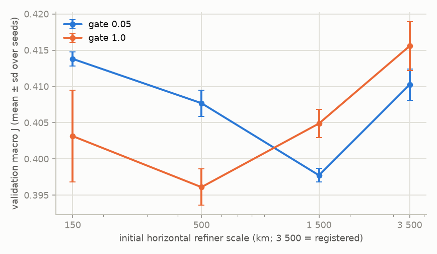

# Synthetic Argo interpolation audit — CESM2, known truth

<!-- generated by 43_synth_argo_report.py from outputs/audit/synthetic/ — do not edit by hand -->

The 2026-09-26 plan, run on synthetic data only: CESM2-LE is the ocean, synthetic Argo profiles are drawn from it, so the truth at every query is known. No real observation is used anywhere below.

## Todo status (2026-10-04)

The five items of the 2026-10-04 todo, all on CESM2 synthetic data. Every arm below was given the same 6,080 input profiles a month, 12 k steps where it is trained (15 k for the re-runs of §10), the same splits, and is scored on the same 351,895 test cells per variable; the report checks this when it is generated. Test year 2005; Δ are paired over seeds.

| todo item | arms | inputs / month | seeds | test result | section |
|---|---|---|---|---|---|
| Anomaly target at the Argo position | `syn_reg_cell` → `syn_reg` | 6,080 | 3 | 0.311 → 0.237 °C (-24 %), 0.0600 → 0.0450 PSU (-25 %) | §5 |
| Compare with a fixed baseline (OI) | `fixed_baselines` vs `syn_r500_g1` | 6,080 | 3 (model) | OI 0.0860 °C / 0.0226 PSU; model 0.2296 ± 0.0021 °C / 0.0425 ± 0.0002 PSU; the model loses to OI on both variables; pointwise MLP 0.1752 ± 0.0006 °C / 0.0370 ± 0.0002 PSU | §9 |
| Local refiner sweep, 3 seeds each | 8 inits, `syn_reg` … `syn_r1500_g1` | 6,080 | 3 | selected on validation: `syn_r500_g1` (500 km / 100 m, gate 1.0), 0.2296 ± 0.0021 °C; vs the registered init -0.0075 ± 0.0021 (n=3) °C; at 15 k steps and 64 slots: `k15_l64_syn_r500_g1` 0.2293 ± 0.0023 °C | §4, §10 |
| Slots 32 → 64 | `syn_r500_g1` → `syn_fix_l64` | 6,080 | 3 | +0.0008 ± 0.0026 (n=3) °C, -0.00022 ± 0.00016 (n=3) PSU; over the nine refiner arms at 15 k steps: -0.0005 ± 0.0032 °C, better in 14 of 27 runs | §7, §10 |
| DFS vs uniform vs count | `syn_r500_g1`, `syn_fix_uniform`, `syn_fix_count` | 6,080 | 3 | uniform +0.0013 ± 0.0010 (n=3) °C, count +0.0010 ± 0.0011 (n=3) °C against DFS; at 15 k steps and 64 slots: uniform +0.0012 ± 0.0011 (n=3) °C, count +0.0005 ± 0.0018 (n=3) °C | §8, §11 |

## Findings

1. **Task** — 7,600 synthetic profiles a month at uniform random positions, 1,520 fixed queries, train 2000-03 / validation 2004 / test 2005.
2. **Overfit passes** — every decoder fits its fixed month to ≤ 0.0056 z (the bar is 0.01) in 20 k steps; the same curves read 0.031-0.071 z at 8 k steps, the budget of the real-data run.
3. **No bottleneck** — latent only, raw local tokens only, and latent + refiner all memorise and copy to ≤ 0.006 z.
4. **Refiner** — the selected init (500 km / 100 m, gate 1.0) beats the registered one by 0.0075 ± 0.0021 °C and 0.0024 ± 0.0003 PSU on test (3 seeds); all eight refiner arms lie within 0.0089 °C of each other, and no run collapsed (validation macro J 0.393-0.420).
5. **At-position climatology** — the largest effect: 0.074 °C (24 %) and 0.0150 PSU (25 %) on test against the cell-centre target, 3 seeds.
6. **z-score tails are physical** — the one data defect (a T = 0 / S = 0 regridding fill, z ≈ -369) is removed at source; the remaining |z| > 8 values are open-ocean signal, and 8σ QC would delete 92,167 TEMP / 33,780 SALT true values. The normalisation was left unchanged.
7. **Latent capacity** — against 32 slots, 64 and 128 change test TEMP by +0.0008 to +0.0026 °C in the Perceiver-IO fuse and -0.0020 to -0.0002 °C in the PhCA-style fuse (seed sd ≈ 0.002): no effect in either fuse.
8. **DFS / uniform / count, Perceiver-IO / PhCA-style** — all within -0.0010 to +0.0019 °C of their reference: ties. With uniform random positions there is no redundancy for DFS to handle, so this cohort shows only that DFS costs nothing when redundancy is absent.

9. **Fixed baselines** — on the same 6,080 input profiles a month and the same 351,895 test cells, validation-tuned OI scores 0.0860 °C / 0.0226 PSU and the model 0.2296 ± 0.0021 °C / 0.0425 ± 0.0002 PSU: the model loses to OI on both variables (model − OI +0.1436 °C, +167.0 %; +0.01987 PSU, +87.7 %). Nearest profile: 0.1728 °C / 0.0371 PSU; pointwise MLP (trained): 0.1752 ± 0.0006 °C / 0.0370 ± 0.0002 PSU; climatology: 0.6528 °C / 0.1119 PSU.

10. **15 k steps and 64 slots** — re-running the nine refiner arms at 15 k steps changes test TEMP by -0.0006 °C on average over 27 paired runs (better in 19), and 64 slots instead of 32 at 15 k steps by -0.0005 °C (better in 14 of 27): neither moves the model. Validation selects 500 km / 100 m, gate 1.0 at 15 k steps and 64 slots: 0.2293 ± 0.0023 °C / 0.0417 ± 0.0004 PSU, 2.67 × OI's temperature error.

11. **Mass rule at 64 slots and 15 k steps** — uniform is +0.0012 °C and count +0.0005 °C from DFS on test (3 seeds, seed sd ≈ 0.002): still ties, as in finding 8.

## 1. The task: fixed Argo-only interpolation, controlled split

Built by `experiments/synthetic/41_synth_argo_cohort.py` into `data/synthetic_argo/cesm2_uniform.nc` (seed 20260926, fixed once).

|  |  |
|---|---|
| ocean | CESM2-LE 1° monthly TEMP/SALT, 2000-01 … 2005-12 (72 months) |
| levels | the real global cohort's 20 levels, 5-985 m (all CESM2 native levels: no vertical interpolation) |
| positions | uniform random on the sphere over ocean, continuous lat/lon; CESM2 bilinearly interpolated to each position |
| density | 7,600 profiles a month: 6,080 inputs, 1,520 queries (even spacing of the inputs ≈ 244 km) |
| split | train 2000-2003 / validation 2004 / test 2005; queries fixed per month, identical for every arm and seed |
| target | anomaly against CESM2's own train-month 1° monthly climatology (the WOA23 stand-in), at the profile's position unless an arm says otherwise |
| input | profiles only (no satellite fields) |
| model | the audit's 405 K Perceiver-IO + DFS + D4RT decoder (`62_sanity_train.py --region synthetic`), unchanged |

Training draws inputs and targets from the input profiles of training months (30 % of them as targets each step, as the real-data driver does); every score below is on the fixed query profiles.

## 2-3. Overfit test and bottleneck isolation

The plan's bar: drive the error to ~0.01 (z units, i.e. 1 % of the per-level anomaly std) on material the model may memorise. Two rungs, one fixed training month (seed 1234):

- **memorise** — one month, fixed inputs, fixed query profiles; train and score on the same cells;

- **copy** — the queries are 512 of the input profiles themselves, at their own positions and levels (can a value reach a query at all?).

Both rungs use December 2003, the registered cell-centre anomaly target and the registered refiner init unless the row says otherwise; AdamW, lr 1e-3 with 300 warm-up steps and cosine decay to 0 at 20 k, weight decay 0.01, 1 024 of the fixed cells per step, all fixed cells scored every 1 000 steps.

The bottleneck split is three decoders over the same encoder: the global latent alone, the raw observation tokens alone (through the query-local refiner), and both.

| rung | run | decoder | TEMP z | TEMP °C | SALT z | SALT PSU | steps | ≤ 0.01 z? |
|---|---|---|---|---|---|---|---|---|
| memorise | `syn_mem_base` | latent + local refiner (registered init) | 0.0013 | 0.0006 | 0.0008 | 0.0001 | 20000 | **yes** |
| memorise | `syn_mem_wd0` | … weight decay 0 | 0.0012 | 0.0007 | 0.0007 | 0.0001 | 20000 | **yes** |
| memorise | `syn_mem_latent_only` | latent only (refiner gate frozen at 0) | 0.0018 | 0.0009 | 0.0015 | 0.0001 | 20000 | **yes** |
| memorise | `syn_mem_tokens_only` | raw local tokens only (latent zeroed) | 0.0012 | 0.0006 | 0.0010 | 0.0001 | 20000 | **yes** |
| memorise | `syn_mem_local` | latent + refiner, 150 km / gate 1.0 init | 0.0006 | 0.0003 | 0.0005 | 0.0000 | 20000 | **yes** |
| copy | `syn_copy_base` | latent + local refiner (registered init) | 0.0051 | 0.0026 | 0.0041 | 0.0005 | 20000 | **yes** |
| copy | `syn_copy_latent_only` | latent only (refiner gate frozen at 0) | 0.0053 | 0.0027 | 0.0056 | 0.0006 | 20000 | **yes** |
| copy | `syn_copy_tokens_only` | raw local tokens only (latent zeroed) | 0.0053 | 0.0026 | 0.0047 | 0.0005 | 20000 | **yes** |
| copy | `syn_copy_local` | latent + refiner, 150 km / gate 1.0 init | 0.0023 | 0.0011 | 0.0023 | 0.0003 | 20000 | **yes** |

## 4. Local refiner: initial scale and gate

Train mode, 12 k steps, seeds 1234-1236, target at the profile's position. Selection is on **validation** (2004, macro J = mean over T and S of RMSE / RMS of the target); the test year (2005) is reported, not selected on. Paired Δ = arm − registered on the same seed, test RMSE.

| run | refiner init | seeds | val macro J | test TEMP °C | test SALT PSU | Δ TEMP °C | Δ SALT PSU |
|---|---|---|---|---|---|---|---|
| `syn_reg` | registered (≈3 500 km, 300 m, gate 0.05) | 3 | 0.4102 ± 0.0026 | 0.2370 ± 0.0016 | 0.0450 ± 0.0001 | ref | ref |
| `syn_reg_g1` | registered scales, gate 1.0 | 3 | 0.4156 ± 0.0042 | 0.2383 ± 0.0010 | 0.0462 ± 0.0001 | +0.0013 ± 0.0006 (n=3) | +0.00124 ± 0.00020 (n=3) |
| `syn_r150_g005` | 150 km / 100 m, gate 0.05 | 3 | 0.4138 ± 0.0012 | 0.2385 ± 0.0023 | 0.0443 ± 0.0001 | +0.0015 ± 0.0007 (n=3) | -0.00065 ± 0.00007 (n=3) |
| `syn_r150_g1` | 150 km / 100 m, gate 1.0 | 3 | 0.4032 ± 0.0078 | 0.2323 ± 0.0055 | 0.0430 ± 0.0008 | -0.0047 ± 0.0052 (n=3) | -0.00197 ± 0.00074 (n=3) |
| `syn_r500_g005` | 500 km / 100 m, gate 0.05 | 3 | 0.4077 ± 0.0022 | 0.2349 ± 0.0015 | 0.0440 ± 0.0001 | -0.0021 ± 0.0013 (n=3) | -0.00095 ± 0.00021 (n=3) |
| `syn_r500_g1` | 500 km / 100 m, gate 1.0 | 3 | 0.3961 ± 0.0031 | 0.2296 ± 0.0021 | 0.0425 ± 0.0002 | -0.0075 ± 0.0021 (n=3) | -0.00245 ± 0.00025 (n=3) |
| `syn_r1500_g005` | 1500 km / 100 m, gate 0.05 | 3 | 0.3977 ± 0.0012 | 0.2319 ± 0.0026 | 0.0434 ± 0.0002 | -0.0051 ± 0.0018 (n=3) | -0.00156 ± 0.00031 (n=3) |
| `syn_r1500_g1` | 1500 km / 100 m, gate 1.0 | 3 | 0.4049 ± 0.0024 | 0.2344 ± 0.0024 | 0.0441 ± 0.0003 | -0.0027 ± 0.0028 (n=3) | -0.00087 ± 0.00036 (n=3) |

## 5. Anomaly target: climatology at the position vs at the 1° cell centre

Data first. The cell-centre target is `value − clim(cell centre)`; the difference from the at-position target, `clim(position) − clim(centre)`, is climatological gradient inside the cell, not anomaly. Train months, physical units, band means: RMS of that gradient term / RMS of the at-position anomaly (share of the cell-centre target's mean square that is gradient):

|  | 0-100 m | 100-300 m | 300-700 m | 700-985 m |
|---|---|---|---|---|
| TEMP | 0.179 / 0.491 (12 %) | 0.185 / 0.373 (23 %) | 0.110 / 0.107 (52 %) | 0.052 / 0.044 (58 %) |
| SALT | 0.042 / 0.106 (13 %) | 0.027 / 0.043 (31 %) | 0.016 / 0.013 (62 %) | 0.009 / 0.005 (77 %) |

|  | largest gradient term | values where it exceeds ¼ of the level's anomaly std |
|---|---|---|
| TEMP | 6.35 °C at 36.1°, 130.8°E, 65 m | 42 % |
| SALT | 6.48 PSU at 0.7°, 311.0°E, 5 m | 41 % |

The share grows with depth: the anomaly shrinks with depth faster than the climatology's gradient across a cell does. CESM2 at 1° has no mesoscale eddies, so its anomaly is smaller than a real one, and these shares likely overstate the effect on real Argo.

Trained, registered refiner init, 3 seeds. Both arms are scored in physical units, where the climatology cancels (`pred − true` of the raw value), so the two targets are compared on the same footing:

| run | target | seeds | test TEMP °C | test SALT PSU |
|---|---|---|---|---|
| `syn_reg_cell` | cell-centre climatology (registered target) | 3 | 0.3110 ± 0.0011 | 0.0600 ± 0.0002 |
| `syn_reg` | at-position climatology | 3 | 0.2370 ± 0.0016 | 0.0450 ± 0.0001 |

Paired Δ (at-position − cell-centre): TEMP -0.0740 ± 0.0007 (n=3) °C, SALT -0.01502 ± 0.00029 (n=3) PSU.

## 6. Salinity outliers and extreme z-scores (before touching the normalisation)

z = (at-position anomaly − train mean) / train std, per level — the scheme the model trains on. Every value in this cohort is true, so a tail here is physical.

|  | median |z| | 99 % | 99.9 % | 99.99 % | max |z| | values |z| > 8 | share of Σz² from |z| > 4 / > 8 |
|---|---|---|---|---|---|---|---|
| TEMP | 0.53 | 5.01 | 10.00 | 15.1 | 24.3 | 24,069 | 40 % / 15 % |
| SALT | 0.49 | 4.70 | 8.16 | 12.3 | 33.9 | 11,703 | 33 % / 7 % |

|  | where the |z| > 8 values are |
|---|---|
| TEMP | open ocean 100 %, Arctic (>66N) 0 %, Rio de la Plata 0 %, Amazon plume 0 %, Southern Ocean (<60S) 0 % |
| SALT | open ocean 95 %, Southern Ocean (<60S) 2 %, Arctic (>66N) 2 %, Congo plume 1 %, Amazon plume 1 % |

The largest values:

|  | z | anomaly | position | depth | month |
|---|---|---|---|---|---|
| TEMP | +24.3 | +12.783 °C | 6.8°, 263.3°E | 65 m | 2004-02 |
| TEMP | +23.6 | +12.427 °C | 6.2°, 261.2°E | 65 m | 2004-02 |
| TEMP | +23.6 | +9.084 °C | 8.8°, 193.3°E | 165 m | 2005-12 |
| SALT | -33.9 | -0.149 PSU | -51.2°, 82.9°E | 985 m | 2003-05 |
| SALT | -32.8 | -0.410 PSU | 13.8°, 282.3°E | 409 m | 2005-02 |
| SALT | -31.3 | -0.137 PSU | -51.3°, 82.9°E | 985 m | 2003-06 |

Per level (train months): std in physical units / std ÷ (1.4826 MAD) / kurtosis (3 for a Gaussian):

|  | 5 m | 125 m | 327 m | 985 m |
|---|---|---|---|---|
| TEMP | 0.4700 / 1.21 / 5 | 0.5164 / 1.83 / 17 | 0.1380 / 1.50 / 8 | 0.0344 / 1.46 / 7 |
| SALT | 0.1261 / 1.97 / 12 | 0.0556 / 1.42 / 8 | 0.0174 / 1.52 / 12 | 0.0044 / 1.70 / 27 |

Two checks on the data themselves:

- **One real defect, removed at source.** The CESM2 store has 29 coastal columns whose deepest wet level reads TEMP = 0, SALT = 0 in every month (2,232 values on the 20 levels) — a regridding fill. `41` masks them before interpolation. Left in, they would have given 20 sampled values at SALT = 0 PSU, z ≈ -369 to -356: the synthetic counterpart of the real data's bad conductivity cells.

- **The real pipeline's 8σ QC would delete true values.** Applied to this all-true cohort, `robust_qc` flags 92,167 TEMP and 33,780 SALT values and drops 4,324 / 1,449 whole profile-channels — every one a false positive.

## 7. Latent capacity: 32 / 64 / 128 slots

On the validated configuration (`syn_r500_g1`: at-position target + the refiner init chosen in §4 on validation, 500 km / 100 m, gate 1.0), DFS mass, in both fuses; only the number of latent slots changes, and each fuse is compared with its own 32-slot run. In the PhCA-style fuse the position-MLP width stays 96, so its output layer grows with the slot count. §8 compares the fuses at 32 slots, where they are size-matched.

| run | fuse | slots | params | seeds | val macro J | test TEMP °C | test SALT PSU | Δ TEMP °C vs 32 | Δ SALT PSU vs 32 |
|---|---|---|---|---|---|---|---|---|---|
| `syn_r500_g1` | Perceiver-IO | 32 | 405,063 | 3 | 0.3961 ± 0.0031 | 0.2296 ± 0.0021 | 0.0425 ± 0.0002 | ref | ref |
| `syn_fix_l64` | Perceiver-IO | 64 | 407,111 | 3 | 0.3933 ± 0.0024 | 0.2304 ± 0.0025 | 0.0423 ± 0.0002 | +0.0008 ± 0.0026 (n=3) | -0.00022 ± 0.00016 (n=3) |
| `syn_fix_l128` | Perceiver-IO | 128 | 411,207 | 3 | 0.3974 ± 0.0037 | 0.2321 ± 0.0005 | 0.0425 ± 0.0007 | +0.0026 ± 0.0023 (n=3) | -0.00005 ± 0.00058 (n=3) |
| `syn_fix_lno` | PhCA-style (LNO) | 32 | 405,543 | 3 | 0.3942 ± 0.0033 | 0.2315 ± 0.0010 | 0.0424 ± 0.0002 | ref | ref |
| `syn_fix_lno_s64` | PhCA-style (LNO) | 64 | 420,007 | 3 | 0.3982 ± 0.0023 | 0.2312 ± 0.0015 | 0.0424 ± 0.0005 | -0.0002 ± 0.0009 (n=3) | +0.00005 ± 0.00041 (n=3) |
| `syn_fix_lno_s128` | PhCA-style (LNO) | 128 | 448,935 | 3 | 0.3956 ± 0.0019 | 0.2295 ± 0.0012 | 0.0422 ± 0.0002 | -0.0020 ± 0.0021 (n=3) | -0.00020 ± 0.00017 (n=3) |

## 8. DFS vs uniform / count mass, Perceiver-IO vs PhCA-style fuse

Validated configuration, same D4RT decoder; one switch per row. Mass rules are compared inside each fuse; the fuses are compared at DFS. With uniform random positions there is no float clustering for DFS to correct, so this cohort can only show whether DFS *costs* anything when redundancy is absent.

| run | fuse | mass | params | seeds | val macro J | test TEMP °C | test SALT PSU | paired Δ TEMP °C |
|---|---|---|---|---|---|---|---|---|
| `syn_r500_g1` | Perceiver-IO | DFS | 405,063 | 3 | 0.3961 ± 0.0031 | 0.2296 ± 0.0021 | 0.0425 ± 0.0002 | ref |
| `syn_fix_uniform` | Perceiver-IO | uniform | 405,063 | 3 | 0.3962 ± 0.0020 | 0.2308 ± 0.0026 | 0.0426 ± 0.0000 | +0.0013 ± 0.0010 (n=3) vs `syn_r500_g1` |
| `syn_fix_count` | Perceiver-IO | count | 405,063 | 3 | 0.3954 ± 0.0024 | 0.2305 ± 0.0010 | 0.0424 ± 0.0003 | +0.0010 ± 0.0011 (n=3) vs `syn_r500_g1` |
| `syn_fix_lno` | PhCA-style (LNO) | DFS | 405,543 | 3 | 0.3942 ± 0.0033 | 0.2315 ± 0.0010 | 0.0424 ± 0.0002 | +0.0019 ± 0.0019 (n=3) vs `syn_r500_g1` |
| `syn_fix_lno_uniform` | PhCA-style (LNO) | uniform | 405,543 | 3 | 0.3954 ± 0.0029 | 0.2321 ± 0.0027 | 0.0423 ± 0.0003 | +0.0006 ± 0.0020 (n=3) vs `syn_fix_lno` |
| `syn_fix_lno_count` | PhCA-style (LNO) | count | 405,543 | 3 | 0.3948 ± 0.0042 | 0.2305 ± 0.0022 | 0.0423 ± 0.0004 | -0.0010 ± 0.0013 (n=3) vs `syn_fix_lno` |

## 9. Baselines: climatology, nearest profile, pointwise MLP, optimal interpolation

Methods with no trainable parameters, written by `experiments/synthetic/44_synth_argo_oi.py` and scored on the cells the models are scored on: the same 6,080 input profiles a month (every method is given all of them), the same 1,520 query profiles, the at-position target, the train-year normalisation, and 351,895 test cells per variable. A zero prediction reproduces the cell counts and climatology error stored in the model summaries, and this report refuses to render if any cited arm saw a different number of profiles.

OI is `ocean_tokenizer.oi` (Bretherton et al. 1976): level by level, Gaussian covariance in great-circle distance, the k nearest profiles. Length scale, noise ratio and k are selected on the validation year, one setting per variable and depth band; the test year is scored once.

The pointwise MLP is the one trained baseline here, written by `experiments/synthetic/45_synth_argo_mlp.py`: the gridded line's `baselines.MLP` with its original settings (256-256-256, 134,658 parameters, Adam, 30 epochs, 120,000 training cells a month, last-epoch weights with no selection), given Argo profiles only. Each cell is predicted on its own from its position, the calendar month, the nearest input profile's TEMP and SALT at that level and the distance to it. It is trained on the input profiles of 2000-2003, with 30 % of them drawn as targets in each month as the model's own training does, and is given all 6,080 input profiles of the month when it is scored.

| method | inputs / month | selected on | test TEMP °C | test SALT PSU | J TEMP | J SALT |
|---|---|---|---|---|---|---|
| climatology (zero anomaly) | 6,080 | — | 0.6528 | 0.1119 | 1.000 | 1.000 |
| nearest profile | 6,080 | — | 0.1728 | 0.0371 | 0.299 | 0.364 |
| pointwise MLP, trained (mean ± sd, 3 seeds) | 6,080 | nothing (last epoch) | 0.1752 ± 0.0006 | 0.0370 ± 0.0002 | 0.3078 ± 0.0007 | 0.3767 ± 0.0022 |
| OI, one setting per variable | 6,080 | validation 2004 | 0.0860 | 0.0226 | 0.163 | 0.227 |
| **OI, tuned per variable and depth band** | 6,080 | validation 2004 | 0.0860 | 0.0226 | 0.164 | 0.225 |
| model `syn_r500_g1` (mean ± sd, 3 seeds) | 6,080 | validation 2004 | 0.2296 ± 0.0021 | 0.0425 ± 0.0002 | 0.3766 ± 0.0033 | 0.4488 ± 0.0008 |

Model − OI on test: TEMP +0.1436 °C (+167.0 %, model seed sd 0.0021), SALT +0.01987 PSU (+87.7 %, seed sd 0.00017). Negative means the model is better.

By depth band, test RMSE in z units:

|  |  | 0-100m | 100-300m | 300-700m | 700-1400m |
|---|---|---|---|---|---|
| TEMP | OI | 0.2057 | 0.2490 | 0.3608 | 0.4047 |
| TEMP | pointwise MLP (mean of seeds) | 0.3835 | 0.5407 | 0.6026 | 0.6857 |
| TEMP | model (mean of seeds) | 0.4982 | 0.6899 | 0.6693 | 0.7665 |
| TEMP | model − OI | +0.2925 | +0.4409 | +0.3085 | +0.3618 |
| SALT | OI | 0.2924 | 0.3483 | 0.4824 | 0.5056 |
| SALT | pointwise MLP (mean of seeds) | 0.4842 | 0.5909 | 0.7701 | 0.8919 |
| SALT | model (mean of seeds) | 0.5550 | 0.7901 | 0.8754 | 0.9366 |
| SALT | model − OI | +0.2626 | +0.4419 | +0.3931 | +0.4310 |

Selected OI settings:

|  | band | L (km) | gamma | k | validation RMSE z | on a grid edge |
|---|---|---|---|---|---|---|
| TEMP | 0-100m | 400 | 0.003 | 20 | 0.2128 | — |
| TEMP | 100-300m | 250 | 0.01 | 40 | 0.2686 | — |
| TEMP | 300-700m | 250 | 0.01 | 40 | 0.3903 | — |
| TEMP | 700-1400m | 250 | 0.003 | 20 | 0.3973 | — |
| SALT | 0-100m | 250 | 0.01 | 40 | 0.2814 | — |
| SALT | 100-300m | 250 | 0.01 | 40 | 0.3621 | — |
| SALT | 300-700m | 250 | 0.03 | 40 | 0.4851 | — |
| SALT | 700-1400m | 250 | 0.01 | 10 | 0.5105 | — |

## 10. Longer training and more slots: the refiner sweep at 15 k steps

The `syn_refiner` queue of §4-§5 re-run at 15,000 steps, once with the registered 32 latent slots (`syn_refiner_k15`, tags `k15_*`) and once with 64 (`syn_refiner_k15_l64`, tags `k15_l64_*`; `--n-latent 64`, each slot still 64 channels wide, 407,111 parameters against 405,063): nine arms × three seeds each. Everything else is as in §4: the same 6,080 input profiles a month, the same splits and the same scored cells, which this report checks. §4 found every seed of the selected arm still improving at its last step, which is what these runs follow up.

Pooled over the nine arms and three seeds (27 paired runs), test RMSE, mean ± sd of the paired differences:

| change | Δ test TEMP °C | runs better | Δ test SALT PSU | runs better |
|---|---|---|---|---|
| 12 k → 15 k steps, at 32 slots | -0.0006 ± 0.0024 | 19 of 27 | -0.00043 ± 0.00057 | 22 of 27 |
| 32 → 64 slots, at 15 k steps | -0.0005 ± 0.0032 | 14 of 27 | -0.00003 ± 0.00061 | 16 of 27 |

Test TEMP (°C) per arm, mean ± sd over seeds; Δ are paired on the same seed:

| refiner init | 12 k steps, 32 slots | 15 k steps, 32 slots | 15 k steps, 64 slots | Δ 15 k − 12 k (32 slots) | Δ 64 − 32 slots (15 k) |
|---|---|---|---|---|---|
| registered init, cell-centre target | 0.3110 ± 0.0011 | 0.3109 ± 0.0029 | 0.3112 ± 0.0016 | -0.0001 ± 0.0021 (n=3) | +0.0003 ± 0.0036 (n=3) |
| registered (≈3 500 km, 300 m, gate 0.05) | 0.2370 ± 0.0016 | 0.2362 ± 0.0020 | 0.2309 ± 0.0053 | -0.0009 ± 0.0021 (n=3) | -0.0052 ± 0.0035 (n=3) |
| registered scales, gate 1.0 | 0.2383 ± 0.0010 | 0.2369 ± 0.0007 | 0.2352 ± 0.0042 | -0.0015 ± 0.0003 (n=3) | -0.0017 ± 0.0035 (n=3) |
| 150 km / 100 m, gate 0.05 | 0.2385 ± 0.0023 | 0.2382 ± 0.0017 | 0.2384 ± 0.0005 | -0.0003 ± 0.0010 (n=3) | +0.0003 ± 0.0017 (n=3) |
| 150 km / 100 m, gate 1.0 | 0.2323 ± 0.0055 | 0.2347 ± 0.0020 | 0.2332 ± 0.0020 | +0.0023 ± 0.0059 (n=3) | -0.0015 ± 0.0038 (n=3) |
| 500 km / 100 m, gate 0.05 | 0.2349 ± 0.0015 | 0.2346 ± 0.0009 | 0.2344 ± 0.0007 | -0.0004 ± 0.0007 (n=3) | -0.0001 ± 0.0009 (n=3) |
| 500 km / 100 m, gate 1.0 | 0.2296 ± 0.0021 | 0.2302 ± 0.0033 | 0.2293 ± 0.0023 | +0.0006 ± 0.0012 (n=3) | -0.0009 ± 0.0013 (n=3) |
| 1500 km / 100 m, gate 0.05 | 0.2319 ± 0.0026 | 0.2296 ± 0.0017 | 0.2317 ± 0.0015 | -0.0023 ± 0.0016 (n=3) | +0.0021 ± 0.0028 (n=3) |
| 1500 km / 100 m, gate 1.0 | 0.2344 ± 0.0024 | 0.2317 ± 0.0023 | 0.2339 ± 0.0015 | -0.0026 ± 0.0002 (n=3) | +0.0022 ± 0.0033 (n=3) |

Test SALT (PSU) per arm, mean ± sd over seeds; Δ are paired on the same seed:

| refiner init | 12 k steps, 32 slots | 15 k steps, 32 slots | 15 k steps, 64 slots | Δ 15 k − 12 k (32 slots) | Δ 64 − 32 slots (15 k) |
|---|---|---|---|---|---|
| registered init, cell-centre target | 0.0600 ± 0.0002 | 0.0598 ± 0.0003 | 0.0598 ± 0.0003 | -0.00015 ± 0.00033 (n=3) | +0.00002 ± 0.00060 (n=3) |
| registered (≈3 500 km, 300 m, gate 0.05) | 0.0450 ± 0.0001 | 0.0449 ± 0.0013 | 0.0447 ± 0.0004 | -0.00001 ± 0.00141 (n=3) | -0.00029 ± 0.00109 (n=3) |
| registered scales, gate 1.0 | 0.0462 ± 0.0001 | 0.0455 ± 0.0011 | 0.0459 ± 0.0003 | -0.00070 ± 0.00098 (n=3) | +0.00036 ± 0.00088 (n=3) |
| 150 km / 100 m, gate 0.05 | 0.0443 ± 0.0001 | 0.0438 ± 0.0002 | 0.0440 ± 0.0004 | -0.00045 ± 0.00019 (n=3) | +0.00013 ± 0.00048 (n=3) |
| 150 km / 100 m, gate 1.0 | 0.0430 ± 0.0008 | 0.0427 ± 0.0007 | 0.0423 ± 0.0002 | -0.00024 ± 0.00040 (n=3) | -0.00044 ± 0.00077 (n=3) |
| 500 km / 100 m, gate 0.05 | 0.0440 ± 0.0001 | 0.0436 ± 0.0001 | 0.0434 ± 0.0002 | -0.00045 ± 0.00006 (n=3) | -0.00018 ± 0.00018 (n=3) |
| 500 km / 100 m, gate 1.0 | 0.0425 ± 0.0002 | 0.0420 ± 0.0001 | 0.0417 ± 0.0004 | -0.00046 ± 0.00015 (n=3) | -0.00033 ± 0.00035 (n=3) |
| 1500 km / 100 m, gate 0.05 | 0.0434 ± 0.0002 | 0.0427 ± 0.0002 | 0.0430 ± 0.0004 | -0.00072 ± 0.00006 (n=3) | +0.00035 ± 0.00059 (n=3) |
| 1500 km / 100 m, gate 1.0 | 0.0441 ± 0.0003 | 0.0434 ± 0.0002 | 0.0434 ± 0.0003 | -0.00072 ± 0.00032 (n=3) | +0.00008 ± 0.00047 (n=3) |

Validation macro J, the selection criterion (the selected at-position arm of each column in bold):

| refiner init | 12 k steps, 32 slots | 15 k steps, 32 slots | 15 k steps, 64 slots |
|---|---|---|---|
| registered init, cell-centre target | 0.5435 ± 0.0024 | 0.5406 ± 0.0027 | 0.5410 ± 0.0023 |
| registered (≈3 500 km, 300 m, gate 0.05) | 0.4102 ± 0.0026 | 0.4033 ± 0.0065 | 0.4057 ± 0.0064 |
| registered scales, gate 1.0 | 0.4156 ± 0.0042 | 0.4072 ± 0.0015 | 0.4081 ± 0.0007 |
| 150 km / 100 m, gate 0.05 | 0.4138 ± 0.0012 | 0.4106 ± 0.0016 | 0.4081 ± 0.0030 |
| 150 km / 100 m, gate 1.0 | 0.4032 ± 0.0078 | 0.4024 ± 0.0068 | 0.3972 ± 0.0037 |
| 500 km / 100 m, gate 0.05 | 0.4077 ± 0.0022 | 0.4052 ± 0.0015 | 0.4022 ± 0.0028 |
| 500 km / 100 m, gate 1.0 | **0.3961 ± 0.0031** | 0.3926 ± 0.0038 | **0.3897 ± 0.0014** |
| 1500 km / 100 m, gate 0.05 | 0.3977 ± 0.0012 | **0.3923 ± 0.0014** | 0.3929 ± 0.0015 |
| 1500 km / 100 m, gate 1.0 | 0.4049 ± 0.0024 | 0.3974 ± 0.0033 | 0.3966 ± 0.0021 |

Validation selects 500 km / 100 m, gate 1.0 at 12 k steps, 1500 km / 100 m, gate 0.05 at 15 k steps with 32 slots, and 500 km / 100 m, gate 1.0 at 15 k steps with 64 slots (`k15_l64_syn_r500_g1`: 0.2293 ± 0.0023 °C, 0.0417 ± 0.0004 PSU on test). 45 of the 54 runs at 15 k steps still had their best validation score at the last step. Against OI (§9), `k15_l64_syn_r500_g1` has 2.67 × its temperature error and 1.84 × its salinity error.

## 11. DFS vs uniform / count mass at 15 k steps and 64 slots

§8 on the current model: the validated refiner init (500 km / 100 m, gate 1.0), the at-position target, the Perceiver-IO fuse, 64 latent slots and 15,000 steps; only the mass rule changes. The DFS row is the §10 run and is not repeated. Paired Δ = arm − DFS on the same seed, test RMSE.

| run | mass | params | seeds | val macro J | test TEMP °C | test SALT PSU | paired Δ TEMP °C | paired Δ SALT PSU |
|---|---|---|---|---|---|---|---|---|
| `k15_l64_syn_r500_g1` | DFS | 407,111 | 3 | 0.3897 ± 0.0014 | 0.2293 ± 0.0023 | 0.0417 ± 0.0004 | ref | ref |
| `k15_l64_syn_fix_uniform` | uniform | 407,111 | 3 | 0.3911 ± 0.0015 | 0.2305 ± 0.0023 | 0.0420 ± 0.0002 | +0.0012 ± 0.0011 (n=3) | +0.00028 ± 0.00022 (n=3) |
| `k15_l64_syn_fix_count` | count | 407,111 | 3 | 0.3882 ± 0.0029 | 0.2298 ± 0.0027 | 0.0418 ± 0.0001 | +0.0005 ± 0.0018 (n=3) | +0.00009 ± 0.00027 (n=3) |
