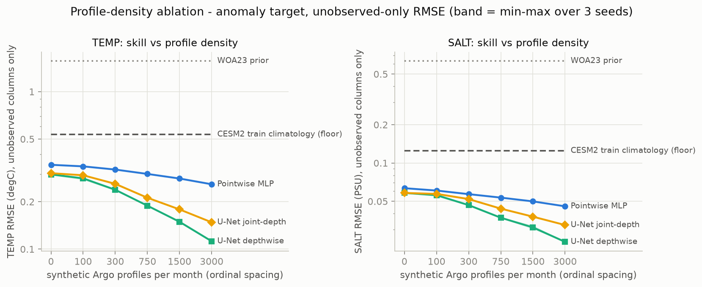
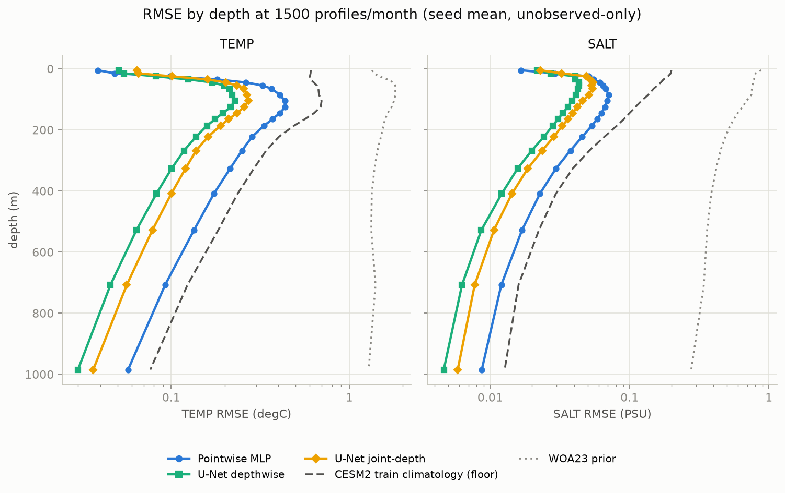

# Week-2 — Profile-Density Ablation (multi-seed) + Shared-Latent Interface

- **Protocol:** identical to the week-1 audit — train-only monthly CESM2 anomaly target, **unobserved-only RMSE** (observed profile columns excluded), input config `profiles_woa_surf` for the learned methods.
- **Seeds:** [1234, 1235, 1236] — the train/test month split is FIXED (seed 1234); seeds vary the profile sampling, MLP point subsampling, and torch init/training. Spread = observation-sampling + training variance.
- **Split:** 312 train / 12 test months.
- **Densities:** [0, 100, 300, 750, 1500, 3000] profiles/month; every learned method is **retrained per density** (the retrain-required contrast the shared-latent model is meant to beat with a single model).
- **Commit:** `a4bcf76ffadf`

## Headline — 1500 profiles/month (mean ± std over 3 seeds)

| method | TEMP RMSE (degC) | SALT RMSE (PSU) | TEMP skill | SALT skill |
|---|---|---|---|---|
| WOA23 prior | 1.5671 ± 0.0003 | 0.6342 ± 0.0002 | — | — |
| Climatology floor (train-only) | 0.5352 ± 0.0002 | 0.1248 ± 0.0000 | — | — |
| Pointwise MLP | 0.2808 ± 0.0008 | 0.0499 ± 0.0002 | +0.475 | +0.600 |
| U-Net (depthwise) | 0.1492 ± 0.0021 | 0.0312 ± 0.0011 | +0.721 | +0.750 |
| U-Net (joint-depth) | 0.1787 ± 0.0013 | 0.0379 ± 0.0003 | +0.666 | +0.697 |

Skill = 1 − RMSE / floor-RMSE at the same density (positive = beats the train-only climatology).

## RMSE vs profile density

### TEMP (degC)

| method | 0 | 100 | 300 | 750 | 1500 | 3000 |
|---|---|---|---|---|---|---|
| WOA23 prior | 1.5672 ± 0.0000 | 1.5672 ± 0.0000 | 1.5669 ± 0.0001 | 1.5672 ± 0.0000 | 1.5671 ± 0.0003 | 1.5674 ± 0.0002 |
| Climatology floor (train-only) | 0.5351 ± 0.0000 | 0.5351 ± 0.0000 | 0.5351 ± 0.0001 | 0.5352 ± 0.0001 | 0.5352 ± 0.0002 | 0.5351 ± 0.0002 |
| Pointwise MLP | 0.3431 ± 0.0028 | 0.3354 ± 0.0018 | 0.3201 ± 0.0019 | 0.3003 ± 0.0007 | 0.2808 ± 0.0008 | 0.2582 ± 0.0011 |
| U-Net (depthwise) | 0.2983 ± 0.0034 | 0.2813 ± 0.0061 | 0.2382 ± 0.0029 | 0.1888 ± 0.0012 | 0.1492 ± 0.0021 | 0.1122 ± 0.0013 |
| U-Net (joint-depth) | 0.3035 ± 0.0018 | 0.2945 ± 0.0007 | 0.2598 ± 0.0044 | 0.2120 ± 0.0022 | 0.1787 ± 0.0013 | 0.1480 ± 0.0013 |

### SALT (PSU)

| method | 0 | 100 | 300 | 750 | 1500 | 3000 |
|---|---|---|---|---|---|---|
| WOA23 prior | 0.6343 ± 0.0000 | 0.6343 ± 0.0001 | 0.6344 ± 0.0001 | 0.6343 ± 0.0001 | 0.6342 ± 0.0002 | 0.6344 ± 0.0003 |
| Climatology floor (train-only) | 0.1249 ± 0.0000 | 0.1249 ± 0.0000 | 0.1249 ± 0.0000 | 0.1249 ± 0.0000 | 0.1248 ± 0.0000 | 0.1248 ± 0.0000 |
| Pointwise MLP | 0.0634 ± 0.0003 | 0.0608 ± 0.0003 | 0.0569 ± 0.0006 | 0.0535 ± 0.0002 | 0.0499 ± 0.0002 | 0.0457 ± 0.0003 |
| U-Net (depthwise) | 0.0582 ± 0.0005 | 0.0559 ± 0.0013 | 0.0467 ± 0.0004 | 0.0372 ± 0.0003 | 0.0312 ± 0.0011 | 0.0240 ± 0.0001 |
| U-Net (joint-depth) | 0.0582 ± 0.0006 | 0.0572 ± 0.0011 | 0.0521 ± 0.0009 | 0.0438 ± 0.0007 | 0.0379 ± 0.0003 | 0.0326 ± 0.0002 |

## RMSE by depth at the standard density

## Per-seed detail (unobserved-only RMSE, TEMP / SALT)

| seed | density | WOA23 prior | Climatology floor (train-only) | Pointwise MLP | U-Net (depthwise) | U-Net (joint-depth) |
|---|---|---|---|---|---|---|
| 1234 | 0 | 1.567 / 0.6343 | 0.535 / 0.1249 | 0.346 / 0.0631 | 0.300 / 0.0577 | 0.302 / 0.0581 |
| 1234 | 100 | 1.567 / 0.6343 | 0.535 / 0.1248 | 0.337 / 0.0605 | 0.281 / 0.0558 | 0.295 / 0.0584 |
| 1234 | 300 | 1.567 / 0.6342 | 0.535 / 0.1248 | 0.321 / 0.0563 | 0.240 / 0.0462 | 0.259 / 0.0512 |
| 1234 | 750 | 1.567 / 0.6342 | 0.535 / 0.1248 | 0.301 / 0.0533 | 0.188 / 0.0372 | 0.214 / 0.0436 |
| 1234 | 1500 | 1.567 / 0.6342 | 0.535 / 0.1249 | 0.281 / 0.0498 | 0.151 / 0.0324 | 0.177 / 0.0378 |
| 1234 | 3000 | 1.567 / 0.6343 | 0.535 / 0.1248 | 0.259 / 0.0456 | 0.113 / 0.0241 | 0.149 / 0.0325 |
| 1235 | 0 | 1.567 / 0.6343 | 0.535 / 0.1249 | 0.342 / 0.0633 | 0.294 / 0.0584 | 0.306 / 0.0576 |
| 1235 | 100 | 1.567 / 0.6344 | 0.535 / 0.1248 | 0.333 / 0.0610 | 0.275 / 0.0546 | 0.294 / 0.0564 |
| 1235 | 300 | 1.567 / 0.6344 | 0.535 / 0.1249 | 0.318 / 0.0570 | 0.235 / 0.0469 | 0.256 / 0.0519 |
| 1235 | 750 | 1.567 / 0.6345 | 0.535 / 0.1249 | 0.299 / 0.0535 | 0.190 / 0.0375 | 0.212 / 0.0445 |
| 1235 | 1500 | 1.567 / 0.6339 | 0.535 / 0.1248 | 0.280 / 0.0500 | 0.150 / 0.0302 | 0.179 / 0.0377 |
| 1235 | 3000 | 1.568 / 0.6342 | 0.535 / 0.1248 | 0.258 / 0.0460 | 0.112 / 0.0240 | 0.148 / 0.0328 |
| 1236 | 0 | 1.567 / 0.6343 | 0.535 / 0.1249 | 0.341 / 0.0638 | 0.300 / 0.0585 | 0.302 / 0.0588 |
| 1236 | 100 | 1.567 / 0.6343 | 0.535 / 0.1249 | 0.336 / 0.0608 | 0.288 / 0.0573 | 0.295 / 0.0568 |
| 1236 | 300 | 1.567 / 0.6344 | 0.535 / 0.1249 | 0.322 / 0.0575 | 0.239 / 0.0470 | 0.264 / 0.0531 |
| 1236 | 750 | 1.567 / 0.6343 | 0.535 / 0.1249 | 0.301 / 0.0536 | 0.188 / 0.0368 | 0.210 / 0.0432 |
| 1236 | 1500 | 1.567 / 0.6344 | 0.535 / 0.1248 | 0.281 / 0.0501 | 0.147 / 0.0309 | 0.180 / 0.0382 |
| 1236 | 3000 | 1.567 / 0.6347 | 0.535 / 0.1248 | 0.257 / 0.0454 | 0.111 / 0.0239 | 0.147 / 0.0324 |

## Shared-latent interface status (Week-2 deliverable)

- `src/ocean_tokenizer/token_api.py` — unified `TokenBatch` observation-token schema; `GridPatchEncoder` (surface + volume), `ProfileEncoder` (profile → multiple depth-segment tokens), `PointEncoder`; shared `coord_features` guaranteeing encoder/query coordinate consistency; abstract `SharedLatentModel` (encode → fuse → decode) contract.
- `SharedLatentStub` — masked mean-pool + MLP query head. Interface plumbing only (permutation/padding-invariant by construction); **not** the method and not benchmarked as such.
- `tests/test_token_api.py` — 19 tests covering variable profile counts (incl. 0), missing modalities (all subsets), coordinate consistency, mask/padding/permutation invariance, NaN handling, gradient flow, and the `prepare_month` bridge.
- **Deliberately deferred to Weeks 3-4:** the Perceiver-style fusion core and the dense-grid-vs-sparse-profile token-imbalance handling.
